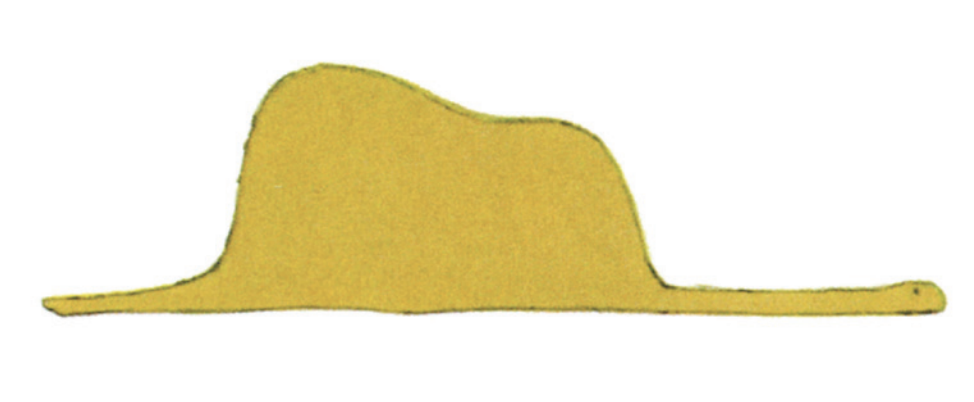
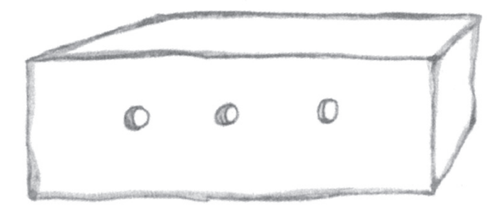

# Jaobon!

is a constructed language with only 366 morphemes, all monosyllabic. Notably, these 366 syllables are the entire set of syllables distinguishable by Jaobon phonology; thus, every phonologically possible syllable has a meaning assigned to it. Almost all of these morphemes are derived from Mandarin, Spanish, and English, although there are a handful derived in whole or part from other languages: Japanese, Hindi, Latin, Arabic, etc. 

Like Mandarin, Jaobon has no morphology which modifies phonemes or results in syllable rebracketing. In this sense, Jaobon can be said to be a purely analytical language. 

The syntax of Jaobon is mostly head-initial, with SVO default word order, prepositions, and relative clauses which occur after the noun. However, compound nouns are head-final, and adjectives and other noun modifiers may appear before the noun when restrictive. Demonstratives and cardinal numbers appear before the noun. This syntax is broadly similar to the main source languages - Mandarin, Spanish, and English. Jaobon also uses [relational](https://en.wikipedia.org/wiki/Relational_noun) nouns extensively in a manner similar to Mandarin, appearing after a noun. 

Jaobon is in large part inspired by, and in response to, Toki Pona; it shares many similarities but also a few key philosophical differences: more roots, shorter roots, and an explicitly prescribed dictionary of root collocations to express more complex concepts. Also, in contrast to Toki Pona's fairly neutral/unique flavor, I think that Jaobon has a distinct affinity with the [Mainland Southeast Asia linguistic area](https://en.wikipedia.org/wiki/Mainland_Southeast_Asia_linguistic_area) (particularly with Chinese languages) in its phonotactics, syntax, semantics, and overall feel. 

Jaobon has three canonical writing systems:

- The Latin alphabet, which is preferable for input methods and informal communication.
- CJK characters, with a set of 366 in use in a one-to-one relationship with Jaobon morphemes. I use simplified Chinese characters to write Jaobon, with the justification that visual simplicity should be prioritized for such a small grapheme set. I prefer the use of CJK characters when reading; all texts on this site are rendered in CJK characters by default. 
- A general-purpose featural script called Featural Dots, which is space-efficient and cool!

If you look at the root list, you may soon realize that *jao bon* means "foot-bottom" (*bon* being a relational noun), or, logically, the sole of the foot. Why would I name the language something so random? In the [first iteration of Jaobon](/history), *jao bon* was a direct calque of the name of Toki Pona, coming from Mandarin 叫 and Spanish *bueno*. In the next version, the meanings of most syllables were reassigned, and *jao bon* happened to now mean "foot-bottom"; I was charmed by the new semantics and decided not to rename the language. Jaobon is now on its third iteration, but the meanings of both *jao* and *bon* happen not to have changed since version 2, and I like the nonsense name as much as I ever did. 

# History

## Jaobon 1 (2014)

The Jaobon project was begun in September or October 2014 - the first written reference to it I have is a [Reddit post](https://www.reddit.com/r/conlangs/comments/2i4l0k/introducing_jaobon_a_major_departure_from_my/) from 2 Oct 2014. The phonology was extremely similar, with the same consonant and vowel inventories, and lacking only coda /k/ and /s/ and the diphthong /oi̯/ relative to the current version. This gave it a total of 192 possible roots (17 consonants times 12 finals, minus 12 impossible combinations because /ti/, /di/, /si/, /hi/, /ji/, and /wu/ were avoided, just as in the current version of Jaobon). However, there were some gaps - I started with 184 roots, at some point going up to 188. A 184-root list is available in a [Reddit post](https://www.reddit.com/r/conlangs/comments/2ihs4y/jaobon_hanzi/) which also includes the CJK characters I associated with each root. A 188-root list is available in the [Memrise course](https://community-courses.memrise.com/community/course/409937/basic-jaobon/) I created some time later.

Because the phonology and number of roots were so different, the rate of lexical similarity between 2014 Jaobon and now is quite low, and few roots are recognizably preserved since then. A glance at my [2014 translation](https://www.reddit.com/r/conlangs/comments/2i4z7k/sample_of_jaobon/) of The North Wind and the Sun shows this off well: the roots which are more or less the same as their current versions include *bin*, *i*, *ke*, and *lai*, but overall the text is very different from an [up-to-date translation](/texts/classics/north_wind).

There are many other differences in addition to lexical. Firstly, the grammar was fairly different from both current Jaobon and the source languages: what are now voice particles functioned then more like case markers, making the word order actually somewhat flexible between SVO, SOV, and OSV, and noun phrases were strictly left-branching. Also, roots were only sourced from English, Spanish, and Mandarin, though a few grammatical particles were invented a priori. Lastly, there were some orthographic differences: /t͡ʃ ʃ/ were ⟨ch sh⟩ rather than ⟨c x⟩, and I wrote compound words without spaces.

## Subsequent projects (2015)

In those early materials, I called Jaobon "oligosynthetic", a term which has varying definitions but was [in vogue](https://www.reddit.com/r/conlangs/comments/2vr4fc/the_rconlangs_oligosynthesis_debate/) on /r/conlangs at the time to describe languages with as few as 20ish morphemes, the most well-known of which was [Vahn](https://www.reddit.com/r/Vahn/), which boasts 37 morphemes. (The term "oligoanalytic" also exists which probably better describes Jaobon and Toki Pona, though I may not have known it at the time; under such usage, Vahn is still a good example of an oligosynthetic language as its morphemes are only one or two phonemes, and phonological words may be multimorphemic.) I think it's true that Jaobon was at that time as much or more a response to the oligosynthesis wave as to Toki Pona in particular, and my intention was to create a language with a somewhat restrictive morpheme inventory that still felt fairly natural, unlike the (in my then-perception) mind-bending and semantically restricted and vague oligolangs.

In February 2015, [I declared](https://www.reddit.com/r/conlangs/comments/2wdlcz/introducing_kus_jaaw_a_catechoradical_language/) that 184 roots had been too few and that I was done with oligosynthesis, starting a new project that I dubbed "catechoradical" - a step above oligosynthetic languages in morpheme count with 512, though still capped very low relative to natural languages. I have no other memories or written records of that catechoradical project and I don't think I developed it further, but it's clear that after a few months of dabbling I was feeling quite cramped with the sub-200 inventory of roots.

In fall 2015, I started work on [Lauvìnko](https://lauvinko.conorstuartroe.com/), a naturalistic language set in early modern Malaysia, and in connection I created a sibling project [Basabano](https://www.reddit.com/r/conlangs/comments/3nhx7o/basabano_my_catechoradical_creole/), a language sharing many traits with Jaobon but which was framed as a creole between Malay, English, Portuguese (≈ Spanish), Hokkien (≈ Mandarin), Hindi, and Arabic, a plausible occurrence in that time and place but also - shock and awe - a language with few lexemes, all of which derive from the most widely spoken languages in the world and is easy to learn. I created about [250 roots](https://docs.google.com/spreadsheets/d/11-Kuwv3nf6l3lt45ftNZQLh-IzqbOM5-fMGuVmSqnRE/edit?usp=sharing), though the bisyllabic phonology permitted thousands and I expressed an intention to create at least several hundred. I also evidently gained enough facility in the language to [journal in it](https://www.reddit.com/r/conlangs/comments/3odam9/a_journal_entry_in_basabano_it_may_not_look_like/), but work stalled on the project at some point. I think I must have concluded it was infeasible to combine the naturalistic origin story and the very much engineered nature of an oligoanalytic language. 

Nonetheless, Basabano seems to have planted a couple of ideas in my mind that would be remembered when I came back around to Jaobon. For one, Basabano permitted four consonant codas: /n s k l/, laying the groundwork for adding coda /s k/ to Jaobon (I must have realized at some point that coda /l/ can actually be quite difficult). Also, perhaps Basabano made me more open to admitting etymologies from outside the core three languages.

## Jaobon 2: the Return of Jaobon (2019)

In summer 2019, I came back onto the oligo scene with a new edition of Jaobon, which this time looks very much like the current version. It has 325 roots, which are only recorded in a [second Memrise course](https://community-courses.memrise.com/community/course/5526464/jaobon-2/1/). Without doing a real count, at a glance it looks like about 80% of the roots are still the same in current Jaobon, and the phonology looks much more like the current version, with the new coda consonants and 350 possible roots. I have no other materials in or about this version of Jaobon and don't even have any sentences written in it, but judging by the set of grammatical particles I'd say the intended grammar was more or less in line with the current version as well.

## Jaobon 3: In Code! (2023-)

In 2020 I started my career as a professional software engineer, and around that time every one of my hobbies became subsumed into being coding projects (seriously - [language learning](https://github.com/cstuartroe/membaca), [creative writing](https://github.com/cstuartroe/storyweb), music [performance](https://github.com/cstuartroe/notesy) and [composition](https://github.com/cstuartroe/scale-theory), [visual art](https://github.com/cstuartroe/svg_gen), [tabletop games](https://github.com/cstuartroe/celestial-cards), and of course [conlanging](https://github.com/cstuartroe/lauvinko), [conlanging](https://github.com/cstuartroe/kuna), [conlanging](https://github.com/cstuartroe/jaobon)). So naturally, when I picked Jaobon back up in April 2023 my first act was to [digitize it](https://github.com/cstuartroe/jaobon/commit/636da35dc303a9fa14424863a2de970288f6e4bc) and put it online.

Soon after, I [zipped up all the gaps](https://github.com/cstuartroe/jaobon/commit/e2d57ae5e92c52b7c70899adb314e8287c4b4d6c) and brought the language to 350 morphemes, occupying every permissible syllable.

In April 2024 I finally [wrote out](https://github.com/cstuartroe/jaobon/commit/a4ee704eaa1f50b2645a3403b413c243a2628f1) a reasonably comprehensive description of Jaobon grammar.

In January 2025 I [changed Jaobon phonology](https://github.com/cstuartroe/jaobon/commit/cd46ad4b49e74d2ff15d3c5a77aed8247e7b92d0) for the first time since 2019 and only the second time ever, adding the diphthong /oi̯/, bringing the total number of possible syllables to 366 and filling all the vacant real estate with new roots. This was partially motivated by wanting to [associate each calendar day](https://bsky.app/profile/jaobon.bsky.social) with a Jaobon root (I'm also into calendrics), and partially motivated by still feeling a bit cramped. Crazy as it may seem, that bump up from 350 to 366 roots felt like it was really hitting the sweet spot. I finally got to de-conflate terms for emotion and color, something which I'd found undesirable for a long time (previously, e.g. "blue" and "sad" were the same term), and added a few nice new roots that felt needed. For the first time in Jaobon's history, I really feel like every root has semantic breathing room and there are no gaps nor any ideas that are challenging to express. There's also been a steep reduction in seriously phonetically mangled etymologies. 

Now Jaobon has a dictionary exceeding 1000 entries and a corpus of translations exceeding 8000 roots, and is finally feeling like a mature, convincing, and presentable project. I think I accomplished the original goal of finding the number of roots that makes an oligoanalytic language "click" for me - where any fewer would feel cramped, but where I can't think of any root I'd like to add or split up. 

# Phonology

Like most languages in the [Mainland Southeast Asia linguistic area](https://en.wikipedia.org/wiki/Mainland_Southeast_Asia_linguistic_area), Jaobon has a phonology heavily centered upon the syllable, with no clear level of phonological organization above the syllable. Also like most of those languages, the set of consonants appearing in the syllable onset is markedly different from the set appearing in the syllable coda. Unlike most of those languages, Jaobon does not employ contrastive syllable tone; indeed, Jaobon does not use any kind of lexically contrastive prosody.

Jaobon phonology is intended to be fairly easy and universally accessible, although in the interest of having enough monosyllabic roots it does have phonemic contrasts (such as a fortis-lenis distinction in stops) and phonotactic complexities (such as syllable-final consonants) that exceed the complexity of some natural languages. In general, an attempt was made to limit these to those which would be easy for the majority of speakers to use. For instance, the large majority of widely-spoken world languages make some type of vocal onset time distinction for stops, and where gaps exist there should be possible substitutions available (e.g., Arabic speakers may use [f] for /p/); the difficulty which, e.g., Tamil or Greek speakers may find with the distinction did not prevent its inclusion. Similarly, I made the judgement that a very constrained set of syllable-final consonants is in practice easy enough to learn even for speakers whose languages do not have them, though place of articulation contrasts were avoided there for the sake of ease. Some widely spoken languages are not entirely compatible with Jaobon phonology, e.g., even Spanish speakers may struggle with the distinction between /d͡ʒ/ and /j/. 

Jaobon has 17 initial consonants:

|  | **Labial** | **Alveolar1** | **Palatal** | **Velar** | **Glottal** |
| - | - | - | - | - | - |
| **Nasal** | m | n |  |  |  |
| **Fortis stop/affricate2** | p | t | t͡ʃ 3 | k | ʔ |
| **Lenis stop/affricate2** | b | d | d͡ʒ 3 | g |  |
| **Fricative4** |  | s | ʃ 5 |  | h 6 |
| **Approximant** | w | l 7 | j |  |  |

- 1 In free variation with dental place of articulation.
- 2 The fortis-lenis distinction may surface as a difference in voicing, aspiration, or both, or even in length or some other feature that may be interpreted as a fortis-lenis binary. I notate stops/affricates in broad transcription as though they contrast in voicing.
- 3 May be any coronal affricate: [t͡ʃ d͡ʒ], [t͡ɕ d͡ʑ], [t͡ʂ d͡ʐ], or even [t͡s d͡z].
- 4 Voicing is non-contrastive in fricatives, but they preferably remain unvoiced. This is because some listeners may have trouble distinguishing between voiced affricates and fricatives.
- 5 Free variation: [ʃ\~ɕ\~ʂ].
- 6 Free variation: [h\~x\~χ\~ʁ].
- 7 May be any lateral or rhotic consonant.

Jaobon has the common system of five cardinal vowels /a e i o u/. It also has three diphthongs /ai̯ au̯ oi̯/. The realization of the vowels is flexible as long as a five-way contrast is maintained, and /oi̯/ in particular permits variation such as [oi̯\~ui̯\~we\~wi\~ɥi\~ø\~y\~øy̯] etc.

A number of initial-vowel sequences are disallowed: /ti/, /di/, /si/, /hi/, /ji/, and /wu/. Because /oi̯/ may often be pronounced [we\~wi] or similar, it is not permitted to have the onset /w/; the root /oi̯/ is merely an interjection to avoid confusion with the roots /we/ and /wi/, and similarly the root /joi̯/ is a marginal interjection as some speakers may find it difficult to pronounce.

Jaobon has three possible coda consonant phonemes:

- A stop /Q/, which is typically pronounced [k̚] or [ʔ], but may optionally assimilate in place to a following consonant.
- A nasal /N/, which is typically [n\~ŋ\~ɴ] before a pause, but usually assimilates in place to a following consonant. May also surface as nasalization of the previous vowel.
- A fricative /S/, which is preferably [s] but may be any fricative sound.

Jaobon syllable structure is CV(C), with an initial consonant and a vowel required and a coda optional. A coda consonant may not occur after a diphthong. These phonotactics result in 366 permissible syllables. In Jaobon, all 366 possible syllables are morphemes with a specific meaning:

|  | **ʔ** | **m** | **n** | **p** | **t** | **t͡ʃ** | **k** | **b** | **d** | **d͡ʒ** | **g** | **s** | **ʃ** | **h** | **w** | **l** | **j** |
| - | - | - | - | - | - | - | - | - | - | - | - | - | - | - | - | - | - |
| **a** | [1](/roots#a) | [2](/roots#ma) | [3](/roots#na) | [4](/roots#pa) | [5](/roots#ta) | [6](/roots#ca) | [7](/roots#ka) | [8](/roots#ba) | [9](/roots#da) | [10](/roots#ja) | [11](/roots#ga) | [12](/roots#sa) | [13](/roots#xa) | [14](/roots#ha) | [15](/roots#wa) | [16](/roots#la) | [17](/roots#ya) |
| **aQ** | [18](/roots#ak) | [19](/roots#mak) | [20](/roots#nak) | [21](/roots#pak) | [22](/roots#tak) | [23](/roots#cak) | [24](/roots#kak) | [25](/roots#bak) | [26](/roots#dak) | [27](/roots#jak) | [28](/roots#gak) | [29](/roots#sak) | [30](/roots#xak) | [31](/roots#hak) | [32](/roots#wak) | [33](/roots#lak) | [34](/roots#yak) |
| **aN** | [35](/roots#an) | [36](/roots#man) | [37](/roots#nan) | [38](/roots#pan) | [39](/roots#tan) | [40](/roots#can) | [41](/roots#kan) | [42](/roots#ban) | [43](/roots#dan) | [44](/roots#jan) | [45](/roots#gan) | [46](/roots#san) | [47](/roots#xan) | [48](/roots#han) | [49](/roots#wan) | [50](/roots#lan) | [51](/roots#yan) |
| **aS** | [52](/roots#as) | [53](/roots#mas) | [54](/roots#nas) | [55](/roots#pas) | [56](/roots#tas) | [57](/roots#cas) | [58](/roots#kas) | [59](/roots#bas) | [60](/roots#das) | [61](/roots#jas) | [62](/roots#gas) | [63](/roots#sas) | [64](/roots#xas) | [65](/roots#has) | [66](/roots#was) | [67](/roots#las) | [68](/roots#yas) |
| **ai̯** | [69](/roots#ai) | [70](/roots#mai) | [71](/roots#nai) | [72](/roots#pai) | [73](/roots#tai) | [74](/roots#cai) | [75](/roots#kai) | [76](/roots#bai) | [77](/roots#dai) | [78](/roots#jai) | [79](/roots#gai) | [80](/roots#sai) | [81](/roots#xai) | [82](/roots#hai) | [83](/roots#wai) | [84](/roots#lai) | [85](/roots#yai) |
| **au̯** | [86](/roots#ao) | [87](/roots#mao) | [88](/roots#nao) | [89](/roots#pao) | [90](/roots#tao) | [91](/roots#cao) | [92](/roots#kao) | [93](/roots#bao) | [94](/roots#dao) | [95](/roots#jao) | [96](/roots#gao) | [97](/roots#sao) | [98](/roots#xao) | [99](/roots#hao) | [100](/roots#wao) | [101](/roots#lao) | [102](/roots#yao) |
| **e** | [103](/roots#e) | [104](/roots#me) | [105](/roots#ne) | [106](/roots#pe) | [107](/roots#te) | [108](/roots#ce) | [109](/roots#ke) | [110](/roots#be) | [111](/roots#de) | [112](/roots#je) | [113](/roots#ge) | [114](/roots#se) | [115](/roots#xe) | [116](/roots#he) | [117](/roots#we) | [118](/roots#le) | [119](/roots#ye) |
| **eQ** | [120](/roots#ek) | [121](/roots#mek) | [122](/roots#nek) | [123](/roots#pek) | [124](/roots#tek) | [125](/roots#cek) | [126](/roots#kek) | [127](/roots#bek) | [128](/roots#dek) | [129](/roots#jek) | [130](/roots#gek) | [131](/roots#sek) | [132](/roots#xek) | [133](/roots#hek) | [134](/roots#wek) | [135](/roots#lek) | [136](/roots#yek) |
| **eN** | [137](/roots#en) | [138](/roots#men) | [139](/roots#nen) | [140](/roots#pen) | [141](/roots#ten) | [142](/roots#cen) | [143](/roots#ken) | [144](/roots#ben) | [145](/roots#den) | [146](/roots#jen) | [147](/roots#gen) | [148](/roots#sen) | [149](/roots#xen) | [150](/roots#hen) | [151](/roots#wen) | [152](/roots#len) | [153](/roots#yen) |
| **eS** | [154](/roots#es) | [155](/roots#mes) | [156](/roots#nes) | [157](/roots#pes) | [158](/roots#tes) | [159](/roots#ces) | [160](/roots#kes) | [161](/roots#bes) | [162](/roots#des) | [163](/roots#jes) | [164](/roots#ges) | [165](/roots#ses) | [166](/roots#xes) | [167](/roots#hes) | [168](/roots#wes) | [169](/roots#les) | [170](/roots#yes) |
| **i** | [171](/roots#i) | [172](/roots#mi) | [173](/roots#ni) | [174](/roots#pi) |  | [175](/roots#ci) | [176](/roots#ki) | [177](/roots#bi) |  | [178](/roots#ji) | [179](/roots#gi) |  | [180](/roots#xi) |  | [181](/roots#wi) | [182](/roots#li) |  |
| **iQ** | [183](/roots#ik) | [184](/roots#mik) | [185](/roots#nik) | [186](/roots#pik) |  | [187](/roots#cik) | [188](/roots#kik) | [189](/roots#bik) |  | [190](/roots#jik) | [191](/roots#gik) |  | [192](/roots#xik) |  | [193](/roots#wik) | [194](/roots#lik) |  |
| **iN** | [195](/roots#in) | [196](/roots#min) | [197](/roots#nin) | [198](/roots#pin) |  | [199](/roots#cin) | [200](/roots#kin) | [201](/roots#bin) |  | [202](/roots#jin) | [203](/roots#gin) |  | [204](/roots#xin) |  | [205](/roots#win) | [206](/roots#lin) |  |
| **iS** | [207](/roots#is) | [208](/roots#mis) | [209](/roots#nis) | [210](/roots#pis) |  | [211](/roots#cis) | [212](/roots#kis) | [213](/roots#bis) |  | [214](/roots#jis) | [215](/roots#gis) |  | [216](/roots#xis) |  | [217](/roots#wis) | [218](/roots#lis) |  |
| **o** | [219](/roots#o) | [220](/roots#mo) | [221](/roots#no) | [222](/roots#po) | [223](/roots#to) | [224](/roots#co) | [225](/roots#ko) | [226](/roots#bo) | [227](/roots#do) | [228](/roots#jo) | [229](/roots#go) | [230](/roots#so) | [231](/roots#xo) | [232](/roots#ho) | [233](/roots#wo) | [234](/roots#lo) | [235](/roots#yo) |
| **oQ** | [236](/roots#ok) | [237](/roots#mok) | [238](/roots#nok) | [239](/roots#pok) | [240](/roots#tok) | [241](/roots#cok) | [242](/roots#kok) | [243](/roots#bok) | [244](/roots#dok) | [245](/roots#jok) | [246](/roots#gok) | [247](/roots#sok) | [248](/roots#xok) | [249](/roots#hok) | [250](/roots#wok) | [251](/roots#lok) | [252](/roots#yok) |
| **oN** | [253](/roots#on) | [254](/roots#mon) | [255](/roots#non) | [256](/roots#pon) | [257](/roots#ton) | [258](/roots#con) | [259](/roots#kon) | [260](/roots#bon) | [261](/roots#don) | [262](/roots#jon) | [263](/roots#gon) | [264](/roots#son) | [265](/roots#xon) | [266](/roots#hon) | [267](/roots#won) | [268](/roots#lon) | [269](/roots#yon) |
| **oS** | [270](/roots#os) | [271](/roots#mos) | [272](/roots#nos) | [273](/roots#pos) | [274](/roots#tos) | [275](/roots#cos) | [276](/roots#kos) | [277](/roots#bos) | [278](/roots#dos) | [279](/roots#jos) | [280](/roots#gos) | [281](/roots#sos) | [282](/roots#xos) | [283](/roots#hos) | [284](/roots#wos) | [285](/roots#los) | [286](/roots#yos) |
| **oi̯** | [287](/roots#oi) | [288](/roots#moi) | [289](/roots#noi) | [290](/roots#poi) | [291](/roots#toi) | [292](/roots#coi) | [293](/roots#koi) | [294](/roots#boi) | [295](/roots#doi) | [296](/roots#joi) | [297](/roots#goi) | [298](/roots#soi) | [299](/roots#xoi) | [300](/roots#hoi) |  | [301](/roots#loi) | [302](/roots#yoi) |
| **u** | [303](/roots#u) | [304](/roots#mu) | [305](/roots#nu) | [306](/roots#pu) | [307](/roots#tu) | [308](/roots#cu) | [309](/roots#ku) | [310](/roots#bu) | [311](/roots#du) | [312](/roots#ju) | [313](/roots#gu) | [314](/roots#su) | [315](/roots#xu) | [316](/roots#hu) |  | [317](/roots#lu) | [318](/roots#yu) |
| **uQ** | [319](/roots#uk) | [320](/roots#muk) | [321](/roots#nuk) | [322](/roots#puk) | [323](/roots#tuk) | [324](/roots#cuk) | [325](/roots#kuk) | [326](/roots#buk) | [327](/roots#duk) | [328](/roots#juk) | [329](/roots#guk) | [330](/roots#suk) | [331](/roots#xuk) | [332](/roots#huk) |  | [333](/roots#luk) | [334](/roots#yuk) |
| **uN** | [335](/roots#un) | [336](/roots#mun) | [337](/roots#nun) | [338](/roots#pun) | [339](/roots#tun) | [340](/roots#cun) | [341](/roots#kun) | [342](/roots#bun) | [343](/roots#dun) | [344](/roots#jun) | [345](/roots#gun) | [346](/roots#sun) | [347](/roots#xun) | [348](/roots#hun) |  | [349](/roots#lun) | [350](/roots#yun) |
| **uS** | [351](/roots#us) | [352](/roots#mus) | [353](/roots#nus) | [354](/roots#pus) | [355](/roots#tus) | [356](/roots#cus) | [357](/roots#kus) | [358](/roots#bus) | [359](/roots#dus) | [360](/roots#jus) | [361](/roots#gus) | [362](/roots#sus) | [363](/roots#xus) | [364](/roots#hus) |  | [365](/roots#lus) | [366](/roots#yus) |

# Writing Systems

Jaobon has three canonical writing systems - Latin alphabet, CJK characters, and Featural Dots. The first two are described here; to see the Featural Dots font, view the [Jaobon website](https://jaobon.conorstuartroe.com/scripts).

## Latin alphabet

Jaobon uses a purely phonemic romanization scheme, that hopefully largely satisfies the principle of least surprise, although in an effort to keep every consonant spelling to one letter, I made the perhaps mildly spicy choices /t͡ʃ/ ⟨c⟩ and /ʃ/ ⟨x⟩ (take up any complaints with Indonesian and Portuguese, respectively). Its romanization for syllable-initial consonants is as follows: 

|  | **Labial** | **Alveolar** | **Palatal** | **Velar** | **Glottal** |
| - | - | - | - | - | - |
| **Nasal** | /m/ ⟨m⟩ | /n/ ⟨n⟩ |  |  |  |
| **Fortis stop/affricate** | /p/ ⟨p⟩ | /t/ ⟨t⟩ | /t͡ʃ/ ⟨c⟩ | /k/ ⟨k⟩ | /ʔ/ ⟨⟩1 |
| **Lenis stop/affricate** | /b/ ⟨b⟩ | /d/ ⟨d⟩ | /d͡ʒ/ ⟨j⟩ | /g/ ⟨g⟩ |  |
| **Fricative** |  | /s/ ⟨s⟩ | /ʃ/ ⟨x⟩ |  | /h/ ⟨h⟩ |
| **Lenis stop/affricate** | /w/ ⟨w⟩ | /l/ ⟨l⟩ | /j/ ⟨y⟩ |  |  |

- 1 The glottal stop is not written in romanization.

The vowels /a e i o u/ are romanized ⟨a e i o u⟩, because I'm not a madman. /ai̯ au̯ oi̯/ are ⟨ai ao oi⟩ (with ⟨ao⟩ taking inspiration from Mandarin Pinyin), and the coda consonants /Q N S/ are spelled ⟨k n s⟩. 

## CJK Characters

Every one of Jaobon's 366 roots has an assigned CJK character spelling, which can be found in the [root list](/roots).

For roots taken from Mandarin and Japanese, I use the (simplified) character used to spell the source word/morpheme; for the handful of roots which derive from multiple Mandarin terms which happen to have similar sounds and meanings, I picked the character used for whichever, in my judgement, is closest to the core meaning of the Jaobon root. Roots derived from two-character Mandarin words generally take their initial consonant and their vowel from the first Mandarin syllable, and their final consonant from the initial consonant of the second Mandarin syllable; in such cases, I spell the Jaobon root with the first character of the Mandarin word, since it contributes the bulk of the phonetic information. 

For roots derived from languages not conventionally spelled with CJK characters, I simply chose a CJK character whose meaning matches the Jaobon root.

Of note: I strictly use simplified characters to spell Jaobon, as their greater graphical simplicity suits the fact that Jaobon uses many fewer characters than any other language using CJK characters. It would actually be non-trivial to convert Jaobon spelling to traditional equivalents, as many single characters used in Jaobon are the simplified variant of multiple traditional characters of different meanings, with the meaning of more than one traditional character serving as inspiration for the meaning of the root as used in Jaobon. 

## Representation of proper nouns

Proper nouns like personal names and place names are set apart orthographically in all writing systems for Jaobon. In the Latin alphabet, names are written capitalized, with all syllables grouped together without spaces: *Toma*. In CJK characters double angle brackets are placed around the name: 《头妈》. 

# Sourcing roots

Jaobon derives its 366 roots from other languages, so that speakers of those languages may have a recognizable connection to as many roots as possible when first encountering them, to aid in remembering them. To this end, I have striven to make every root as close in sound and meaning as possible to the source word. I don't think that a speaker of a given source language would be able to guess the meaning of most Jaobon roots at first glance, but I do think they will find the similarity to be a memory aid once the etymology is pointed out to them. For instance, I don't think most English speakers would be able to guess without context that [*dak*](/roots#dak) means "dark, black," but once told that it derived from the English word "dark," I'm sure they'd be able to recall the word *dak* much more easily. 

Jaobon roots are predominantly taken from the three most widely natively spoken languages in the world: Mandarin, Spanish, and English. In fact, the first version of Jaobon included only one or two roots from other sources. This was to maximize the number of people who would be able to recognize the source of a given root (I suppose the logical extreme of this strategy would have been to simply source every root from Mandarin, but I wanted to preserve at least some semblance of an internation/neutral character for the language; and besides, doing so would have exacerbated the issue described below). 

The problem with this strategy is that the main challenge of assigning Jaobon morphemes is that it essentially functions like an extremely complex Tetris game - I was attempting to assign meanings to as many syllables as possible, while making sure that the meanings were core enough to deserve a morpheme, and that no etymology was so distorted in sound or meaning that its mnemonic value was lost. Despite my best efforts, the language was suffering from the same syndrome as Volapük - words so distorted from their sources as to be humorous. What English speaker, for instance, would really connect the Jaobon word *hen* with its English source "heaven", and remember it as a term for "sky"; or the Jaobon word *tek* with its English source "thick"? I think that deriving all or close to all of the 366 roots from only Spanish, English, and Mandarin while maintaining the quality of etymologies would have been essentially impossible. 

In the end, I prioritized the fidelity of etymologies and my goal of using every phonologically permissible syllable over the purity of using only the three core languages. I threw out some etymologies which sounded too unlike the source word to be recognizable, and filled gaps opportunistically with words from other languages. I ended up with a total of 15 source languages, although all but the core three contribute a relatively tiny number of roots. In retrospect, I think this also had a positive effect on the feeling of the language, making it just a touch more variegated, global, and inclusive. 

The counts of how many roots derive entirely or in part from each source language are as follows:

- [Chinese: 166 roots](/roots?lang=Chinese)
- [Spanish: 115 roots](/roots?lang=Spanish)
- [English: 109 roots](/roots?lang=English)
- [Hindi: 9 roots](/roots?lang=Hindi)
- [Japanese: 6 roots](/roots?lang=Japanese)
- [French: 5 roots](/roots?lang=French)
- [Latin: 5 roots](/roots?lang=Latin)
- [Malay: 4 roots](/roots?lang=Malay)
- [Turkish: 3 roots](/roots?lang=Turkish)
- [Dutch: 3 roots](/roots?lang=Dutch)
- [Russian: 2 roots](/roots?lang=Russian)
- [Arabic: 2 roots](/roots?lang=Arabic)
- [German: 2 roots](/roots?lang=German)
- [Vietnamese: 1 roots](/roots?lang=Vietnamese)

The counts sum to more than 366, since many roots have more than one source language.

The only language among this set without a large number of speakers (> 80 million) and/or international significance is Dutch, though it's worth noting that none of the Dutch-derived roots comes solely from Dutch; they're only there to reinforce and add adjacent semantic space to English/German sources. The inclusion of Dutch was because of my personal familiarity with the language that led me to spot some chances to use Dutch etymologies that felt too fitting to pass up. I'll also point out that for Japanese, some of those are Sino-Japanese readings of characters which are especially recognizable cognates to the many widely-spoken Chinese varieties which preserve final stops. 

Even after opening up sourcing to a wider array of languages, all Jaobon roots have undergone varying degrees of indignity in the form of phonological and semantic distortion, some severe enough that I'm sure Jaobon hasn't entirely escaped its Volapükishness. In particular: 

- Vowels are often distorted: English *back* [bæk] → Jaobon *bek* [bek]
- Consonants, especially liquids and glides, are liable to disappear: Mandarin 年 [njɛn˧˥] → Jaobon *nen*, Spanish *crecer* → Jaobon *kes*, English *horse* → Jaobon *hos*, English *glass* → Jaobon *las*, Hindi मुक्त [mʊkt̪] → Jaobon *muk*
- Consonants (particularly, [f]) are occasionally replaced with the closest but still not-so-similar alternatives: Mandarin 复杂 [fût͡sǎ] → Jaobon *pus*. This is especially true with final consonants: 
  - Any old stop might become Jaobon final *k* (for which I consider both [k] and [ʔ] acceptable pronunciations): English *dog* → Jaobon *dok*, Mandarin 舞蹈 [u˧˥ tau̯˨˩˦] → Jaobon *uk* 
  - Any coronal fricative or affricate might become Jaobon final *s*: English *with* → Jaobon *wis*, Mandarin 物质 [u˥˩ ʈ͡ʂɻ̩˥˩] → Jaobon *us*
- On rare occasions, I allowed a root to be more recognizable in spelling than pronunciation: English *make* → Jaobon *mak* 
- I may only take the first or stressed syllable of a multisyllablic source word/stem: Spanish *nadar* → Jaobon *na*, Spanish *escuchar* → Jaobon *kus* 

In addition to phonetic fidelity, an effort was made to preserve semantic faithfulness as well, which was key in defining the semantic space of certain roots. For instance, Jaobon *xun* from Chinese 順 takes on its multiple related senses, including "follow, go along; obey, comply; suit, fit; agree with". This principle was not respected in all cases, in order to fill in semantic gaps, e.g. Jaobon *wik* from English *weak* taking on not only the meaning "weak", but the related sense "tired". 

In some cases, the principle of semantic fidelity has led to related sets of words having different syntax, e.g. emotion terms *xi* "like", *has* "anger": *mi xi Toma* "I like Tom" vs. *mi yo has nis Toma* "I'm angry with Tom". 

# Root List

### [向](https://en.wiktionary.org/wiki/向) a

preposition, aspect particle - to, toward, at, for

From

- [Spanish a](https://en.wiktionary.org/wiki/a#Spanish)

### [爱](https://en.wiktionary.org/wiki/爱) ai

transitive verb - love

From

- [Chinese 爱](https://en.wiktionary.org/wiki/爱#Chinese)

### [表](https://en.wiktionary.org/wiki/表) ak

intransitive verb, adverb - act, behave, appear, seem, express

From

- [English act](https://en.wiktionary.org/wiki/act#English)

### [兽](https://en.wiktionary.org/wiki/兽) an

noun - animal, beast

From

- [English animal](https://en.wiktionary.org/wiki/animal#English)
- [Spanish animal](https://en.wiktionary.org/wiki/animal#Spanish)

### [奥](https://en.wiktionary.org/wiki/奥) ao

adjective - strange, unknown, mysterious

From

- [Chinese 奥](https://en.wiktionary.org/wiki/奥#Chinese)

### [使](https://en.wiktionary.org/wiki/使) as

voice particle - make, cause, volitive

From

- [Spanish hacer](https://en.wiktionary.org/wiki/hacer#Spanish)

### [把](https://en.wiktionary.org/wiki/把) ba

transitive verb - hold, wield, handle

From

- [Chinese 把](https://en.wiktionary.org/wiki/把#Chinese)

### [百](https://en.wiktionary.org/wiki/百) bai

numeral - hundred

From

- [Chinese 百](https://en.wiktionary.org/wiki/百#Chinese)

### [牛](https://en.wiktionary.org/wiki/牛) bak

noun - cow, bovine

From

- [Spanish vaca](https://en.wiktionary.org/wiki/vaca#Spanish)

### [半](https://en.wiktionary.org/wiki/半) ban

numeral - half

From

- [Chinese 半](https://en.wiktionary.org/wiki/半#Chinese)

### [包](https://en.wiktionary.org/wiki/包) bao

transitive verb - bag, package, bundle, container; to cover, to wrap

From

- [Chinese 包](https://en.wiktionary.org/wiki/包#Chinese)

### [空](https://en.wiktionary.org/wiki/空) bas

adjective - empty, blank, vacant, hollow

From

- [Spanish vacío](https://en.wiktionary.org/wiki/vacío#Spanish)

### [美](https://en.wiktionary.org/wiki/美) be

adjective - beautiful, nice

From

- [Spanish bello](https://en.wiktionary.org/wiki/bello#Spanish)

### [后](https://en.wiktionary.org/wiki/后) bek

positional - back, behind, after, east

From

- [English back](https://en.wiktionary.org/wiki/back#English)

### [变](https://en.wiktionary.org/wiki/变) ben

transitive verb, aspect particle - bend, change, become

From

- [Chinese 变](https://en.wiktionary.org/wiki/变#Chinese)
- [English bend](https://en.wiktionary.org/wiki/bend#English)

### [次](https://en.wiktionary.org/wiki/次) bes

noun - time, instance, action, turn, once

From

- [Spanish vez](https://en.wiktionary.org/wiki/vez#Spanish)

### [活](https://en.wiktionary.org/wiki/活) bi

intransitive verb - live, reside, life

From

- [Spanish vivir](https://en.wiktionary.org/wiki/vivir#Spanish)

### [大](https://en.wiktionary.org/wiki/大) bik

adjective - big, large, old

From

- [English big](https://en.wiktionary.org/wiki/big#English)

### [冰](https://en.wiktionary.org/wiki/冰) bin

adjective - freeze, cold

From

- [Chinese 冰](https://en.wiktionary.org/wiki/冰#Chinese)

### [客](https://en.wiktionary.org/wiki/客) bis

intransitive verb - visit, travel, tour, guest

From

- [Spanish visitar](https://en.wiktionary.org/wiki/visitar#Spanish)
- [English visit](https://en.wiktionary.org/wiki/visit#English)

### [飞](https://en.wiktionary.org/wiki/飞) bo

intransitive verb - fly

From

- [Spanish volar](https://en.wiktionary.org/wiki/volar#Spanish)

### [喊](https://en.wiktionary.org/wiki/喊) boi

intransitive verb - yell, shout, howl, bark, moo, meow (etc., any animal sound)

From

- [French aboyer](https://en.wiktionary.org/wiki/aboyer#French)

### [孔](https://en.wiktionary.org/wiki/孔) bok

noun - mouth, hole open at one end

From

- [Spanish boca](https://en.wiktionary.org/wiki/boca#Spanish)

### [下](https://en.wiktionary.org/wiki/下) bon

positional - under, bottom, bum

From

- [English bottom](https://en.wiktionary.org/wiki/bottom#English)
- [Chinese 本](https://en.wiktionary.org/wiki/本#Chinese)

### [声](https://en.wiktionary.org/wiki/声) bos

intransitive verb - voice, sound, noise, make noise

From

- [Spanish voz](https://en.wiktionary.org/wiki/voz#Spanish)

### [补](https://en.wiktionary.org/wiki/补) bu

transitive verb - repair, recompense, compensate, fill in

From

- [Chinese 补](https://en.wiktionary.org/wiki/补#Chinese)

### [书](https://en.wiktionary.org/wiki/书) buk

noun - book

From

- [English book](https://en.wiktionary.org/wiki/book#English)

### [财](https://en.wiktionary.org/wiki/财) bun

noun - boon, prize, accomplishment, asset

From

- [English boon](https://en.wiktionary.org/wiki/boon#English)

### [找](https://en.wiktionary.org/wiki/找) bus

transitive verb, adverb - seek, search, look for, want, aim, intentionally

From

- [Spanish buscar](https://en.wiktionary.org/wiki/buscar#Spanish)

### [差](https://en.wiktionary.org/wiki/差) ca

intransitive verb - fall short, different, minus, mistake, error, bad

From

- [Chinese 差](https://en.wiktionary.org/wiki/差#Chinese)

### [茶](https://en.wiktionary.org/wiki/茶) cai

intransitive verb - boil, tea

From

- [Chinese 茶](https://en.wiktionary.org/wiki/茶#Chinese)
- [Hindi चाय](https://en.wiktionary.org/wiki/चाय#Hindi)

### [四](https://en.wiktionary.org/wiki/四) cak

numeral - four

From

- [Hindi चार](https://en.wiktionary.org/wiki/चार#Hindi)

### [唱](https://en.wiktionary.org/wiki/唱) can

intransitive verb - sing, praise

From

- [Chinese 唱](https://en.wiktionary.org/wiki/唱#Chinese)
- [French chanter](https://en.wiktionary.org/wiki/chanter#French)

### [条](https://en.wiktionary.org/wiki/条) cao

adjective, adverb - long, string, strip, ribbon, extreme, too

From

- [Chinese 条](https://en.wiktionary.org/wiki/条#Chinese)
- [Chinese 超](https://en.wiktionary.org/wiki/超#Chinese)

### [咔](https://en.wiktionary.org/wiki/咔) cas

intransitive verb - click, snap, pop

From

- [Spanish chasquear](https://en.wiktionary.org/wiki/chasquear#Spanish)

### [车](https://en.wiktionary.org/wiki/车) ce

noun - car, vehicle

From

- [Chinese 車](https://en.wiktionary.org/wiki/車#Chinese)

### [切](https://en.wiktionary.org/wiki/切) cek

transitive verb - cut, slice, separate

From

- [Chinese 切割](https://en.wiktionary.org/wiki/切割#Chinese)

### [前](https://en.wiktionary.org/wiki/前) cen

positional - front, face, before, west

From

- [Chinese 前](https://en.wiktionary.org/wiki/前#Chinese)

### [追](https://en.wiktionary.org/wiki/追) ces

transitive verb - chase, pursue, follow

From

- [English chase](https://en.wiktionary.org/wiki/chase#English)

### [七](https://en.wiktionary.org/wiki/七) ci

numeral - seven

From

- [Chinese 七](https://en.wiktionary.org/wiki/七#Chinese)

### [子](https://en.wiktionary.org/wiki/子) cik

noun - child, offspring, (diminutive)

From

- [Spanish chico](https://en.wiktionary.org/wiki/chico#Spanish)
- [Russian -чик](https://en.wiktionary.org/wiki/-чик#Russian)
- [Turkish -çik](https://en.wiktionary.org/wiki/-çik#Turkish)

### [请](https://en.wiktionary.org/wiki/请) cin

transitive verb - politely request, please

From

- [Chinese 请](https://en.wiktionary.org/wiki/请#Chinese)

### [酪](https://en.wiktionary.org/wiki/酪) cis

intransitive verb - cheese, form, coagulate, curdle

From

- [English cheese](https://en.wiktionary.org/wiki/cheese#English)

### [吃](https://en.wiktionary.org/wiki/吃) co

transitive verb - eat, drink, consume

From

- [Chinese 吃](https://en.wiktionary.org/wiki/吃#Chinese)

### [漂](https://en.wiktionary.org/wiki/漂) coi

intransitive verb - float, drift, slide, glide, smooth, effortless

From

- [Vietnamese trôi](https://en.wiktionary.org/wiki/trôi#Vietnamese)

### [球](https://en.wiktionary.org/wiki/球) cok

noun - ball, sphere

From

- [Chinese 球体](https://en.wiktionary.org/wiki/球体#Chinese)

### [虫](https://en.wiktionary.org/wiki/虫) con

noun - insect, worm, invertebrate, arthropod

From

- [Chinese 虫](https://en.wiktionary.org/wiki/虫#Chinese)

### [信](https://en.wiktionary.org/wiki/信) cos

transitive verb - trust, believe in, faith, confidence

From

- [English trust](https://en.wiktionary.org/wiki/trust#English)

### [出](https://en.wiktionary.org/wiki/出) cu

intransitive verb - out, send, happen, leave, quit, depart

From

- [Chinese 出](https://en.wiktionary.org/wiki/出#Chinese)

### [储](https://en.wiktionary.org/wiki/储) cuk

transitive verb - store, stockpile, preserve, save, keep

From

- [Chinese 储备](https://en.wiktionary.org/wiki/储备#Chinese)
- [Chinese 储存](https://en.wiktionary.org/wiki/储存#Chinese)

### [春](https://en.wiktionary.org/wiki/春) cun

noun - vitality, life, lust, spring, alive

From

- [Chinese 春](https://en.wiktionary.org/wiki/春#Chinese)

### [选](https://en.wiktionary.org/wiki/选) cus

transitive verb - choose, select, decide

From

- [English choose](https://en.wiktionary.org/wiki/choose#English)

### [打](https://en.wiktionary.org/wiki/打) da

transitive verb - hit, strike

From

- [Chinese 打](https://en.wiktionary.org/wiki/打#Chinese)

### [带](https://en.wiktionary.org/wiki/带) dai

transitive verb - support, carry, bring, wear

From

- [Chinese 带](https://en.wiktionary.org/wiki/带#Chinese)

### [黑](https://en.wiktionary.org/wiki/黑) dak

adjective - dark, black

From

- [English dark](https://en.wiktionary.org/wiki/dark#English)

### [单](https://en.wiktionary.org/wiki/单) dan

adjective - simple, easy

From

- [Chinese 单](https://en.wiktionary.org/wiki/单#Chinese)

### [到](https://en.wiktionary.org/wiki/到) dao

preposition, adverb - arrive, until, up to, succeed

From

- [Chinese 到](https://en.wiktionary.org/wiki/到#Chinese)

### [十](https://en.wiktionary.org/wiki/十) das

numeral - ten

From

- [Hindi दस](https://en.wiktionary.org/wiki/दस#Hindi)

### [从](https://en.wiktionary.org/wiki/从) de

preposition, linking particle - from, off of, away from

From

- [Spanish de](https://en.wiktionary.org/wiki/de#Spanish)

### [细](https://en.wiktionary.org/wiki/细) dek

adjective - thin, slender, narrow

From

- [Spanish delgado](https://en.wiktionary.org/wiki/delgado#Spanish)

### [内](https://en.wiktionary.org/wiki/内) den

positional - inside

From

- [Spanish dentro](https://en.wiktionary.org/wiki/dentro#Spanish)

### [言](https://en.wiktionary.org/wiki/言) des

transitive verb - speak, say, mean, signify

From

- [Spanish decir](https://en.wiktionary.org/wiki/decir#Spanish)

### [睡](https://en.wiktionary.org/wiki/睡) do

intransitive verb - sleep

From

- [Spanish dormir](https://en.wiktionary.org/wiki/dormir#Spanish)

### [悲](https://en.wiktionary.org/wiki/悲) doi

noun - sorrow, sadness, pain

From

- [Spanish duelo](https://en.wiktionary.org/wiki/duelo#Spanish)

### [犬](https://en.wiktionary.org/wiki/犬) dok

noun - dog

From

- [English dog](https://en.wiktionary.org/wiki/dog#English)

### [懂](https://en.wiktionary.org/wiki/懂) don

transitive verb - understand

From

- [Chinese 懂](https://en.wiktionary.org/wiki/懂#Chinese)

### [二](https://en.wiktionary.org/wiki/二) dos

numeral - two, pair

From

- [Spanish dos](https://en.wiktionary.org/wiki/dos#Spanish)

### [肚](https://en.wiktionary.org/wiki/肚) du

noun - belly, stomach

From

- [Chinese 肚](https://en.wiktionary.org/wiki/肚#Chinese)

### [市](https://en.wiktionary.org/wiki/市) dus

noun - city

From

- [Chinese 都市](https://en.wiktionary.org/wiki/都市#Chinese)

### [盾](https://en.wiktionary.org/wiki/盾) dun

transitive verb - shield, guard, cover, protect

From

- [Chinese 盾](https://en.wiktionary.org/wiki/盾#Chinese)

### [刚](https://en.wiktionary.org/wiki/刚) duk

adjective - hard, strong, tough, stiff

From

- [Spanish duro](https://en.wiktionary.org/wiki/duro#Spanish)

### [饿](https://en.wiktionary.org/wiki/饿) e

adjective - hungry, greedy, starve

From

- [Chinese 饿](https://en.wiktionary.org/wiki/饿#Chinese)

### [外](https://en.wiktionary.org/wiki/外) ek

positional - far, distant, foreign, outside, apart

From

- [English ex-](https://en.wiktionary.org/wiki/ex-#English)
- [Spanish ex-](https://en.wiktionary.org/wiki/ex-#Spanish)

### [在](https://en.wiktionary.org/wiki/在) en

preposition, aspect particle - in, on, continuous

From

- [Spanish en](https://en.wiktionary.org/wiki/en#Spanish)

### [是](https://en.wiktionary.org/wiki/是) es

voice particle - be, absolutive

From

- [Spanish es](https://en.wiktionary.org/wiki/es#Spanish)
- [Spanish estar](https://en.wiktionary.org/wiki/estar#Spanish)

### [集](https://en.wiktionary.org/wiki/集) ga

intransitive verb - gather, assemble, condense, aggregate

From

- [English gather](https://en.wiktionary.org/wiki/gather#English)

### [该](https://en.wiktionary.org/wiki/该) gai

adverb - should, ought

From

- [Chinese 该](https://en.wiktionary.org/wiki/该#Chinese)

### [猫](https://en.wiktionary.org/wiki/猫) gak

noun - cat

From

- [Spanish gato](https://en.wiktionary.org/wiki/gato#Spanish)

### [杆](https://en.wiktionary.org/wiki/杆) gan

noun - stick, pole, rod, bar

From

- [Chinese 杆](https://en.wiktionary.org/wiki/杆#Chinese)
- [Chinese 杠](https://en.wiktionary.org/wiki/杠#Chinese)
- [Chinese 竿](https://en.wiktionary.org/wiki/竿#Chinese)

### [高](https://en.wiktionary.org/wiki/高) gao

adjective - tall, high, noble, proud

From

- [Chinese 高](https://en.wiktionary.org/wiki/高#Chinese)

### [气](https://en.wiktionary.org/wiki/气) gas

noun - gas, air, odor

From

- [English gas](https://en.wiktionary.org/wiki/gas#English)
- [Spanish gas](https://en.wiktionary.org/wiki/gas#Spanish)

### [给](https://en.wiktionary.org/wiki/给) ge

transitive verb - give, offer

From

- [Chinese 给](https://en.wiktionary.org/wiki/给#Chinese)

### [收](https://en.wiktionary.org/wiki/收) gek

transitive verb - get, receive

From

- [English get](https://en.wiktionary.org/wiki/get#English)

### [根](https://en.wiktionary.org/wiki/根) gen

noun - root, source, origin

From

- [Chinese 根](https://en.wiktionary.org/wiki/根#Chinese)

### [规](https://en.wiktionary.org/wiki/规) ges

noun - rule, law

From

- [Chinese 规则](https://en.wiktionary.org/wiki/规则#Chinese)

### [导](https://en.wiktionary.org/wiki/导) gi

transitive verb - guide, steer, direct, lead, govern

From

- [Spanish guiar](https://en.wiktionary.org/wiki/guiar#Spanish)

### [迷](https://en.wiktionary.org/wiki/迷) gik

noun - geek, enthusiast, specialist

From

- [English geek](https://en.wiktionary.org/wiki/geek#English)

### [秘](https://en.wiktionary.org/wiki/秘) gis

transitive verb - hide, conceal, obscure, secret

From

- [Turkish giz](https://en.wiktionary.org/wiki/giz#Turkish)
- [Turkish gizlemek](https://en.wiktionary.org/wiki/gizlemek#Turkish)

### [绿](https://en.wiktionary.org/wiki/绿) gin

adjective - green

From

- [English green](https://en.wiktionary.org/wiki/green#English)

### [够](https://en.wiktionary.org/wiki/够) go

adjective - enough, adequate, suffice

From

- [Chinese 够](https://en.wiktionary.org/wiki/够#Chinese)

### [贵](https://en.wiktionary.org/wiki/贵) goi

adjective - expensive, valuable, precious

From

- [Chinese 贵](https://en.wiktionary.org/wiki/贵#Chinese)

### [点](https://en.wiktionary.org/wiki/点) gok

noun - drop, bead, spot, point, grain

From

- [Spanish gota](https://en.wiktionary.org/wiki/gota#Spanish)

### [公](https://en.wiktionary.org/wiki/公) gon

adjective - public, shared, government

From

- [Chinese 公](https://en.wiktionary.org/wiki/公#Chinese)
- [Chinese 共](https://en.wiktionary.org/wiki/共#Chinese)

### [果](https://en.wiktionary.org/wiki/果) gos

noun - fruit, egg, produce, results

From

- [Chinese 果实](https://en.wiktionary.org/wiki/果实#Chinese)

### [故](https://en.wiktionary.org/wiki/故) gu

adjective - old, tradition, ancient

From

- [Chinese 故](https://en.wiktionary.org/wiki/故#Chinese)

### [组](https://en.wiktionary.org/wiki/组) guk

noun - group, together

From

- [English group](https://en.wiktionary.org/wiki/group#English)
- [Spanish grupo](https://en.wiktionary.org/wiki/grupo#Spanish)
- [Chinese 共同](https://en.wiktionary.org/wiki/共同#Chinese)

### [关](https://en.wiktionary.org/wiki/关) gun

adjective - closed, shut

From

- [Chinese 关](https://en.wiktionary.org/wiki/关#Chinese)

### [事](https://en.wiktionary.org/wiki/事) gus

noun - story, narrative, matter

From

- [Chinese 故事](https://en.wiktionary.org/wiki/故事#Chinese)

### [哈](https://en.wiktionary.org/wiki/哈) ha

intransitive verb, interjection - laugh

From

- [Chinese 哈哈](https://en.wiktionary.org/wiki/哈哈#Chinese)
- [English haha](https://en.wiktionary.org/wiki/haha#English)
- [Spanish jaja](https://en.wiktionary.org/wiki/jaja#Spanish)

### [还](https://en.wiktionary.org/wiki/还) hai

adverb - still, yet, additional, surplus, but

From

- [Chinese 还](https://en.wiktionary.org/wiki/还#Chinese)

### [心](https://en.wiktionary.org/wiki/心) hak

noun - heart, emotion, feeling, center

From

- [English heart](https://en.wiktionary.org/wiki/heart#English)

### [反](https://en.wiktionary.org/wiki/反) han

transitive verb - reverse, oppose, opposite, against, respond, react

From

- [Chinese 返](https://en.wiktionary.org/wiki/返#Chinese)
- [Chinese 反](https://en.wiktionary.org/wiki/反#Chinese)

### [好](https://en.wiktionary.org/wiki/好) hao

adjective, adverb - good, beneficial, pleasant, just

From

- [Chinese 好](https://en.wiktionary.org/wiki/好#Chinese)

### [怒](https://en.wiktionary.org/wiki/怒) has

noun - anger, wrath

From

- [French rage](https://en.wiktionary.org/wiki/rage#French)
- [Hindi ख़श्म](https://en.wiktionary.org/wiki/ख़श्म#Hindi)

### [健](https://en.wiktionary.org/wiki/健) he

intransitive verb - heal, health, healthy

From

- [English health](https://en.wiktionary.org/wiki/health#English)

### [恨](https://en.wiktionary.org/wiki/恨) hek

transitive verb - hate, be disgusted by

From

- [English hate](https://en.wiktionary.org/wiki/hate#English)
- [Dutch hekel](https://en.wiktionary.org/wiki/hekel#Dutch)

### [很](https://en.wiktionary.org/wiki/很) hen

adverb - very, intensely

From

- [Chinese 很](https://en.wiktionary.org/wiki/很#Chinese)

### [吸](https://en.wiktionary.org/wiki/吸) hes

intransitive verb - breathe, smell

From

- [Spanish respirar](https://en.wiktionary.org/wiki/respirar#Spanish)
- [Chinese 呼吸](https://en.wiktionary.org/wiki/呼吸#Chinese)

### [厚](https://en.wiktionary.org/wiki/厚) ho

adjective - thick, ample, deep, wide, dense, fat

From

- [Chinese 厚](https://en.wiktionary.org/wiki/厚#Chinese)

### [回](https://en.wiktionary.org/wiki/回) hoi

intransitive verb - turn, revolve, rotate, turn back, return, orbit

From

- [Chinese 回](https://en.wiktionary.org/wiki/回#Chinese)

### [热](https://en.wiktionary.org/wiki/热) hok

adjective - hot, heat

From

- [English hot](https://en.wiktionary.org/wiki/hot#English)

### [红](https://en.wiktionary.org/wiki/红) hon

adjective - red

From

- [Chinese 红](https://en.wiktionary.org/wiki/红#Chinese)

### [马](https://en.wiktionary.org/wiki/马) hos

noun - horse, equine

From

- [English horse](https://en.wiktionary.org/wiki/horse#English)

### [玩](https://en.wiktionary.org/wiki/玩) hu

intransitive verb - game, play, have fun

From

- [Spanish jugar](https://en.wiktionary.org/wiki/jugar#Spanish)

### [角](https://en.wiktionary.org/wiki/角) huk

noun - hook, bend, curve, corner

From

- [English hook](https://en.wiktionary.org/wiki/hook#English)
- [Dutch hoek](https://en.wiktionary.org/wiki/hoek#Dutch)

### [混](https://en.wiktionary.org/wiki/混) hun

intransitive verb - mix, mingle, together, marriage

From

- [Chinese 混](https://en.wiktionary.org/wiki/混#Chinese)
- [Spanish junto](https://en.wiktionary.org/wiki/junto#Spanish)
- [Chinese 婚](https://en.wiktionary.org/wiki/婚#Chinese)

### [猴](https://en.wiktionary.org/wiki/猴) hus

noun - monkey, ape, naughty, tricksy

From

- [Chinese 猴子](https://en.wiktionary.org/wiki/猴子#Chinese)

### [又](https://en.wiktionary.org/wiki/又) i

coordinating conjunction - and

From

- [Spanish y](https://en.wiktionary.org/wiki/y#Spanish)

### [火](https://en.wiktionary.org/wiki/火) ik

intransitive verb - burn, fire

From

- [Latin ignis](https://en.wiktionary.org/wiki/ignis#Latin)
- [English ignite](https://en.wiktionary.org/wiki/ignite#English)

### [引](https://en.wiktionary.org/wiki/引) in

transitive verb - pull, stretch, extend, exaggerate, attract, tempt

From

- [Chinese 引](https://en.wiktionary.org/wiki/引#Chinese)

### [左](https://en.wiktionary.org/wiki/左) is

positional - left, south

From

- [Spanish izquierdo](https://en.wiktionary.org/wiki/izquierdo#Spanish)

### [家](https://en.wiktionary.org/wiki/家) ja

noun - family, household

From

- [Chinese 家](https://en.wiktionary.org/wiki/家#Chinese)

### [胜](https://en.wiktionary.org/wiki/胜) jai

noun - victory, glory, long live

From

- [Hindi जय](https://en.wiktionary.org/wiki/जय#Hindi)

### [袄](https://en.wiktionary.org/wiki/袄) jak

noun - coat, jacket

From

- [English jacket](https://en.wiktionary.org/wiki/jacket#English)

### [张](https://en.wiktionary.org/wiki/张) jan

adjective - flat, sheet, surface, platform

From

- [Chinese 张](https://en.wiktionary.org/wiki/张#Chinese)

### [脚](https://en.wiktionary.org/wiki/脚) jao

noun - foot, leg

From

- [Chinese 脚](https://en.wiktionary.org/wiki/脚#Chinese)

### [真](https://en.wiktionary.org/wiki/真) jas

adjective, adverb - true, real, genuine, correct, serious

From

- [Chinese 真实](https://en.wiktionary.org/wiki/真实#Chinese)

### [这](https://en.wiktionary.org/wiki/这) je

determiner - this, that

From

- [Chinese 这](https://en.wiktionary.org/wiki/这#Chinese)

### [觉](https://en.wiktionary.org/wiki/觉) jek

transitive verb - think, believe, feel

From

- [Chinese 觉得](https://en.wiktionary.org/wiki/觉得#Chinese)

### [人](https://en.wiktionary.org/wiki/人) jen

noun - person, human

From

- [Chinese 人](https://en.wiktionary.org/wiki/人#Chinese)

### [介](https://en.wiktionary.org/wiki/介) jes

transitive verb - introduce, bring up, advise, comment, suggest

From

- [Chinese 介紹](https://en.wiktionary.org/wiki/介紹#Chinese)
- [English suggest](https://en.wiktionary.org/wiki/suggest#English)

### [计](https://en.wiktionary.org/wiki/计) ji

transitive verb - number, amount, some, ordinal, unit, count, calculate

From

- [Chinese 几](https://en.wiktionary.org/wiki/几#Chinese)
- [Chinese 计](https://en.wiktionary.org/wiki/计#Chinese)
- [Chinese 第](https://en.wiktionary.org/wiki/第#Chinese)

### [机](https://en.wiktionary.org/wiki/机) jik

noun - structure, organization, institution

From

- [Chinese 机关](https://en.wiktionary.org/wiki/机关#Chinese)
- [Chinese 机构](https://en.wiktionary.org/wiki/机构#Chinese)

### [金](https://en.wiktionary.org/wiki/金) jin

noun - metal, money

From

- [Chinese 金](https://en.wiktionary.org/wiki/金#Chinese)

### [术](https://en.wiktionary.org/wiki/术) jis

noun - skill, craft, technology, technique, art

From

- [Chinese 技术](https://en.wiktionary.org/wiki/技术#Chinese)

### [就](https://en.wiktionary.org/wiki/就) jo

adverb - just, only, already, as soon as, own

From

- [Chinese 就](https://en.wiktionary.org/wiki/就#Chinese)

### [注](https://en.wiktionary.org/wiki/注) joi

transitive verb - watch out, pay attention, beware, nurture, guard

From

- [Chinese 注意](https://en.wiktionary.org/wiki/注意#Chinese)

### [逗](https://en.wiktionary.org/wiki/逗) jok

noun - humor, joke

From

- [English joke](https://en.wiktionary.org/wiki/joke#English)

### [种](https://en.wiktionary.org/wiki/种) jon

noun - seed, bean, gamete, gene, sexual, species

From

- [Chinese 种](https://en.wiktionary.org/wiki/种#Chinese)

### [桌](https://en.wiktionary.org/wiki/桌) jos

noun - table, desk, horizontal

From

- [Chinese 桌子](https://en.wiktionary.org/wiki/桌子#Chinese)

### [举](https://en.wiktionary.org/wiki/举) ju

transitive verb - raise, lift, cite, demonstrate

From

- [Chinese 举](https://en.wiktionary.org/wiki/举#Chinese)

### [如](https://en.wiktionary.org/wiki/如) juk

subordinating conjunction - if

From

- [Chinese 如果](https://en.wiktionary.org/wiki/如果#Chinese)

### [菌](https://en.wiktionary.org/wiki/菌) jun

noun - bacteria, mold

From

- [Chinese 菌](https://en.wiktionary.org/wiki/菌#Chinese)

### [汁](https://en.wiktionary.org/wiki/汁) jus

noun - juice, liquid, blood

From

- [English juice](https://en.wiktionary.org/wiki/juice#English)

### [跌](https://en.wiktionary.org/wiki/跌) ka

intransitive verb - fall, drop, down

From

- [Spanish caer](https://en.wiktionary.org/wiki/caer#Spanish)

### [开](https://en.wiktionary.org/wiki/开) kai

transitive verb, aspect particle - start, open, begin, operate

From

- [Chinese 开](https://en.wiktionary.org/wiki/开#Chinese)

### [屎](https://en.wiktionary.org/wiki/屎) kak

noun - feces

From

- [Spanish caca](https://en.wiktionary.org/wiki/caca#Spanish)

### [看](https://en.wiktionary.org/wiki/看) kan

transitive verb - see, read

From

- [Chinese 看](https://en.wiktionary.org/wiki/看#Chinese)

### [考](https://en.wiktionary.org/wiki/考) kao

transitive verb - test, inspect, consider, try, evaluate

From

- [Chinese 考](https://en.wiktionary.org/wiki/考#Chinese)

### [房](https://en.wiktionary.org/wiki/房) kas

noun - house, home, building

From

- [Spanish casa](https://en.wiktionary.org/wiki/casa#Spanish)

### [何](https://en.wiktionary.org/wiki/何) ke

determiner - what, which

From

- [Spanish qué](https://en.wiktionary.org/wiki/qué#Spanish)

### [兄](https://en.wiktionary.org/wiki/兄) kek

noun - sibling

From

- [Malay kakak](https://en.wiktionary.org/wiki/kakak#Malay)
- [Arabic شقيق](https://en.wiktionary.org/wiki/شقيق#Arabic)

### [能](https://en.wiktionary.org/wiki/能) ken

adverb - can, may, possible, able

From

- [English can](https://en.wiktionary.org/wiki/can#English)
- [Chinese 可能](https://en.wiktionary.org/wiki/可能#Chinese)

### [增](https://en.wiktionary.org/wiki/增) kes

intransitive verb - grow, increase

From

- [Spanish crecer](https://en.wiktionary.org/wiki/crecer#Spanish)

### [者](https://en.wiktionary.org/wiki/者) ki

relativizer - (relativizer)

From

- [French qui](https://en.wiktionary.org/wiki/qui#French)

### [除](https://en.wiktionary.org/wiki/除) kik

transitive verb - remove, take away, clean off

From

- [Spanish quitar](https://en.wiktionary.org/wiki/quitar#Spanish)

### [锐](https://en.wiktionary.org/wiki/锐) kin

adjective - keen, sharp, witty, clever, blade

From

- [English keen](https://en.wiktionary.org/wiki/keen#English)

### [吻](https://en.wiktionary.org/wiki/吻) kis

transitive verb - kiss

From

- [English kiss](https://en.wiktionary.org/wiki/kiss#English)

### [口](https://en.wiktionary.org/wiki/口) ko

noun - door, opening, hole open at both ends

From

- [Chinese 口](https://en.wiktionary.org/wiki/口#Chinese)

### [身](https://en.wiktionary.org/wiki/身) koi

noun - body, torso, corpse, form, (3D) shape

From

- [Spanish cuerpo](https://en.wiktionary.org/wiki/cuerpo#Spanish)

### [短](https://en.wiktionary.org/wiki/短) kok

adjective - short (in length, distance, duration)

From

- [Spanish corto](https://en.wiktionary.org/wiki/corto#Spanish)

### [识](https://en.wiktionary.org/wiki/识) kon

transitive verb - recognize, be familiar with

From

- [Spanish conocer](https://en.wiktionary.org/wiki/conocer#Spanish)

### [物](https://en.wiktionary.org/wiki/物) kos

noun - thing, object, tool

From

- [Spanish cosa](https://en.wiktionary.org/wiki/cosa#Spanish)

### [苦](https://en.wiktionary.org/wiki/苦) ku

adjective - bitter, suffering, unpleasant, alkali

From

- [Chinese 苦](https://en.wiktionary.org/wiki/苦#Chinese)

### [烧](https://en.wiktionary.org/wiki/烧) kuk

transitive verb - cook, burn, heat up

From

- [English cook](https://en.wiktionary.org/wiki/cook#English)

### [黄](https://en.wiktionary.org/wiki/黄) kun

adjective - yellow, orange, brown

From

- [Malay kuning](https://en.wiktionary.org/wiki/kuning#Malay)

### [听](https://en.wiktionary.org/wiki/听) kus

transitive verb - hear

From

- [Spanish escuchar](https://en.wiktionary.org/wiki/escuchar#Spanish)

### [边](https://en.wiktionary.org/wiki/边) la

positional - side, edge, direction

From

- [Spanish lado](https://en.wiktionary.org/wiki/lado#Spanish)

### [来](https://en.wiktionary.org/wiki/来) lai

intransitive verb - come, become, exhortative

From

- [Chinese 来](https://en.wiktionary.org/wiki/来#Chinese)

### [奶](https://en.wiktionary.org/wiki/奶) lak

noun - milk

From

- [Latin lac](https://en.wiktionary.org/wiki/lac#Latin)

### [蓝](https://en.wiktionary.org/wiki/蓝) lan

adjective - blue

From

- [Chinese 蓝](https://en.wiktionary.org/wiki/蓝#Chinese)

### [许](https://en.wiktionary.org/wiki/许) lao

transitive verb - allow, let, open

From

- [English allow](https://en.wiktionary.org/wiki/allow#English)

### [玻](https://en.wiktionary.org/wiki/玻) las

noun - glass, transparent

From

- [English glass](https://en.wiktionary.org/wiki/glass#English)

### [类](https://en.wiktionary.org/wiki/类) le

noun - type, kind, class

From

- [Chinese 类](https://en.wiktionary.org/wiki/类#Chinese)

### [电](https://en.wiktionary.org/wiki/电) lek

noun - electric, electricity

From

- [English electric](https://en.wiktionary.org/wiki/electric#English)
- [Spanish eléctrico](https://en.wiktionary.org/wiki/eléctrico#Spanish)

### [慢](https://en.wiktionary.org/wiki/慢) len

adjective - slow

From

- [Spanish lento](https://en.wiktionary.org/wiki/lento#Spanish)

### [读](https://en.wiktionary.org/wiki/读) les

transitive verb - read, understand, interpret, study

From

- [German lesen](https://en.wiktionary.org/wiki/lesen#German)

### [礼](https://en.wiktionary.org/wiki/礼) li

noun - ritual, ceremony, etiquette, custom, gift

From

- [Chinese 礼](https://en.wiktionary.org/wiki/礼#Chinese)

### [轻](https://en.wiktionary.org/wiki/轻) lik

adjective, adverb - lightweight, fragile, weak, slight, minor

From

- [Spanish ligero](https://en.wiktionary.org/wiki/ligero#Spanish)

### [洁](https://en.wiktionary.org/wiki/洁) lin

adjective - clean, clear, pure

From

- [Spanish limpio](https://en.wiktionary.org/wiki/limpio#Spanish)

### [备](https://en.wiktionary.org/wiki/备) lis

adjective - ready, clever, ripe, alert

From

- [Spanish listo](https://en.wiktionary.org/wiki/listo#Spanish)

### [矮](https://en.wiktionary.org/wiki/矮) lo

adjective - low, short, modest

From

- [English low](https://en.wiktionary.org/wiki/low#English)

### [而](https://en.wiktionary.org/wiki/而) loi

adverb - then, next, later, so, therefore

From

- [Spanish luego](https://en.wiktionary.org/wiki/luego#Spanish)

### [狂](https://en.wiktionary.org/wiki/狂) lok

adjective - crazy, risky, imprudent, chaotic

From

- [Spanish loco](https://en.wiktionary.org/wiki/loco#Spanish)

### [独](https://en.wiktionary.org/wiki/独) lon

adjective - unique, alone, solitary

From

- [English lone](https://en.wiktionary.org/wiki/lone#English)

### [层](https://en.wiktionary.org/wiki/层) los

noun - level, floor, layer, stratum

From

- [Chinese 楼层](https://en.wiktionary.org/wiki/楼层#Chinese)

### [流](https://en.wiktionary.org/wiki/流) lu

intransitive verb - flow, pour, spill, move, circulate

From

- [Chinese 流](https://en.wiktionary.org/wiki/流#Chinese)
- [Spanish fluir](https://en.wiktionary.org/wiki/fluir#Spanish)

### [所](https://en.wiktionary.org/wiki/所) luk

noun - place, location

From

- [Spanish lugar](https://en.wiktionary.org/wiki/lugar#Spanish)

### [轮](https://en.wiktionary.org/wiki/轮) lun

noun - round, circle, wheel, cycle

From

- [Chinese 轮](https://en.wiktionary.org/wiki/轮#Chinese)

### [光](https://en.wiktionary.org/wiki/光) lus

noun - light, intelligence, clarity, perspective

From

- [Spanish luz](https://en.wiktionary.org/wiki/luz#Spanish)

### [亲](https://en.wiktionary.org/wiki/亲) ma

noun - parent, older relative

From

- [English ma](https://en.wiktionary.org/wiki/ma#English)
- [Spanish mamá](https://en.wiktionary.org/wiki/mamá#Spanish)
- [Chinese 妈妈](https://en.wiktionary.org/wiki/妈妈#Chinese)
- [Hindi मामा](https://en.wiktionary.org/wiki/मामा#Hindi)

### [买](https://en.wiktionary.org/wiki/买) mai

transitive verb - buy, sell, trade, exchange, swap, switch

From

- [Chinese 卖](https://en.wiktionary.org/wiki/卖#Chinese)
- [Chinese 买](https://en.wiktionary.org/wiki/买#Chinese)

### [作](https://en.wiktionary.org/wiki/作) mak

transitive verb - make, construct, create, prepare

From

- [English make](https://en.wiktionary.org/wiki/make#English)
- [Dutch maken](https://en.wiktionary.org/wiki/maken#Dutch)
- [German machen](https://en.wiktionary.org/wiki/machen#German)

### [满](https://en.wiktionary.org/wiki/满) man

adjective, adverb - full, satisfied, complete, whole, entire

From

- [Chinese 满](https://en.wiktionary.org/wiki/满#Chinese)

### [毛](https://en.wiktionary.org/wiki/毛) mao

noun - hair, fur, feather, wool, bristle

From

- [Chinese 毛](https://en.wiktionary.org/wiki/毛#Chinese)

### [更](https://en.wiktionary.org/wiki/更) mas

adverb - more, most

From

- [Spanish más](https://en.wiktionary.org/wiki/más#Spanish)

### [每](https://en.wiktionary.org/wiki/每) me

determiner - all, each, every

From

- [Chinese 每](https://en.wiktionary.org/wiki/每#Chinese)

### [器](https://en.wiktionary.org/wiki/器) mek

noun - mechanism, device, tool, machine, contraption

From

- [English mechanism](https://en.wiktionary.org/wiki/mechanism#English)
- [Spanish mecanismo](https://en.wiktionary.org/wiki/mecanismo#Spanish)

### [们](https://en.wiktionary.org/wiki/们) men

number particle - plural, many, much, a lot

From

- [English many](https://en.wiktionary.org/wiki/many#English)
- [Chinese 们](https://en.wiktionary.org/wiki/们#Chinese)

### [中](https://en.wiktionary.org/wiki/中) mes

positional - middle, center, between, among

From

- [English meso-](https://en.wiktionary.org/wiki/meso-#English)
- [Spanish medio](https://en.wiktionary.org/wiki/medio#Spanish)

### [我](https://en.wiktionary.org/wiki/我) mi

pronoun - 1st person

From

- [English me](https://en.wiktionary.org/wiki/me#English)
- [Spanish mí](https://en.wiktionary.org/wiki/mí#Spanish)

### [友](https://en.wiktionary.org/wiki/友) mik

noun - friend, kind, amicable

From

- [Spanish amigo](https://en.wiktionary.org/wiki/amigo#Spanish)

### [名](https://en.wiktionary.org/wiki/名) min

transitive verb - name, word, call, refer

From

- [Chinese 名](https://en.wiktionary.org/wiki/名#Chinese)

### [失](https://en.wiktionary.org/wiki/失) mis

intransitive verb - miss, err, mistake

From

- [English miss](https://en.wiktionary.org/wiki/miss#English)
- [English mistake](https://en.wiktionary.org/wiki/mistake#English)

### [末](https://en.wiktionary.org/wiki/末) mo

intransitive verb - die, end, ending

From

- [Spanish morir](https://en.wiktionary.org/wiki/morir#Spanish)
- [Chinese 末](https://en.wiktionary.org/wiki/末#Chinese)

### [软](https://en.wiktionary.org/wiki/软) moi

adjective - soft, smooth, mild

From

- [Spanish muelle](https://en.wiktionary.org/wiki/muelle#Spanish)

### [仿](https://en.wiktionary.org/wiki/仿) mok

transitive verb - mock, copy, imitate, resemble

From

- [English mock](https://en.wiktionary.org/wiki/mock#English)

### [山](https://en.wiktionary.org/wiki/山) mon

noun - mountain, hill, mound, pile, heap, mass

From

- [English mound](https://en.wiktionary.org/wiki/mound#English)
- [English mountain](https://en.wiktionary.org/wiki/mountain#English)
- [Spanish montón](https://en.wiktionary.org/wiki/montón#Spanish)
- [Spanish montaña](https://en.wiktionary.org/wiki/montaña#Spanish)

### [必](https://en.wiktionary.org/wiki/必) mos

adverb - must, have to (epistemic and deontic senses)

From

- [English must](https://en.wiktionary.org/wiki/must#English)

### [木](https://en.wiktionary.org/wiki/木) mu

noun - tree, post, column, wood

From

- [Chinese 木](https://en.wiktionary.org/wiki/木#Chinese)

### [放](https://en.wiktionary.org/wiki/放) muk

adjective - free, open, unencumbered, loose, relaxed, non-binary, gender-nonconforming

From

- [Hindi मुक्त](https://en.wiktionary.org/wiki/मुक्त#Hindi)

### [月](https://en.wiktionary.org/wiki/月) mun

noun - moon, month

From

- [English moon](https://en.wiktionary.org/wiki/moon#English)

### [鼠](https://en.wiktionary.org/wiki/鼠) mus

noun - mouse, rodent

From

- [English mouse](https://en.wiktionary.org/wiki/mouse#English)
- [Latin mūs](https://en.wiktionary.org/wiki/mūs#Latin)

### [泳](https://en.wiktionary.org/wiki/泳) na

intransitive verb - swim

From

- [Spanish nadar](https://en.wiktionary.org/wiki/nadar#Spanish)

### [九](https://en.wiktionary.org/wiki/九) nai

numeral - nine

From

- [English nine](https://en.wiktionary.org/wiki/nine#English)

### [露](https://en.wiktionary.org/wiki/露) nak

adjective - nature, character, base, bare, naked

From

- [Spanish natural](https://en.wiktionary.org/wiki/natural#Spanish)
- [English natural](https://en.wiktionary.org/wiki/natural#English)
- [English naked](https://en.wiktionary.org/wiki/naked#English)

### [男](https://en.wiktionary.org/wiki/男) nan

adjective - male, masculine

From

- [Chinese 男](https://en.wiktionary.org/wiki/男#Chinese)

### [脑](https://en.wiktionary.org/wiki/脑) nao

noun - brain, mind

From

- [Chinese 脑](https://en.wiktionary.org/wiki/脑#Chinese)

### [国](https://en.wiktionary.org/wiki/国) nas

noun - nation, people, ethnicity

From

- [English nation](https://en.wiktionary.org/wiki/nation#English)
- [Spanish nación](https://en.wiktionary.org/wiki/nación#Spanish)

### [网](https://en.wiktionary.org/wiki/网) ne

noun - system, network, economy, environment, internet

From

- [English net](https://en.wiktionary.org/wiki/net#English)

### [颈](https://en.wiktionary.org/wiki/颈) nek

noun - neck, stem

From

- [English neck](https://en.wiktionary.org/wiki/neck#English)

### [年](https://en.wiktionary.org/wiki/年) nen

noun - year

From

- [Chinese 年](https://en.wiktionary.org/wiki/年#Chinese)

### [性](https://en.wiktionary.org/wiki/性) nes

nominalizer - essence, concept, abstract noun

From

- [English -ness](https://en.wiktionary.org/wiki/-ness#English)

### [你](https://en.wiktionary.org/wiki/你) ni

pronoun - 2nd person

From

- [Chinese 你](https://en.wiktionary.org/wiki/你#Chinese)

### [肉](https://en.wiktionary.org/wiki/肉) nik

noun - meat, flesh, organ

From

- [Japanese 肉](https://en.wiktionary.org/wiki/肉#Japanese)

### [无](https://en.wiktionary.org/wiki/无) nin

numeral - none, nothing, zero

From

- [Spanish ninguno](https://en.wiktionary.org/wiki/ninguno#Spanish)

### [于](https://en.wiktionary.org/wiki/于) nis

preposition, linking particle - about, concerning, with regard to

From

- [Japanese について](https://en.wiktionary.org/wiki/について#Japanese)

### [不](https://en.wiktionary.org/wiki/不) no

adverb - no, not

From

- [English no](https://en.wiktionary.org/wiki/no#English)
- [Spanish no](https://en.wiktionary.org/wiki/no#Spanish)

### [烦](https://en.wiktionary.org/wiki/烦) noi

transitive verb - nag, annoy, bother, harass, disturb

From

- [English annoy](https://en.wiktionary.org/wiki/annoy#English)

### [夕](https://en.wiktionary.org/wiki/夕) nok

noun - night

From

- [Spanish noche](https://en.wiktionary.org/wiki/noche#Spanish)
- [Latin nox](https://en.wiktionary.org/wiki/nox#Latin)

### [农](https://en.wiktionary.org/wiki/农) non

transitive verb - farm, grow, raise, agriculture

From

- [Chinese 农](https://en.wiktionary.org/wiki/农#Chinese)

### [鼻](https://en.wiktionary.org/wiki/鼻) nos

noun - nose

From

- [English nose](https://en.wiktionary.org/wiki/nose#English)

### [新](https://en.wiktionary.org/wiki/新) nu

adjective - new, young

From

- [English new](https://en.wiktionary.org/wiki/new#English)

### [午](https://en.wiktionary.org/wiki/午) nun

noun - noon, daytime

From

- [English noon](https://en.wiktionary.org/wiki/noon#English)

### [女](https://en.wiktionary.org/wiki/女) nus

adjective - feminine, female

From

- [Chinese 女性](https://en.wiktionary.org/wiki/女性#Chinese)
- [Chinese 女生](https://en.wiktionary.org/wiki/女生#Chinese)
- [Chinese 女子](https://en.wiktionary.org/wiki/女子#Chinese)

### [珠](https://en.wiktionary.org/wiki/珠) nuk

noun - nut, bead, pearl

From

- [Latin nux](https://en.wiktionary.org/wiki/nux#Latin)
- [English nut](https://en.wiktionary.org/wiki/nut#English)

### [另](https://en.wiktionary.org/wiki/另) o

adjective, coordinating conjunction - or, other

From

- [English or](https://en.wiktionary.org/wiki/or#English)
- [Spanish otro](https://en.wiktionary.org/wiki/otro#Spanish)

### [喂](https://en.wiktionary.org/wiki/喂) oi

interjection - oh, hey

From

- [Chinese 喂](https://en.wiktionary.org/wiki/喂#Chinese)
- [English oi](https://en.wiktionary.org/wiki/oi#English)
- [Japanese おい](https://en.wiktionary.org/wiki/おい#Japanese)

### [八](https://en.wiktionary.org/wiki/八) ok

numeral - eight

From

- [Spanish ocho](https://en.wiktionary.org/wiki/ocho#Spanish)

### [菇](https://en.wiktionary.org/wiki/菇) on

noun - fungus, mushroom

From

- [Spanish hongo](https://en.wiktionary.org/wiki/hongo#Spanish)

### [熊](https://en.wiktionary.org/wiki/熊) os

noun - bear

From

- [Spanish oso](https://en.wiktionary.org/wiki/oso#Spanish)

### [站](https://en.wiktionary.org/wiki/站) pa

intransitive verb, aspect particle - stand up, stop, halt, be still

From

- [Spanish parar](https://en.wiktionary.org/wiki/parar#Spanish)

### [排](https://en.wiktionary.org/wiki/排) pai

transitive verb - arrange, put in order, oversee, row

From

- [Chinese 排](https://en.wiktionary.org/wiki/排#Chinese)

### [鸟](https://en.wiktionary.org/wiki/鸟) pak

noun - bird

From

- [Spanish pájaro](https://en.wiktionary.org/wiki/pájaro#Spanish)
- [Hindi पक्षी](https://en.wiktionary.org/wiki/पक्षी#Hindi)

### [饭](https://en.wiktionary.org/wiki/饭) pan

noun - bread, rice, starch, grain

From

- [Spanish pan](https://en.wiktionary.org/wiki/pan#Spanish)
- [Chinese 饭](https://en.wiktionary.org/wiki/饭#Chinese)

### [力](https://en.wiktionary.org/wiki/力) pao

noun - power, energy, strength

From

- [English power](https://en.wiktionary.org/wiki/power#English)

### [过](https://en.wiktionary.org/wiki/过) pas

preposition, aspect particle - pass, cross, across, on the other side of, experiential, spend time

From

- [English pass](https://en.wiktionary.org/wiki/pass#English)
- [Spanish pasar](https://en.wiktionary.org/wiki/pasar#Spanish)

### [损](https://en.wiktionary.org/wiki/损) pe

transitive verb - lose, pay, suffer

From

- [English pay](https://en.wiktionary.org/wiki/pay#English)
- [Spanish perder](https://en.wiktionary.org/wiki/perder#Spanish)
- [Spanish pena](https://en.wiktionary.org/wiki/pena#Spanish)

### [黏](https://en.wiktionary.org/wiki/黏) pek

intransitive verb - sticky, adhere, glue, attach

From

- [Spanish pegar](https://en.wiktionary.org/wiki/pegar#Spanish)

### [片](https://en.wiktionary.org/wiki/片) pen

noun - slice, sheet, paper, card, leaf

From

- [Chinese 片](https://en.wiktionary.org/wiki/片#Chinese)

### [重](https://en.wiktionary.org/wiki/重) pes

noun - weight, mass, importance

From

- [Spanish peso](https://en.wiktionary.org/wiki/peso#Spanish)

### [皮](https://en.wiktionary.org/wiki/皮) pi

positional - skin, outside, edge, peel, surface

From

- [English peel](https://en.wiktionary.org/wiki/peel#English)
- [Spanish piel](https://en.wiktionary.org/wiki/piel#Spanish)
- [Chinese 皮](https://en.wiktionary.org/wiki/皮#Chinese)

### [像](https://en.wiktionary.org/wiki/像) pik

noun - picture, image, depiction, explanation

From

- [English picture](https://en.wiktionary.org/wiki/picture#English)

### [刺](https://en.wiktionary.org/wiki/刺) pin

transitive verb - prick, pierce, stab, pin, thorn

From

- [English pin](https://en.wiktionary.org/wiki/pin#English)
- [Spanish pinchar](https://en.wiktionary.org/wiki/pinchar#Spanish)

### [块](https://en.wiktionary.org/wiki/块) pis

noun - piece, part, drop, singulative

From

- [English piece](https://en.wiktionary.org/wiki/piece#English)
- [Spanish pieza](https://en.wiktionary.org/wiki/pieza#Spanish)

### [乏](https://en.wiktionary.org/wiki/乏) po

adjective - poor, helpless, forlorn, meager, sparse, few, scarce

From

- [English poor](https://en.wiktionary.org/wiki/poor#English)
- [Spanish pobre](https://en.wiktionary.org/wiki/pobre#Spanish)
- [Spanish poco](https://en.wiktionary.org/wiki/poco#Spanish)

### [鸡](https://en.wiktionary.org/wiki/鸡) poi

noun - chicken, fowl

From

- [Spanish pollo](https://en.wiktionary.org/wiki/pollo#Spanish)

### [猪](https://en.wiktionary.org/wiki/猪) pok

noun - pig

From

- [Spanish puerco](https://en.wiktionary.org/wiki/puerco#Spanish)

### [加](https://en.wiktionary.org/wiki/加) pon

transitive verb - put, place, add, set

From

- [Spanish poner](https://en.wiktionary.org/wiki/poner#Spanish)

### [位](https://en.wiktionary.org/wiki/位) pos

noun - position, role, place, status

From

- [English position](https://en.wiktionary.org/wiki/position#English)
- [Spanish puesto](https://en.wiktionary.org/wiki/puesto#Spanish)
- [Spanish posición](https://en.wiktionary.org/wiki/posición#Spanish)

### [路](https://en.wiktionary.org/wiki/路) pu

noun - way, road, path, direction

From

- [Russian путь](https://en.wiktionary.org/wiki/путь#Russian)

### [争](https://en.wiktionary.org/wiki/争) puk

intransitive verb - conflict, fight, war

From

- [Spanish pugnar](https://en.wiktionary.org/wiki/pugnar#Spanish)

### [基](https://en.wiktionary.org/wiki/基) pun

noun - fundamental, basic, basis

From

- [Spanish fundamental](https://en.wiktionary.org/wiki/fundamental#Spanish)
- [English fundamental](https://en.wiktionary.org/wiki/fundamental#English)

### [复](https://en.wiktionary.org/wiki/复) pus

adjective - complex, difficult

From

- [Chinese 复杂](https://en.wiktionary.org/wiki/复杂#Chinese)

### [知](https://en.wiktionary.org/wiki/知) sa

transitive verb - know

From

- [Spanish saber](https://en.wiktionary.org/wiki/saber#Spanish)

### [菜](https://en.wiktionary.org/wiki/菜) sai

noun - vegetable, plant

From

- [Chinese 菜](https://en.wiktionary.org/wiki/菜#Chinese)

### [酒](https://en.wiktionary.org/wiki/酒) sak

noun - alcohol

From

- [Japanese 酒](https://en.wiktionary.org/wiki/酒#Japanese)

### [三](https://en.wiktionary.org/wiki/三) san

numeral - three

From

- [Chinese 三](https://en.wiktionary.org/wiki/三#Chinese)

### [早](https://en.wiktionary.org/wiki/早) sao

adjective - early, morning

From

- [Chinese 早](https://en.wiktionary.org/wiki/早#Chinese)

### [酱](https://en.wiktionary.org/wiki/酱) sas

noun - sauce, dressing

From

- [English sauce](https://en.wiktionary.org/wiki/sauce#English)
- [Spanish salsa](https://en.wiktionary.org/wiki/salsa#Spanish)

### [己](https://en.wiktionary.org/wiki/己) se

pronoun - self, reflexive

From

- [Spanish se](https://en.wiktionary.org/wiki/se#Spanish)

### [干](https://en.wiktionary.org/wiki/干) sek

adjective - dry, thirsty

From

- [Spanish seco](https://en.wiktionary.org/wiki/seco#Spanish)

### [坐](https://en.wiktionary.org/wiki/坐) sen

intransitive verb, aspect particle - sit, stay, remain, continue

From

- [Spanish sentar](https://en.wiktionary.org/wiki/sentar#Spanish)

### [六](https://en.wiktionary.org/wiki/六) ses

numeral - six

From

- [Spanish seis](https://en.wiktionary.org/wiki/seis#Spanish)

### [色](https://en.wiktionary.org/wiki/色) so

noun - color

From

- [Chinese 色](https://en.wiktionary.org/wiki/色#Chinese)

### [碎](https://en.wiktionary.org/wiki/碎) soi

transitive verb - break, shatter, shred

From

- [Chinese 碎](https://en.wiktionary.org/wiki/碎#Chinese)

### [锁](https://en.wiktionary.org/wiki/锁) sok

transitive verb - lock, latch, secure, certain

From

- [Chinese 锁定](https://en.wiktionary.org/wiki/锁定#Chinese)
- [English secure](https://en.wiktionary.org/wiki/secure#English)

### [日](https://en.wiktionary.org/wiki/日) son

noun - sun, day

From

- [English sun](https://en.wiktionary.org/wiki/sun#English)

### [交](https://en.wiktionary.org/wiki/交) sos

noun - social, society

From

- [English social](https://en.wiktionary.org/wiki/social#English)
- [English society](https://en.wiktionary.org/wiki/society#English)
- [Spanish social](https://en.wiktionary.org/wiki/social#Spanish)
- [Spanish sociedad](https://en.wiktionary.org/wiki/sociedad#Spanish)

### [速](https://en.wiktionary.org/wiki/速) su

adjective - fast, quick

From

- [Chinese 速](https://en.wiktionary.org/wiki/速#Chinese)

### [糖](https://en.wiktionary.org/wiki/糖) suk

noun - sugar

From

- [Spanish azúcar](https://en.wiktionary.org/wiki/azúcar#Spanish)

### [酸](https://en.wiktionary.org/wiki/酸) sun

noun - sour, acid

From

- [Chinese 酸](https://en.wiktionary.org/wiki/酸#Chinese)

### [污](https://en.wiktionary.org/wiki/污) sus

adjective - dirty, gross, grubby, unwashed

From

- [Spanish sucio](https://en.wiktionary.org/wiki/sucio#Spanish)

### [他](https://en.wiktionary.org/wiki/他) ta

pronoun - 3rd person, thing

From

- [Chinese 他](https://en.wiktionary.org/wiki/他#Chinese)
- [Chinese 她](https://en.wiktionary.org/wiki/她#Chinese)
- [Chinese 它](https://en.wiktionary.org/wiki/它#Chinese)

### [系](https://en.wiktionary.org/wiki/系) tai

transitive verb - knot, tie, join, connect, relate

From

- [English tie](https://en.wiktionary.org/wiki/tie#English)

### [怕](https://en.wiktionary.org/wiki/怕) tak

transitive verb - fear, afraid

From

- [Malay takut](https://en.wiktionary.org/wiki/takut#Malay)

### [躺](https://en.wiktionary.org/wiki/躺) tan

intransitive verb - lie, recline

From

- [Chinese 躺](https://en.wiktionary.org/wiki/躺#Chinese)

### [千](https://en.wiktionary.org/wiki/千) tao

numeral - thousand

From

- [English thousand](https://en.wiktionary.org/wiki/thousand#English)

### [杯](https://en.wiktionary.org/wiki/杯) tas

noun - cup, bowl

From

- [Spanish taza](https://en.wiktionary.org/wiki/taza#Spanish)

### [布](https://en.wiktionary.org/wiki/布) te

noun - fabric, cloth, clothing

From

- [Spanish tela](https://en.wiktionary.org/wiki/tela#Spanish)

### [拿](https://en.wiktionary.org/wiki/拿) tek

transitive verb - take, buy

From

- [English take](https://en.wiktionary.org/wiki/take#English)

### [天](https://en.wiktionary.org/wiki/天) ten

noun - sky, weather, heaven, god, holy, sacred

From

- [Chinese 天](https://en.wiktionary.org/wiki/天#Chinese)

### [味](https://en.wiktionary.org/wiki/味) tes

noun - taste, smell, flavor, preference

From

- [English taste](https://en.wiktionary.org/wiki/taste#English)

### [头](https://en.wiktionary.org/wiki/头) to

noun - head, individual, chief, main

From

- [Chinese 头](https://en.wiktionary.org/wiki/头#Chinese)

### [推](https://en.wiktionary.org/wiki/推) toi

transitive verb - push, extend, postpone, publish, promote, spread, distribute

From

- [Chinese 推](https://en.wiktionary.org/wiki/推#Chinese)

### [摸](https://en.wiktionary.org/wiki/摸) tok

transitive verb - touch, feel, play (instrument)

From

- [Spanish tocar](https://en.wiktionary.org/wiki/tocar#Spanish)

### [同](https://en.wiktionary.org/wiki/同) ton

adjective - same, common, like, as

From

- [Chinese 同](https://en.wiktionary.org/wiki/同#Chinese)

### [扔](https://en.wiktionary.org/wiki/扔) tos

transitive verb - throw, throw out, reject, expel, emit, spew, cough

From

- [English toss](https://en.wiktionary.org/wiki/toss#English)
- [Spanish tos](https://en.wiktionary.org/wiki/tos#Spanish)

### [土](https://en.wiktionary.org/wiki/土) tu

noun - ground, land, dirt, territory, earth

From

- [Chinese 土](https://en.wiktionary.org/wiki/土#Chinese)

### [管](https://en.wiktionary.org/wiki/管) tuk

noun - tube, pipe

From

- [Spanish tubo](https://en.wiktionary.org/wiki/tubo#Spanish)
- [English tube](https://en.wiktionary.org/wiki/tube#English)

### [乐](https://en.wiktionary.org/wiki/乐) tun

noun - music, harmony

From

- [English tune](https://en.wiktionary.org/wiki/tune#English)

### [涂](https://en.wiktionary.org/wiki/涂) tus

transitive verb - paint, smear, wipe, coating, layer

From

- [Chinese 涂层](https://en.wiktionary.org/wiki/涂层#Chinese)
- [Chinese 涂饰](https://en.wiktionary.org/wiki/涂饰#Chinese)

### [五](https://en.wiktionary.org/wiki/五) u

numeral - five

From

- [Chinese 五](https://en.wiktionary.org/wiki/五#Chinese)

### [舞](https://en.wiktionary.org/wiki/舞) uk

intransitive verb - dance

From

- [Chinese 舞蹈](https://en.wiktionary.org/wiki/舞蹈#Chinese)

### [一](https://en.wiktionary.org/wiki/一) un

numeral - one, a, some, any

From

- [Spanish un](https://en.wiktionary.org/wiki/un#Spanish)
- [Spanish uno](https://en.wiktionary.org/wiki/uno#Spanish)

### [质](https://en.wiktionary.org/wiki/质) us

noun - substance, material, matter

From

- [Chinese 物质](https://en.wiktionary.org/wiki/物质#Chinese)

### [水](https://en.wiktionary.org/wiki/水) wa

noun - water

From

- [English water](https://en.wiktionary.org/wiki/water#English)
- [Spanish agua](https://en.wiktionary.org/wiki/agua#Spanish)

### [白](https://en.wiktionary.org/wiki/白) wai

adjective - white, pale

From

- [English white](https://en.wiktionary.org/wiki/white#English)

### [走](https://en.wiktionary.org/wiki/走) wak

intransitive verb - walk, move

From

- [English walk](https://en.wiktionary.org/wiki/walk#English)

### [晚](https://en.wiktionary.org/wiki/晚) wan

noun - late, night, evening

From

- [Chinese 晚](https://en.wiktionary.org/wiki/晚#Chinese)

### [哇](https://en.wiktionary.org/wiki/哇) wao

interjection - wow, (exclamation)

From

- [English wow](https://en.wiktionary.org/wiki/wow#English)

### [洗](https://en.wiktionary.org/wiki/洗) was

transitive verb - wash, bathe, erase

From

- [English wash](https://en.wiktionary.org/wiki/wash#English)

### [为](https://en.wiktionary.org/wiki/为) we

noun - way, state, manner, function, reason

From

- [English way](https://en.wiktionary.org/wiki/way#English)
- [Chinese 为](https://en.wiktionary.org/wiki/为#Chinese)

### [醒](https://en.wiktionary.org/wiki/醒) wek

intransitive verb - alert, awake, wait, anticipate

From

- [English wake](https://en.wiktionary.org/wiki/wake#English)
- [English wait](https://en.wiktionary.org/wiki/wait#English)

### [温](https://en.wiktionary.org/wiki/温) wen

adjective - warm, tender, gentle

From

- [Chinese 温](https://en.wiktionary.org/wiki/温#Chinese)

### [骨](https://en.wiktionary.org/wiki/骨) wes

noun - bone

From

- [Spanish hueso](https://en.wiktionary.org/wiki/hueso#Spanish)

### [逃](https://en.wiktionary.org/wiki/逃) wi

intransitive verb - escape, avoid, flee

From

- [Spanish huir](https://en.wiktionary.org/wiki/huir#Spanish)

### [弱](https://en.wiktionary.org/wiki/弱) wik

adjective - weak, tired

From

- [English weak](https://en.wiktionary.org/wiki/weak#English)

### [赢](https://en.wiktionary.org/wiki/赢) win

transitive verb - win, gain, obtain, succeed

From

- [English win](https://en.wiktionary.org/wiki/win#English)

### [跟](https://en.wiktionary.org/wiki/跟) wis

transitive verb - follow, with, in accompaniment

From

- [English with](https://en.wiktionary.org/wiki/with#English)

### [墙](https://en.wiktionary.org/wiki/墙) wo

noun - wall, barrier

From

- [English wall](https://en.wiktionary.org/wiki/wall#English)

### [工](https://en.wiktionary.org/wiki/工) wok

intransitive verb - work, labor, position, role

From

- [English work](https://en.wiktionary.org/wiki/work#English)

### [问](https://en.wiktionary.org/wiki/问) won

transitive verb - ask, request, question, problem, issue

From

- [Chinese 问](https://en.wiktionary.org/wiki/问#Chinese)

### [朽](https://en.wiktionary.org/wiki/朽) wos

intransitive verb - worsen, decay, decline, rot, deteriorate

From

- [English worsen](https://en.wiktionary.org/wiki/worsen#English)
- [Malay rosot](https://en.wiktionary.org/wiki/rosot#Malay)
- [Malay rosak](https://en.wiktionary.org/wiki/rosak#Malay)

### [沙](https://en.wiktionary.org/wiki/沙) xa

noun - sand, powder

From

- [Chinese 沙](https://en.wiktionary.org/wiki/沙#Chinese)

### [时](https://en.wiktionary.org/wiki/时) xas

noun - time, hour

From

- [Chinese 时间](https://en.wiktionary.org/wiki/时间#Chinese)
- [Chinese 小时](https://en.wiktionary.org/wiki/小时#Chinese)

### [羞](https://en.wiktionary.org/wiki/羞) xai

adjective - shy, timid, meek, ashamed

From

- [English shy](https://en.wiktionary.org/wiki/shy#English)

### [支](https://en.wiktionary.org/wiki/支) xak

noun - branch, department, section, arm, tributary

From

- [Hindi शाखा](https://en.wiktionary.org/wiki/शाखा#Hindi)

### [上](https://en.wiktionary.org/wiki/上) xan

positional - top, over, above, up

From

- [Chinese 上](https://en.wiktionary.org/wiki/上#Chinese)

### [小](https://en.wiktionary.org/wiki/小) xao

adjective - small, young

From

- [Chinese 小](https://en.wiktionary.org/wiki/小#Chinese)

### [写](https://en.wiktionary.org/wiki/写) xe

transitive verb - write

From

- [Chinese 写](https://en.wiktionary.org/wiki/写#Chinese)

### [摇](https://en.wiktionary.org/wiki/摇) xek

intransitive verb - shake, vibrate, sway, move (back and forth)

From

- [English shake](https://en.wiktionary.org/wiki/shake#English)

### [深](https://en.wiktionary.org/wiki/深) xen

adjective - deep, rich, saturated

From

- [Chinese 深](https://en.wiktionary.org/wiki/深#Chinese)

### [学](https://en.wiktionary.org/wiki/学) xes

transitive verb - learn, study

From

- [Chinese 学习](https://en.wiktionary.org/wiki/学习#Chinese)

### [喜](https://en.wiktionary.org/wiki/喜) xi

transitive verb - happy, pleased, enjoy, interest

From

- [Chinese 喜](https://en.wiktionary.org/wiki/喜#Chinese)

### [雅](https://en.wiktionary.org/wiki/雅) xik

adjective - chic, hip, cool

From

- [French chic](https://en.wiktionary.org/wiki/chic#French)

### [星](https://en.wiktionary.org/wiki/星) xin

noun - star, week

From

- [Chinese 星](https://en.wiktionary.org/wiki/星#Chinese)

### [蜥](https://en.wiktionary.org/wiki/蜥) xis

noun - lizard, snake, reptile

From

- [Chinese 蜥形纲](https://en.wiktionary.org/wiki/蜥形纲#Chinese)

### [手](https://en.wiktionary.org/wiki/手) xo

noun - hand, arm

From

- [Chinese 手](https://en.wiktionary.org/wiki/手#Chinese)

### [升](https://en.wiktionary.org/wiki/升) xoi

transitive verb - climb, ascend, rise, mount, improve

From

- [Japanese 昇](https://en.wiktionary.org/wiki/昇#Japanese)
- [Spanish subir](https://en.wiktionary.org/wiki/subir#Spanish)

### [石](https://en.wiktionary.org/wiki/石) xok

noun - stone, rock

From

- [Chinese 石头](https://en.wiktionary.org/wiki/石头#Chinese)
- [English rock](https://en.wiktionary.org/wiki/rock#English)

### [胸](https://en.wiktionary.org/wiki/胸) xon

noun - chest, breast

From

- [Chinese 胸](https://en.wiktionary.org/wiki/胸#Chinese)

### [休](https://en.wiktionary.org/wiki/休) xos

intransitive verb - rest, pause

From

- [Chinese 休息](https://en.wiktionary.org/wiki/休息#Chinese)

### [鞋](https://en.wiktionary.org/wiki/鞋) xu

noun - shoe

From

- [English shoe](https://en.wiktionary.org/wiki/shoe#English)

### [谢](https://en.wiktionary.org/wiki/谢) xuk

transitive verb - thank

From

- [Arabic شكرا](https://en.wiktionary.org/wiki/شكرا#Arabic)

### [顺](https://en.wiktionary.org/wiki/顺) xun

transitive verb - obey, follow, fit, suit

From

- [Chinese 顺](https://en.wiktionary.org/wiki/顺#Chinese)

### [舒](https://en.wiktionary.org/wiki/舒) xus

adjective - comfortable, cozy, snug, relaxed

From

- [Chinese 舒适](https://en.wiktionary.org/wiki/舒适#Chinese)

### [压](https://en.wiktionary.org/wiki/压) ya

transitive verb - press, push, control, print

From

- [Chinese 压](https://en.wiktionary.org/wiki/压#Chinese)

### [讶](https://en.wiktionary.org/wiki/讶) yai

intransitive verb - surprised, amazed, be surprised by

From

- [Chinese 讶异](https://en.wiktionary.org/wiki/讶异#Chinese)

### [约](https://en.wiktionary.org/wiki/约) yak

positional, adverb - around, near, about, approximately, almost

From

- [Turkish yakın](https://en.wiktionary.org/wiki/yakın#Turkish)
- [Japanese 約](https://en.wiktionary.org/wiki/約#Japanese)

### [羊](https://en.wiktionary.org/wiki/羊) yan

noun - sheep, goat

From

- [Chinese 羊](https://en.wiktionary.org/wiki/羊#Chinese)

### [要](https://en.wiktionary.org/wiki/要) yao

transitive verb - want, need

From

- [Chinese 要](https://en.wiktionary.org/wiki/要#Chinese)

### [牙](https://en.wiktionary.org/wiki/牙) yas

noun - tooth

From

- [Chinese 牙齿](https://en.wiktionary.org/wiki/牙齿#Chinese)

### [也](https://en.wiktionary.org/wiki/也) ye

adverb - also, too

From

- [Chinese 也](https://en.wiktionary.org/wiki/也#Chinese)

### [眼](https://en.wiktionary.org/wiki/眼) yek

noun - eye, personality, character, soul

From

- [Chinese 眼睛](https://en.wiktionary.org/wiki/眼睛#Chinese)

### [盐](https://en.wiktionary.org/wiki/盐) yen

noun - salt

From

- [Chinese 盐](https://en.wiktionary.org/wiki/盐#Chinese)

### [唉](https://en.wiktionary.org/wiki/唉) yes

adverb - yes, indeed

From

- [English yes](https://en.wiktionary.org/wiki/yes#English)

### [有](https://en.wiktionary.org/wiki/有) yo

existential - have, own, there is

From

- [Chinese 有](https://en.wiktionary.org/wiki/有#Chinese)

### [哎](https://en.wiktionary.org/wiki/哎) yoi

interjection - (marginal interjection expressing surprise or dismay)

From

### [右](https://en.wiktionary.org/wiki/右) yok

positional - right (side), north

From

- [Chinese 右边](https://en.wiktionary.org/wiki/右边#Chinese)

### [踊](https://en.wiktionary.org/wiki/踊) yon

intransitive verb - leap, jump, bounce

From

- [Chinese 踊](https://en.wiktionary.org/wiki/踊#Chinese)

### [油](https://en.wiktionary.org/wiki/油) yos

noun - oil, fat, grease

From

- [Chinese 油脂](https://en.wiktionary.org/wiki/油脂#Chinese)

### [鱼](https://en.wiktionary.org/wiki/鱼) yu

noun - fish

From

- [Chinese 鱼](https://en.wiktionary.org/wiki/鱼#Chinese)

### [助](https://en.wiktionary.org/wiki/助) yuk

transitive verb - help, assist

From

- [Spanish ayudar](https://en.wiktionary.org/wiki/ayudar#Spanish)

### [云](https://en.wiktionary.org/wiki/云) yun

noun - cloud, fog, mist, steam, vapor

From

- [Chinese 云](https://en.wiktionary.org/wiki/云#Chinese)

### [用](https://en.wiktionary.org/wiki/用) yus

transitive verb - use

From

- [English use](https://en.wiktionary.org/wiki/use#English)

# Syntax

This section attempts to describe Jaobon syntax in maximum detail and precision. For someone aspiring to learn Jaobon, it may not be necessary to read this section, at least not in its entirety. Jaobon syntax is quite similar to that of its major source languages of Mandarin, English, and Spanish, and is probably possible to acquire implicitly via exposure. 

## Parts of speech

Every Jaobon root has an explicitly assigned part of speech. Maximally, there are 20 distinct parts of speech, although some could be considered classes of bound morphemes rather than word classes, and also some parts of speech are probably subtypes of others, with the syntactic tests to distinguish between parts of speech often being fairly weak. In particular, there tends to be great flexibility for most roots to function as both nouns and noun modifiers. 

Nominals:

- [noun: 128 roots](/roots?pos=noun)
- [positional: 12 roots](/roots?pos=positional)
- [numeral: 14 roots](/roots?pos=numeral)
- [pronoun: 4 roots](/roots?pos=pronoun)
- [determiner: 3 roots](/roots?pos=determiner)
- [nominalizer: 1 roots](/roots?pos=nominalizer)

Intransitives:

- [intransitive verb: 44 roots](/roots?pos=intransitive verb)
- [adjective: 59 roots](/roots?pos=adjective)
- [number particle: 1 roots](/roots?pos=number particle)

Transitives:

- [transitive verb: 74 roots](/roots?pos=transitive verb)
- [preposition: 6 roots](/roots?pos=preposition)
- [existential: 1 roots](/roots?pos=existential)

Other:

- [adverb: 20 roots](/roots?pos=adverb)
- [aspect particle: 7 roots](/roots?pos=aspect particle)
- [voice particle: 2 roots](/roots?pos=voice particle)
- [coordinating conjunction: 2 roots](/roots?pos=coordinating conjunction)
- [subordinating conjunction: 1 roots](/roots?pos=subordinating conjunction)
- [relativizer: 1 roots](/roots?pos=relativizer)
- [linking particle: 2 roots](/roots?pos=linking particle)
- [interjection: 4 roots](/roots?pos=interjection)

## Sentence order

Jaobon is analytical and has a strict word order. The word order of a clause is (with optional elements in brackets): 

[subordinating conjunction] [topic] subject [aspect particles] [adverbs] predicates [oblique phrases] 

### Subject

The subject is any noun phrase. 

### Aspect particles

Aspect particles are prepositions and verbs which Jaobon co-opts for aspectual (sometimes mixed with tense) meaning. 过 *pas* "across, over" indicates an experiential/retrospective aspect and/or past tense. 向 *a* "to" indicates a prospective aspect or future tense. 在 *en* "in, on" indicates a progressive aspect, which may have a default present-tense interpretation, but can certainly be used for past and future times if context makes that clear: 时者我在工，他过言向我 *xas ki mi en wok, ta pas des a mi* "When I was working, she spoke to me." 站 *pa* "stop" indicates a cessative aspect: 你站速走 *ni pa su wak* "you stop running." 坐 *sen* "sit" indicates a continuative aspect: 你坐速走 *ni sen su wak* "you continue running." 开 *kai* "open" indicates an inchoative/inceptive aspect: 你开速走 *ni kai su wak* "you start to run." 变 *ben* "change" also indicates an inceptive aspect, but is preferred for adjectives or states, while 开 *kai* is preferred for verbs, or predicates conveying more dynamic action: 他变红 *ta ben hon* "it turns red." 开 *kai* vs. 变 *ben* may be used for the same predicate, to lend a sense of action vs. state change respectively: 油开流 *yos kai lu* "the oil begins flowing (as though poured etc.)" vs. 油变流 *yos ben lu* "the fat melts." 

A clause with no aspect particles may be interpreted as a simple present, a past or future perfective, or a gnomic, depending on context. 

Aspect particles can be chained according to logical order: 你向站速走 *ni a pa su wak* "you will stop running." 我过开使学 *mi pas kai as xes* "I have started studying." 

### Adverbs

Jaobon's 20 adverbs appear in between aspect particles and predicates: 我过该工 *mi pas gai wok* "I should have worked." Like aspect particles, they can be chained according to logical order: 我过该更工 *mi pas gai mas wok* "I should have worked more." 

### Predicates

A predicate consists of an optional voice particle, a required predicate core, and an optional direct object. A predicate core may be a noun phrase, an intransitive phrase (intransitive verb, adjective, number particle), or a transitive phrase (transitive verb, preposition, existential). A direct object is not permitted if the predicate core is a noun phrase. A direct object generally is required if the predicate core is a transitive phrase (though it can be dropped for some transitive roots), unless it uses the voice particle 是 *es*, which forms a passive. A direct object is not permitted for intransitive predicate cores unless they use the voice particle 使 *as*. Intransitive and transitive phrases are generally a single root, though modifiers may come before the root acting as the head of the phrase in lexicalized combinations. 

There are two voice particles, 使 *as* and 是 *es* The meaning of voice particles depends on the type of predicate core: 

- For most noun phrases, only 是 *es* may be used. It essentially functions as a copula, equating the subject and verbal phrase: 头刺兽是奶兽 *to pin an es lak an* "Deers are mammals." Although it is the only possible voice particle, it is still most common to include the particle to clearly separate the subject from the predicate, since nouns may often directly modify other nouns. It is most likely to be dropped in simple sentences: 他学人 *ta xes jen* "he is a student." A special case of noun phrases, complementizer phrases, can use the voice particle 使 *as* with a causative meaning: 我过使何他吃水 *mi pas as ke ta co wa* "I made him drink water." 
- Intransitive predicate cores may use 是 *es* or no voice particle with the same meaning - that the predicate describes the subject: 他是高 *ta es gao* or 他高 *ta gao* "he is tall." The choice of whether or not to use 是 *es* is basically the same as for noun predicate cores - including 是 *es* can resolve syntactic ambiguity or otherwise make the structure of the clause more obvious. Intransitive predicate cores can use 使 *as*, which permits the presence of a direct object. If there is a direct object, the clause takes on a causative meaning: 我使健他 *mi as he ta* "I make him healthy," or "I heal him." Without a direct object, it has a volitional or reflexive meaning: 我使健 *mi as he* "I am intentionally healthy," or "I make myself healthy." 
- Transitive predicates, in contrast, default to the same meaning as 使 *as* if a voice particle is not included. With 使 *as* or no voice particle, the subject is the agent, with a generally required direct object being the patient: 我使吃水 *mi as co wa* or 我吃水 *mi co wa* "I drink water." Unlike with the use of 是 *es* for nouns and intransitives, including the voice particle is not just a matter of clarifying the syntax of the sentence, but may also suggest greater volition: 我过损玩 *mi pas pe hu* "I lost the game" vs. 我过使损玩 *mi pas as pe hu* "I (intentionally) lost the game." Transitive predicates may use 是 *es*, which indicates a passive meaning and forbids a direct object: 我在是追 *mi en es ces* "I am being followed." The agent can be recovered with the preposition 于 *nis*: 我在是追于他 *mi en es ces nis ta* "I'm being followed by him." Note the perhaps surprising syntax that this implies for prepositions, which are a subtype of transitives: to mean "it is under the table," 他是在桌下 *ta es en jos bon* is incorrect, although it might be an apparent word-for-word translation from English or Spanish. 他 *ta* has an agent role with regard to the transitive 在 *en*, so it must use either 使 *as* or no voice particle. No voice particle is prototypical for prepositions: 他在桌下 *ta en jos bon*. 使 *as* may be used to imply volition: 他使在桌下 *ta as en jos bon* would be correct if, for instance, "it" was an animal that had gone under the table. This is a normal way to express willful motion: 他使向买所 *ta as a mai luk* "she's going to the store". 

A major exception to the general rules for subjects and predicates is the existential 有 *yo*, which I class as a special transitive part of speech. It behaves like a transitive verb with the meaning "have": 我有们书 *mi yo men buk* "I have many books," and 这约有吃所 *je yak yo co luk* "there's a restaurant near here." However, there are two major differences from other transitives: 

- 有 *yo* cannot use voice particles.
- Instead of a normal passive construction, 有 *yo* can be used in an existential construction that simply lacks a subject: 有人者能助你 *yo jen ki ken yuk ni* "there's someone who can help you." This is one of two clause types in Jaobon which may lack a subject, the other being imperatives. This 有 *yo*...者 *ki* pattern in particular is used like an indefinite article, to introduce a subject which has not previously been mentioned: 有人者过使站在路 *yo jen ki pas as pa en pu* "a person was standing in the street." 

There may be multiple predicates within a single clause. Optionally, they can be separated by a coordinating conjunction, but more typically they simply occur back-to-back: 我坐又吃饭 *mi sen i co pan* or 我坐吃饭 *mi sen co pan* "I sit and eat." A direct object can be shared between two or more predicates, appearing only in the last one: 他把吃茶 *ta ba co cai* "she grabbed the tea and drank it." Voice particles apply to subsequent predicates until a new voice particle is included: 走蜥过使吃又末切虫 *wak xis pas as co i mo cek con* "the lizard ate the insect, which killed the insect", but 走蜥过使吃切虫又是末 *wak xis pas as co cek con i es mo* "the lizard ate the insect, and the lizard died." 

### Subordinating conjunction

The subordinating conjunctions are 如 *juk* "if" and 为者 *we ki* "in order to." They appear at the beginning of a clause and make the clause subordinate; it may come before or after the corresponding main clause. 

### Oblique phrases

Oblique phrases in Jaobon are isolated noun phrases which have some oblique meaning. The most common roots to serve as head of an oblique phrase by far are 时 *xas* "time," 为 *we* "way, manner," and 次 *bes* "instance." 

为 *we* is used to form adverbs of manner: 我使言速为 *mi as des su we* "I speak quickly." This includes 何为 *ke we* "how." 

时 *xas* is the head root of many lexicalized combinations referring to units or periods of time: 日时 *son xas* "day," 切时 *cek xas* "minute," 早时 *sao xas* "morning." Some lexicalized terms for time have other head roots: 年 *nen* "year," 午中 *nun mes* "noon," 时点 *xas gok* "second." Units of time can be prefixed with 这 *je* "this" to refer to the current one: 这日时 *je son xas*, and 前 *cen* "in front" and 后 *bek* "behind" for the previous and next: 前星时 *cen xin xas* "last week," 后日时 *bek son xas* "tomorrow." Two periods before or after can be expressed by doubling 前 *cen* or 后 *bek*, while two or more periods away can be expressed by inserting a number in between 前 *cen* or 后 *bek* and the time word: 前前日时 *cen cen son xas* or 前二日时 *cen dos son xas* "the day before yesterday, two days ago." Time words can also be prefixed with 何 *ke* "what, which" to form an interrogative: 何年 *ke nen* "which year." Note also simply 何时 *ke xas* "when." Time words ending in 时 *xas* may have the 时 *xas* dropped when they are prefixed: 这日 *je son* "today" instead of 这日时 *je son xas*. 

时 *xas* is also used as the head of oblique phrases in another way: in the set phrase 时者 *xas ki* "when, the time that." For example: 时者我摸他，他热。 *xas ki mi tok ta, ta hok.* "when I touched it, it was hot." This is structurally just a relative clause modifying 时 *xas*. 

Another common oblique phrase head is 次 *bes* "instance, time": 三次我言 *san bes mi des* "I spoke three times." Note the phrases 们次 *men bes*, which means not just "many times," but also "often," and 更次 *mas bes*, meaning "usually," and 新次 *nu bes* "again." 

Note that clause-level prepositional phrases are not classed as oblique phrases, but as predicates, and may come before or after other predicates: 他使坐在活房 *ta as sen en bi kas* or 他使在活房坐 *ta as en bi kas sen* "she sits in the house." 

### Topics

A single prepositional or oblique phrase may come at the beginning of a clause, functioning as a topic: 这时前我觉何你更高从我 *je xas cen mi jek ke ni mas gao de mi* "before now I thought you were taller than me", 在房内家人坐晚吃 *en kas den ja jen sen wan co* "inside the house, the family is eating dinner". 

Ability to topicalize in this way is the only robust syntactic test to distinguish prepositions from verbs in Jaobon. 

### Recipients and benefactors

Jaobon does not have indirect objects as a syntactic position. Recipients are the direct object of the verb 给 *ge* "give," with the thing being given being the object of a verb like 把 *ba* "hold" in a separate predicate: 他过把礼物给我 *ta pas ba li kos ge mi* "she gave me a gift." Benefactors are similarly direct objects of the verb 助 *yuk* "help": 我过助你带他来 *mi pas yuk ni dai ta lai* "I brought it for you." 

Such sentences are not really possible to passivize in the normal way, though this is true for any sentence with multiple predicates which are hard to conceptually separate. Making a recipient a subject can simply be accomplished with the verb 收 *gek* "receive" (我过收礼物从他 *mi pas gek li kos de ta* "I got a gift from her"), though this is kind of cheating. The only other possibility is clefting with relative clauses: 礼物是者他把给我 *li kos es ki ta ba ge mi* "a gift is what she gave me." 

## Noun phrase order

Noun phrases have a single head root, with modifiers branching in both directions from the noun. 

### Left-branching modifiers

Modifiers before the head of the noun phrase are directly attached. Determiners and numerals come before the head, in that order: 这三人 *je san jen* "these three people." Noun lexemes in Jaobon are also typically built in a left-branching fashion: 学人 *xes jen* "student" - the head is 人 *jen* "person," not 学 *xes* "study." Adjectives may come before the head of the noun phrase, although this is preferred only for lexicalized or at least commonly-repeated combinations: 公土 *gon tu* "park, public land." 

Modifiers coming before the head of a noun phrase are very flexible, in that nearly any part of speech can appear in that position. Note noun-noun compounds like 眼玻 *yek las* "eyeglasses," verb-noun compounds like 引肉 *in nik* "muscle," and even entire predicates behaving as a modifier like in 言规人 *des ges jen* "lawyer." As a result, they don't obey a fixed set of rules for the relationship between modifier and head, tending to obey conventions specific to the head or type of construction. For example, prefixing 人 *jen* "person" with a bare transitive verb tends to form an agent noun, not a patient noun: 信人 *cos jen* refers to someone who puts trust in someone else, not to the trustee or confidant. But prefixing 物 *kos* "thing, object" with a transitive verb can refer to an instrument or a patient, and the meaning is simply lexicalized: compare 写物 *xe kos* "pen" with 吃物 *co kos* "food." 

### Genitives and linking particles

Jaobon has a linking genitive particle 从 *de* which can be used similarly to Spanish *de* to mark possession or any other relationship between two nouns. For example, 书从他 *buk de ta* can mean "his book" as in "the book he owns" or "the book he wrote." 

Genitives can also be expressed as with the possessor as a left-branching modifier, filling the same syntactic slot as a determiner (e.g., 他书 *ta buk* "his book"). 

There is no rigid criteria for which strategy to use, although the genitive particle 从 *de* is generally preferred for possessors consisting of more than one root. 

There is one other linking particle which allows one noun to modify another: 于 *nis* "about". It is used for conceptual relationships between noun phrases: 言于导机 *des nis gi jik* "discussion about politics", 书于兽 *buk nis an* "book about animals". 

Although 从 *de* and 于 *nis* are both prepositions, other prepositions cannot be used to directly link nouns: *桌在烧所 *jos en kuk luk*. The relativizer 者 *ki* must be used: 桌者在烧所 *jos ki en kuk luk* "table in the kitchen". This is because most other prepositions double as aspect particles, which could lead to ambiguity if allowed to join noun phrases as well. 

### Relative clauses

Branching rightward also happens via relative clauses, marked with the relativizer particle 者 *ki*. Relative clauses occur more frequently in Jaobon than in English or Spanish, but less often than Mandarin noun modifiers in 的. Jaobon relative clauses may have other nominal arguments, and the head noun may be a subject, direct object, or oblique role in the relative clause. An example of a relative clause where the head noun is a subject: 人者不吃肉 *jen ki no co nik* "person who does not eat meat." An example of a relative clause where the head noun is a direct object: 物者我过看 *kos ki mi pas kan* "thing I saw." Examples of relative clauses where the head noun is an oblique argument: 为者我们过作他 *we ki mi men pas mak ta* "how we made it," 时者我们作他 *xas ki mi men mak ta* "the time when we made it." 

Jaobon uses a gapping strategy for relative clauses, with no relative or resumptive pronouns. If the predicate contains no subject, then the head noun is taken to be the subject: 人者备 *jen ki lis* "clever person." If the predicate does contain a subject and permits an object, then the head noun is assumed to be the object, unless semantics make it obvious that the head noun is oblique: 物者我吃 *kos ki mi co* "the thing I eat" (head noun is object), but 为者我吃 *we ki mi co* "the manner in which I eat." If both subject and object slots are filled in the relative clause, the head noun must be oblique. 

Relative clauses are used not just for complex modifying clauses in Jaobon, but are the preferred strategy for adjectives unless the adjectival meaning is a core part of the noun phrase, most often because it is an at least somewhat lexicalized phrase. That is, 车者红 *ce ki hon* would be the normal way to say "red car", not 红车 *hon ce*. 

Note the perhaps unintuitive syntax for relative clauses where the shared noun is the object of a preposition: 所者你在 *luk ki ni en* "the place where you are." This follows from the syntax for relative clauses with transitive predicates in general. 

A relative clause can also be a noun phrase in itself, with no head noun: 者我找 *ki mi bus* "what I found." 

### Noun phrase heads

A noun phrase may be headed by any nominal root. Nouns, numerals, positionals, demonstratives, and pronouns are unambiguously nominal and can easily be a complete noun phrase on their own. Pronouns, in fact, cannot take modifiers. On the other hand, the nominalizer 性 *nes* must have left-branching modifiers: 大性 *bik nes* "size." 

Any intransitive may also be the head of a noun phrase. Adjectives and intransitive verbs can stand on their own as the head of a noun phrase, but like the nominalizer 性 *nes*, the number suffix 们 *men* must have left-branching modifiers: 人们 *jen men* "people". The actual meaning of adjectives and intransitive verbs when they behave as nouns varies, with the tendency being for adjectives to refer to some entity described by the adjective, and intransitive verbs to refer to the concept of the verb or a single instance, but this is flexible and may be up to interpretation depending on context. 我喜美 *mi xi be* could mean "I like the beautiful (thing)," "I like beautiful things," or "I like beauty," depending on context. Similarly, 我身于客 *mi koi nis bis* is somewhat ambiguous in its meaning, most likely meaning "I am afraid of travel," but perhaps meaning "I am afraid of travelers/guests." Ambiguity can always be easily resolved by simply adding the nominalizer 性 *nes* on the end to form an abstract noun (e.g., 美性 *be nes* "beauty," 客性 *bis nes* "traveling, tourism") or a noun root like 人 *jen* "person" or 物 *kos* "thing" to form a concrete noun (e.g., 美物 *be kos* "beautiful thing," 客人 *bis jen* "traveler, guest".) Some intransitive roots have conventional meanings that may be their default interpretation as a noun, e.g., 茶 *cai* means "boil" as a predicate, but "tea" as a noun. 

Transitives verbs may also be the head of a noun phrase, in a manner similar to intransitive verbs. There are some few transitive verbs which have conventionalized meanings as a noun, e.g., 刺 *pin* means "pierce" as a verb, and "pin" or "thorn" as a noun. Other transitive roots - that is, prepositions and the existential 有 *yo* - cannot be the head of a noun phrase. 

### Positionals

Positionals are a class of words unknown to European languages, but common in languages of other regions, including being ubiquitous in Mandarin. They basically refer to some location relative to a noun, carrying much of the semantic information that would be carried by prepositions in English, so that fewer prepositional distinctions can be made: 在房内 *en kas den* "in the house" vs. 在房下 *en kas bon* "under the house". 

As seen in the previous example sentences, positionals simply come after the nominal that they denote a position relative to, with that nominal syntactically being a left-branching modifier of the positional. 

The nominal can also come after the positional linked by 从 *de*, which can be clearer when dealing with complex nominals: 在下从房者绿 *en bon de kas ki gin* "under the green house". 

### Number

Jaobon has an optional plural suffix 们 *men* which can be used for any noun: 人们 *jen men* "people", 吃所们 *co luk men* "restaurants". Syntactically, 们 *men* is behaving as the head of the noun phrase, with the pluralized noun being a left-branching modifier. Note that 们 *men* as a modifier, rather than a head, means "many". 

Nouns without the plural suffix should not be taken to be necessarily plural, but rather of indeterminate number. A bare noun may refer to multiple referents if other cues make that clear: 更次犬有后条 *mas bes dok yo bek cao* "dogs usually have tails". 

A special case of this is nouns modified by a numeral, which should never also have a plural suffix: 三犬 *san dok* "three dogs", not *三犬们 *san dok men*. 

## Non-indicative sentences

### Interrogatives

Jaobon has some preference for wh-fronting. If there is an interrogative oblique like 何为 *ke we* "how" or 何时 *ke xas* "when," it appears in the pre-subject position. If an interrogative argument, like 何 *ke* "what," 何人 *ke jen* "who", or 何计（物） *ke ji (kos)* "how many (things)," would be the object, there is a preference to shift it to being the subject via a passive (e.g., 何是吃于你？ *ke es co nis ni?* "what did you eat?") or a free relative clause (e.g., 何是者你吃？ *ke es ki ni co?* "what did you eat?"). This is not mandatory, though: 你吃何？ *ni co ke?* may be a less usual, though perhaps more informal, way to ask "what did you eat?" 

For polar questions, a sentence-final particle 另 *o* is used: 你喜他另？ *ni xi ta o?* "do you like it?" 另 *o* is also a conjunction meaning "or"; the implication of utterance-final 另 *o* is an implicit negative clause, i.e. 你喜他另不喜他？ *ni xi ta o no xi ta?* "do you like it or not"? 

### Imperatives and hortatives

Jaobon imperatives lack an overt subject: 找他！ *bus ta!* "find it!" Imperative clauses also cannot have a subordinating conjunction or aspect particles, so that the predicate is often the first element of the sentence. However, the adverb 不 *no* "not" is very normal in imperatives: 不找他！ *no bus ta!* "don't search for it!" and the adverbs 更 *mas* "more," 也 *ye* "also," and 就 *jo* (normally meaning "as soon as", but in imperatives expressing urgency) are also permitted. 

Imperatives never use the voice particle 使 *as*, but still use 是 *es* as expected. That is, *使找他！ *as bus ta!* "find it!" and *使备！ *as lis!* "get ready!" are not grammatical, with simply 找他！ *bus ta!* and 备！ *lis!* being correct, but 是争人！ *es puk jen!* "be a soldier!" and 是看！ *es kan!* "be seen!" are grammatical. 

The tone of an imperative can be softened with a predicate 来 *lai* "come" or 请 *cin* "politely request" before the main predicate: 来找他！ *lai bus ta!* or 请找他！ *cin bus ta!* "please find it!" 

Hortatives that include the speaker actually do have a subject 我们 *mi men* "we" and mandatorily include 来 *lai*: 我们来找他！ *mi men lai bus ta!* "let's find it!" Note that such sentences can be read as plain indicative sentences as well - only context and tone of voice clarifies which mood is intended. 

## Other topics

### Comparatives

A comparative phrase in Jaobon uses the adverb 更 *mas* before the quality or action being compared, with the object of comparison in a later predicate with the preposition 从 *de*: 你更高从他 *ni mas gao de ta* "you're taller than him." 

Comparatives with properties with verbal meanings compare frequency or intensity: 我更读书从你 *mi mas les buk de ni* "I read more books than you" or "I read books more often than you." 

Superlatives can be the same as comparatives, or optionally clarified with 从每 *de me* "than everything/everyone": 你更高从每 *ni mas gao de me* "you're the tallest." 

### Comparative correlatives

Phrases communicated in English with "the more... the more..." and Mandarin with "越... 越..." are translated in Jaobon with an oblique clause 次者。。。更。。。 *bes ki... mas...* in a main clause with the adverbs 就更 *jo mas*: 次者更们，就更好 *bes ki mas men, jo mas hao* "the more, the better." 

The similar phrase structure in English "more and more..." and in Mandarin "越来越..." has a completely different 过时就更 *pas xas jo mas* equivalent in Jaobon: 这小人过时就更高 *je xao jen pas xas jo mas gao* "that child is getting taller and taller." 

### As ... as possible

This adverbial concept is expressed in Jaobon with an oblique phrase 更。。。为者能 *mas ... we ki ken*: 请作这更速为者能 *cin mak je mas su we ki ken* "please do it ASAP." 

### Preposition support

Prepositions can be awkward to use directly with aspect particles, since they are often homonymous. For instance, 我过向飞流土 *mi pas a bo lu tu* "I went to the airport" is a little odd, with two prepositions in a row (过向 *pas a*). 我向向飞流土 *mi a a bo lu tu* "I will go to the airport" is even stranger, with two 向 *a* in a row. These sentences are grammatical, but it is more natural to use a supporting intransitive. With prepositions of motion (向 *a*, 怒 *has*, 过 *pas*), this is normally 走 *wak*: 我过走向飞流土 *mi pas wak a bo lu tu*. 走 *wak* prototypically refers to walking on foot when in reference to people, but this connotation is weak, and discarded when implausible; The compound 脚走 *jao wak* specifically refers to walking on foot, and can be used to clarify: 我过脚走向飞流土 *mi pas jao wak a bo lu tu* "I walked to the airport". With 在 *en* and 于 *nis*, the normal supporting intransitive is 坐 *sen*: 我过坐在他房 *mi pas sen en ta kas* "I was in his house". Analogously, 坐 *sen* prototypically refers to a sitting position with human referents, but this is also a weak connotation. The compound 脚坐 *jao sen* analogously refers specifically to actually sitting. 

### Personal names and titles

Since any phonologically valid rendering of a name in Jaobon will sound like a sequence of existing roots, there is some risk of ambiguity between a name and the normal compositional meaning of those roots. A particularly difficult example is that someone named Jen may find their name to be very confusing in Jaobon, as it simply sounds like 人 *jen* "person". It is fair game to choose between any of one's names to predominantly use in Jaobon, if one fits Jaobon phonology better or is less confusable for a normal phrase. Phonetic distortions are also fine in order to arrive at a sequence of roots with a nicer meaning, e.g. the most straightforward phonetic rendering of my name (Conor) is probably 《口泳》 *Kona* or 《跌泳》 *Kana*, but I prefer 《识露》 *Konnak*. Taken a step further, there's nothing wrong with inventing an a priori Jaobon name for oneself. 

To reduce auditory ambiguity as well as convey social information, personal names are typically prefixed by a root acting like a title or the Mandarin name prefixes 老 and 小. The set of titles is fairly open, although using overly unconventional titles in speech may not serve to reduce confusion. 

The most neutral title possible is 他 *ta*, which conveys no information whatsoever about its referent, although it is so impersonal that it may only be appropriate if the identity of the referent is unknown or general, such as on a form or legal document. 

Another fairly neutral option is a title that only conveys gender information: 男 *nan*, 女 *nus*, or 放 *muk*, equivalent to English Mr., Ms., Mx. This is appropriate for fairly formal settings or unfamiliar people. 

Age/seniority based titles 故 *gu* and 小 *xao*, equivalent to Mandarin 老 and 小, convey a bit more social information but are probably only socially appropriate among somewhat closer associates. 

Less formal but still common titles include 友 *mik* or 美 *be* for friends and kinship terms like 子 *cik*, 兄 *kek*, 亲 *ma* (which need not be for actual blood relatives) 

The least formal and even humorous titles include physical attributes like 高 *gao*, 矮 *lo*, animals like 鼠 *mus*, 猴 *hus*, 鸟 *pak*, 熊 *os*, or any descriptor that feels appropriate, like 锐 *kin*, 奥 *ao*. 

These prefixed titles are distinguished from true occupational titles, e.g., 者使健 *ki as he* "medical doctor", which should come after the personal name. Such occupational titles may obviate the need for a name prefix: 《向礼》者使健 *Ali ki as he* or 故《向礼》者使健 *gu Ali ki as he* "Dr. Ali". 

### Names of countries and languages

Countries, languages, ethnic groups and the like are named with proper nouns much like personal names, with a single proper noun referring to the language, nation, etc., and being used as a modifier to terms like 国土 *nas tu* "country" or 言为 *des we* "language" to specify category. For example, 《悲车》 *Doice* means "German/Germany", and on its own can refer to the country, the ethnicity, or the language, but would more commonly modify another term. 

The term 国 *nas* refers to a nation in all senses - a place, a polity, a group of people sharing a national identity - and is the most common term to use for countries generically: 《悲车》国 *Doice nas* "Germany", 《中土》国 *Mestu nas* "China", etc. To more explicitly refer to only one of these sentence, 土 *tu* or 国土 *nas tu* may refer to the location, 机 *jik*, 土机 *tu jik*, or 国导机 *nas gi jik* to refer to the state or government, and 组 *guk* to refer to an ethnic group or national populace. 

Subnational divisions (provinces/states) use the term 块 *pis* or 国土块 *nas tu pis*: 《新右》块 *Nuyok pis* "New York state". Even smaller divisions (counties, townships, etc.) should use 所 *luk*: 《口者》所 *Koki luk* "County Cork". Cities and towns use 市 *dus*: 《新右》市 *Nuyok dus* "New York City". 土 *tu* also refers to continents: 《向计》土 *Aji tu*. 

人 *jen* can refer to a person with a particular ethnic or national identity: 《悲车》人 *Doice jen* "German person", with 机人 *jik jen* referring specifically to a legal citizen. 

言为 *des we* means "language" and is used to form a term for a specific language: 《悲车》言为 *Doice des we* "German language". 

Geographical terms like cardinal directions and "new" may be translated rather than phonetically rendered: 右《跌矮来泳》块 *yok Kalolaina pis* "North Carolina", 左《向每礼跌》土 *is Amelika tu* "South America". 

# Dictionary

## Personal pronouns

我 *mi* "I/me/my"

你 *ni* "You/your"

他 *ta* "He/him/his"

他 *ta* "She/her/hers"

他 *ta* "It/its"

我们 *mi men* "We/us/our"

你们 *ni men* "Y'all/Y'all's"

他们 *ta men* "They/them/their"

己 *se* "self"

## Numbers

计，山计 *ji, mon ji* "number (cardinal)"

计，排计 *ji, pai ji* "number (id/ordinal)"

计写块 *ji xe pis* "numeral/digit"

无 *nin* "0"

一 *un* "1"

二 *dos* "2"

三 *san* "3"

四 *cak* "4"

五 *u* "5"

六 *ses* "6"

七 *ci* "7"

八 *ok* "8"

九 *nai* "9"

十 *das* "10"

十一 *das un* "11"

十二 *das dos* "12"

十三 *das san* "13"

十四 *das cak* "14"

十五 *das u* "15"

十六 *das ses* "16"

十七 *das ci* "17"

十八 *das ok* "18"

十九 *das nai* "19"

二十 *dos das* "20"

二十一 *dos das un* "21"

二十二 *dos das dos* "22"

三十 *san das* "30"

四十 *cak das* "40"

五十 *u das* "50"

六十 *ses das* "60"

七十 *ci das* "70"

八十 *ok das* "80"

九十 *nai das* "90"

百 *bai* "100"

百一 *bai un* "101"

百二 *bai dos* "102"

百十 *bai das* "110"

二百 *dos bai* "200"

千 *tao* "1,000"

千一 *tao un* "1,001"

十千 *das tao* "10,000"

百千 *bai tao* "100,000"

千千 *tao tao* "1,000,000"

千山己三次 *tao mon se san bes* "1,000,000,000"

反一 *han un* "-1"

奥一 *ao un* "i"

计一 *ji un* "first"

计二 *ji dos* "second"

计三 *ji san* "third"

计四 *ji cak* "fourth"

计五 *ji u* "fifth"

半 *ban* "1/2"

## Math

一从三块 *un de san pis* "1/3"

二从三块 *dos de san pis* "2/3"

一从四块 *un de cak pis* "1/4"

一从五块 *un de u pis* "1/5"

三点一四 *san gok un cak* "3.14"

从百块 *de bai pis* "percent"

又 *i* "plus"

差 *ca* "minus"

山 *mon* "times"

切 *cek* "divided by"

山己〜次 *mon se \~ bes* "to the power of"

计根 *ji gen* "numerical base, radix"

不末计 *no mo ji* "infinity"

满回计 *man hoi ji* "tau"

半回计 *ban hoi ji* "pi"

## Quantifiers

们 *men* "some"

乏 *po* "a few"

更，更们 *mas, mas men* "most"

每 *me* "all"

无 *nin* "none"

就 *jo* "only"

## Time

年 *nen* "year"

月，月时 *mun, mun xas* "month"

星时 *xin xas* "week"

日，日时 *son, son xas* "day (24 hours)"

日块 *son pis* "hour"

切时 *cek xas* "minute"

时点 *xas gok* "second"

年十 *nen das* "decade"

年百 *nen bai* "century"

年千 *nen tao* "millennium"

光时 *lus xas* "daytime"

早时，午前 *sao xas, nun cen* "morning"

午中 *nun mes* "noon"

午后 *nun bek* "afternoon"

晚时 *wan xas* "evening"

夕时 *nok xas* "night"

夕中 *nok mes* "midnight"

计六日块 *ji ses son pis* "6:00 am"

计十八日块 *ji das ok son pis* "6:00 pm"

这时 *je xas* "now"

后，而 *bek, loi* "later"

前前日 *cen cen son* "day before yesterday"

前日 *cen son* "yesterday"

前晚，前夕 *cen wan, cen nok* "last night"

这日 *je son* "today"

这夕 *je nok* "tonight"

后日 *bek son* "tomorrow"

后后日 *bek bek son* "day after tomorrow"

日计 *son ji* "date"

时 *xas* "time"

〜前 *\~ cen* "before"

〜后 *\~ bek* "after"

〜后 *\~ bek* "ago"

## Seasons

春时 *cun xas* "spring"

热时 *hok xas* "summer"

朽时 *wos xas* "autumn"

冰时 *bin xas* "winter"

水时 *wa xas* "monsoon/wet season"

干时 *sek xas* "dry season"

年块 *nen pis* "season"

## Days of the week

星子月 *xin cik mun* "monday"

星子金 *xin cik jin* "tuesday"

星子水 *xin cik wa* "wednesday"

星子木 *xin cik mu* "thursday"

星子火 *xin cik ik* "friday"

星子土 *xin cik tu* "saturday"

星子日 *xin cik son* "sunday"

星时末 *xin xas mo* "weekend"

## Months

月时一 *mun xas un* "january"

月时二 *mun xas dos* "february"

月时三 *mun xas san* "march"

月时四 *mun xas cak* "april"

月时五 *mun xas u* "may"

月时六 *mun xas ses* "june"

月时七 *mun xas ci* "july"

月时八 *mun xas ok* "august"

月时九 *mun xas nai* "september"

月时十 *mun xas das* "october"

月时十一 *mun xas das un* "november"

月时十二 *mun xas das dos* "december"

## Holidays

休日 *xos son* "holiday"

开年日 *kai nen son* "New Years' Day"

开春日，光日 *kai cun son, lus son* "Imbolc"

爱日 *ai son* "Valentine's Day"

开热日，菜色日 *kai hok son, sai so son* "Beltane, May Day"

热中日 *hok mes son* "Midsummer, summer solstice"

开朽日，饭日 *kai wos son, pan son* "Lunasa"

朽中日 *wos mes son* "Mid-autumn"

开冰日，奥日 *kai bin son, ao son* "Samhain, Halloween"

冰中日 *bin mes son* "Midwinter, Yule, Christmas"

出日 *cu son* "birthday"

## Relative directions

上 *xan* "top"

下 *bon* "bottom"

边 *la* "side"

前 *cen* "front"

后 *bek* "back"

内 *den* "inside"

皮，外 *pi, ek* "outside"

上 *xan* "up"

下 *bon* "down"

上 *xan* "over"

下 *bon* "under"

左 *is* "left"

右 *yok* "right"

前 *cen* "straight"

## Cardinal directions

日右 *son yok* "north"

日左 *son is* "south"

日后 *son bek* "east"

日前 *son cen* "west"

日前右 *son cen yok* "northwest"

日后右 *son bek yok* "northeast"

日前左 *son cen is* "southwest"

男变左 *nan ben is* "southeast"

边，路 *la, pu* "direction"

## Units of measure

外块 *ek pis* "meter"

外块百切 *ek pis bai cek* "centimeter"

外块千集，千外块 *ek pis tao ga, tao ek pis* "kilometer"

重块千集，千重块 *pes pis tao ga, tao pes pis* "kilogram"

热块 *hok pis* "degree of temperature"

角块 *huk pis* "arc degree"

皮外角 *pi ek huk* "radian"

## Dimensions of measure

大性 *bik nes* "size"

计，们性 *ji, men nes* "amount"

重 *pes* "weight"

热性 *hok nes* "temperature"

条性 *cao nes* "length (spatial or duration)"

外性 *ek nes* "distance"

外性从轮皮块 *ek nes de lun pi pis* "arc length"

角厚性 *huk ho nes* "measure of angle"

## Fields of study

计学 *ji xes* "mathematics"

基计学 *pun ji xes* "arithmetic"

变计学 *ben ji xes* "calculus"

集计学 *ga ji xes* "statistics"

物学 *kos xes* "physics"

质学 *us xes* "chemistry"

春学 *cun xes* "biology"

健学，身学 *he xes, koi xes* "medicine, medical science"

言学 *des xes* "linguistics, semiotics"

土球学 *tu cok xes* "geography"

买网学 *mai ne xes* "economics"

事读 *gus les* "literature studies"

故事学 *gu gus xes* "history"

## Geometry

轮 *lun* "circle"

轮张 *lun jan* "disk"

四中角张 *cak mes huk jan* "rectangle"

同边中角张 *ton la mes huk jan* "square"

三角张，三边张 *san huk jan, san la jan* "triangle"

边张 *la jan* "polygon"

边 *la* "edge"

角 *huk* "corner, angle"

细角 *dek huk* "acute angle"

中角 *mes huk* "right angle"

厚角 *ho huk* "obtuse angle"

点 *gok* "dot, point"

块 *pis* "piece, part"

满 *man* "whole"

同边中角身 *ton la mes huk koi* "cube"

皮外性 *pi ek nes* "radius"

张厚性 *jan ho nes* "diameter"

轮皮块 *lun pi pis* "arc"

## Colors

黑 *dak* "black"

白 *wai* "white"

红 *hon* "red"

黄 *kun* "yellow"

绿 *gin* "green"

蓝 *lan* "blue"

黑黄 *dak kun* "brown"

黑白 *dak wai* "gray"

白红，蓝红 *wai hon, lan hon* "pink"

红蓝 *hon lan* "purple"

黄红 *kun hon* "orange"

色 *so* "color"

## Body parts

头 *to* "head"

颈 *nek* "neck"

颈内 *nek den* "throat"

头前 *to cen* "face"

孔毛 *bok mao* "beard"

孔上毛 *bok xan mao* "mustache"

头毛 *to mao* "head hair"

皮毛 *pi mao* "body hair"

眼 *yek* "eye"

孔 *bok* "mouth"

孔边 *bok la* "lip"

鼻 *nos* "nose"

牙 *yas* "tooth"

听肉 *kus nik* "ear"

言肉 *des nik* "tongue"

孔边 *bok la* "cheek"

孔下山 *bok bon mon* "chin"

胸 *xon* "chest"

后 *bek* "back"

手支 *xo xak* "arm"

手 *xo* "hand"

手子 *xo cik* "finger"

厚手子 *ho xo cik* "thumb"

脚支 *jao xak* "leg"

脚 *jao* "foot"

脚子 *jao cik* "toe"

手根 *xo gen* "shoulder"

心 *hak* "heart"

脑肉 *nao nik* "brain"

脑 *nao* "mind"

脚根 *jao gen* "hip"

脚角 *jao huk* "knee"

肚 *du* "belly"

骨 *wes* "bone"

引肉 *in nik* "muscle"

皮 *pi* "skin"

身 *koi* "body"

## Health

肉汁 *nik jus* "blood"

皮水 *pi wa* "sweat"

眼水 *yek wa* "tear"

屎 *kak* "poop"

扔水 *tos wa* "pee"

健反 *he han* "disease"

声 *bos* "voice"

损觉 *pe jek* "pain"

肉差 *nik ca* "injury"

## Animals

奶兽 *lak an* "mammal"

犬 *dok* "dog"

猫 *gak* "cat"

颈毛猫 *nek mao gak* "lion"

黑条猫 *dak cao gak* "tiger"

犬兽 *dok an* "wolf"

猫犬 *gak dok* "fox"

熊 *os* "bear"

猴 *hus* "monkey"

牛 *bak* "cow"

猪 *pok* "pig"

羊 *yan* "sheep"

羊 *yan* "goat"

马 *hos* "horse"

头刺兽 *to pin an* "deer"

鼻刺兽 *nos pin an* "rhinoceros"

泳厚兽 *na ho an* "hippopotamus"

条鼻兽 *cao nos an* "elephant"

条颈兽 *cao nek an* "giraffe"

大水兽 *bik wa an* "whale"

鸟水兽 *pak wa an* "dolphin"

飞鼠 *bo mus* "bat"

鼠 *mus* "mouse"

鼠 *mus* "rat"

踊鼠 *yon mus* "rabbit"

刚片奶兽 *duk pen lak an* "pangolin"

骨皮奶兽 *wes pi lak an* "armadillo"

鸟 *pak* "bird"

鸡，土鸡 *poi, tu poi* "chicken"

水鸡，小水鸡 *wa poi, xao wa poi* "duck"

中水鸡 *mes wa poi* "goose"

大水鸡 *bik wa poi* "swan"

小土鸡 *xao tu poi* "quail"

夕眼鸟 *nok yek pak* "owl"

天鸟 *ten pak* "eagle"

小天鸟 *xao ten pak* "hawk"

言鸟 *des pak* "parrot"

脑鸟 *nao pak* "corvid"

黑脑鸟 *dak nao pak* "crow, raven"

拿脑鸟 *tek nao pak* "magpie"

干果蜥 *sek gos xis* "reptile"

使怕蜥 *as tak xis* "dinosaur"

盾蜥 *dun xis* "turtle"

泳秘蜥 *na gis xis* "alligator"

泳秘蜥 *na gis xis* "crocodile"

走蜥 *wak xis* "lizard"

条蜥 *cao xis* "snake"

火蜥 *ik xis* "dragon"

鱼 *yu* "fish"

使怕鱼 *as tak yu* "shark"

黄鱼 *kun yu* "goldfish"

切虫 *cek con* "arthropod"

八脚虫 *ok jao con* "spider"

六脚虫 *ses jao con* "insect"

色飞虫 *so bo con* "butterfly"

红点虫 *hon gok con* "ladybug"

交虫 *sos con* "hymenopteran"

刺交虫 *pin sos con* "bee"

刺虫 *pin con* "wasp"

土交虫 *tu sos con* "ant"

唱踊虫 *can yon con* "cricket"

朽飞虫 *wos bo con* "fly"

朽秘虫 *wos gis con* "cockroach "

条虫 *cao con* "worm"

盾涂虫 *dun tus con* "snail"

扔脚鱼 *tos jao yu* "squid"

八脚鱼 *ok jao yu* "octopus"

舞水虫 *uk wa con* "crab"

水星，五手水虫 *wa xin, u xo wa con* "starfish"

水果蜥 *wa gos xis* "amphibian"

水踊蜥 *wa yon xis* "frog"

土踊蜥 *tu yon xis* "toad"

兽 *an* "animal"

农兽 *non an* "livestock"

房兽 *kas an* "pet"

## Animal body parts

毛杆 *mao gan* "feather"

飞手 *bo xo* "wing"

后条 *bek cao* "tail"

头刺 *to pin* "horn"

## Biology

春学 *cun xes* "biology"

春包 *cun bao* "cell"

春包墙 *cun bao wo* "cell wall"

种写 *jon xe* "DNA/RNA"

种书 *jon buk* "chromosome"

春菌 *cun jun* "bacteria, microorganism"

黏种子 *pek jon cik* "virus"

## Transit

排车 *pai ce* "train"

飞车 *bo ce* "airplane"

车，路车，轮车 *ce, pu ce, lun ce* "car"

带车 *dai ce* "truck"

二轮车，脚力车 *dos lun ce, jao pao ce* "bicycle"

公车 *gon ce* "bus"

水车 *wa ce* "boat, ship"

星车 *xin ce* "spaceship"

漂物 *coi kos* "raft"

气轮 *gas lun* "tire"

石油 *xok yos* "gasoline"

力器 *pao mek* "engine"

许片 *lao pen* "ticket"

带流性 *dai lu nes* "transportation"

流厚性 *lu ho nes* "traffic"

站速器 *pa su mek* "brake"

## Places

市 *dus* "city"

市子 *dus cik* "town"

房约，房组 *kas yak, kas guk* "neighborhood"

活房，家房 *bi kas, ja kas* "house"

房山 *kas mon* "apartment"

房 *kas* "building"

房块，墙内 *kas pis, wo den* "room"

土 *tu* "ground"

房土 *kas tu* "yard"

农土 *non tu* "garden"

路 *pu* "street/road"

飞流土 *bo lu tu* "airport"

排车休所 *pai ce xos luk* "train station"

过水路 *pas wa pu* "bridge"

客休房 *bis xos kas* "hotel"

吃房 *co kas* "restaurant"

农土，农所 *non tu, non luk* "farm"

规所 *ges luk* "court (law)"

学所 *xes luk* "school"

工所 *wok luk* "office"

小学所 *xao xes luk* "primary school"

中学所 *mes xes luk* "secondary school"

大学所 *bik xes luk* "university"

夕舞房 *nok uk kas* "nightclub"

酒房 *sak kas* "bar"

茶房 *cai kas* "cafe"

公土 *gon tu* "park"

睡土 *do tu* "camp"

买所 *mai luk* "store"

表张 *ak jan* "theater"

光像房 *lus pik kas* "cinema"

公书房 *gon buk kas* "library"

健所 *he luk* "hospital"

唱天所 *can ten luk* "church, temple"

买土 *mai tu* "market"

储金所 *cuk jin luk* "bank"

玩土 *hu tu* "field/pitch"

玩张 *hu jan* "court (sports)"

储兽所 *cuk an luk* "zoo"

考所 *kao luk* "laboratory"

国土 *nas tu* "country"

国土块 *nas tu pis* "province"

所 *luk* "location"

## Clothing

头布 *to te* "hat"

眼玻 *yek las* "glasses"

胸布 *xon te* "shirt"

单胸布 *dan xon te* "T-shirt"

放中布 *muk mes te* "skirt"

脚支布 *jao xak te* "pants"

礼布 *li te* "suit"

放布 *muk te* "dress"

内布 *den te* "undies"

温胸布 *wen xon te* "sweater"

袄 *jak* "coat/jacket"

脚布，鞋内布 *jao te, xu den te* "sock"

鞋 *xu* "shoe"

颈布 *nek te* "scarf, necktie"

同布 *ton te* "uniform"

包子 *bao cik* "pocket"

污子 *sus cik* "stain"

布 *te* "clothing"

## Family members

男子 *nan cik* "son"

女子 *nus cik* "daughter"

女亲 *nus ma* "mother"

男亲 *nan ma* "father"

亲 *ma* "parent"

男兄 *nan kek* "brother"

女兄 *nus kek* "sister"

家人 *ja jen* "family"

女上亲 *nus xan ma* "grandmother"

男上亲 *nan xan ma* "grandfather"

男混人 *nan hun jen* "husband"

女混人 *nus hun jen* "wife"

混人 *hun jen* "spouse"

外兄 *ek kek* "cousin"

亲男兄 *ma nan kek* "uncle"

亲女兄 *ma nus kek* "aunt"

女外子 *nus ek cik* "niece"

男外子 *nan ek cik* "nephew"

男混兄 *nan hun kek* "stepbrother"

女混兄 *nus hun kek* "stepsister"

男混亲 *nan hun ma* "stepfather"

女混亲 *nus hun ma* "stepmother"

男混兄 *nan hun kek* "brother-in-law"

女混兄 *nus hun kek* "sister-in-law"

女混亲 *nus hun ma* "mother-in-law"

男混亲 *nan hun ma* "father-in-law"

## People

人 *jen* "person"

人 *jen* "human"

男人 *nan jen* "man"

女人 *nus jen* "woman"

增人，大人 *kes jen, bik jen* "adult"

男小人 *nan xao jen* "boy"

女小人 *nus xao jen* "girl"

小人 *xao jen* "child"

出子 *cu cik* "baby"

独导人 *lon gi jen* "monarch"

男独导人 *nan lon gi jen* "king"

女独导人 *nus lon gi jen* "queen"

导人，导头 *gi jen, gi to* "leader"

国头 *nas to* "president, head of state"

导机头 *gi jik to* "prime minister, head of government"

约人 *yak jen* "neighbor"

友，友人 *mik, mik jen* "friend"

男爱人 *nan ai jen* "boyfriend"

女爱人 *nus ai jen* "girlfriend"

者是烦 *ki es noi* "victim"

玩人 *hu jen* "player"

喜看迷 *xi kan gik* "fan"

人山，人组 *jen mon, jen guk* "crowd"

坐车人 *sen ce jen* "passenger"

## Occupations

导学人 *gi xes jen* "teacher"

学人 *xes jen* "student"

言规人 *des ges jen* "lawyer"

者使健 *ki as he* "doctor"

不健人 *no he jen* "patient"

带问人 *dai won jen* "waiter"

储秘人 *cuk gis jen* "secretary"

天人 *ten jen* "priest"

天人 *ten jen* "rabbi"

天人 *ten jen* "imam"

盾机 *dun jik* "police"

盾人 *dun jen* "police officer"

争机 *puk jik* "army"

争人 *puk jen* "soldier"

美术人 *be jis jen* "artist"

写书人 *xe buk jen* "author"

导人 *gi jen* "manager"

找真人 *bus jas jen* "reporter"

表人 *ak jen* "actor"

导表人 *gi ak jen* "director"

房像人 *kas pik jen* "architect"

电脑写人 *lek nao xe jen* "programmer"

补器人 *bu mek jen* "mechanic"

水车人 *wa ce jen* "sailor"

星车人 *xin ce jen* "astronaut"

## Society

信事 *cos gus* "religion"

天 *ten* "heaven"

末下所 *mo bon luk* "hell"

末性 *mo nes* "death"

健质 *he us* "medicine"

金，买金 *jin, mai jin* "money"

金片 *jin pen* "bill"

金块 *jin pis* "coin"

物金 *kos jin* "cash"

买性 *mai nes* "business"

混性 *hun nes* "marriage"

混礼 *hun li* "wedding"

组 *guk* "team"

人类 *jen le* "race"

给种 *ge jon* "sex (act)"

种类 *jon le* "sex (category)"

种心 *jon hak* "gender"

种要 *jon yao* "sexual orientation"

使末人 *as mo jen* "murder"

关所 *gun luk* "prison"

术 *jis* "technology"

术物 *jis kos* "artwork"

力 *pao* "energy"

争 *puk* "war"

不争 *no puk* "peace"

打 *da* "attack"

公导，组导 *gon gi, guk gi* "politics"

选次 *cus bes* "election"

公机，国导机 *gon jik, nas gi jik* "government"

土机 *tu jik* "state, polity"

导机 *gi jik* "parliament"

机人 *jik jen* "citizen"

独导土 *lon gi tu* "monarchy, kingdom"

公国 *gon nas* "republic"

组选 *guk cus* "democracy"

喜片 *xi pen* "magazine"

新出片 *nu cu pen* "newspaper"

新事 *nu gus* "news"

买片 *mai pen* "advertisement"

反健质 *han he us* "poison"

出打器 *cu da mek* "gun"

身玩 *koi hu* "sport"

摇身 *xek koi* "exercise"

球 *cok* "ball"

玩 *hu* "game"

片玩 *pen hu* "card game"

拿组片玩 *tek guk pen hu* "trick-taking card game"

工 *wok* "job"

工路 *wok pu* "career"

工类 *wok le* "occupation, job title"

同规片 *ton ges pen* "contract"

工组 *wok guk* "company"

金计，贵性 *jin ji, goi nes* "price"

变脑质 *ben nao us* "psychoactive drug"

言片 *des pen* "sign"

天头 *ten to* "god"

人集，言集 *jen ga, des ga* "meeting, conference"

玩集 *hu ga* "party, recreational event"

出机 *cu jik* "postal service"

色布，事色布，国色布 *so te, gus so te, nas so te* "flag"

买网 *mai ne* "economy"

## Arts

美术 *be jis* "art"

乐 *tun* "music"

乐组 *tun guk* "band"

唱，乐 *can, tun* "song"

光像 *lus pik* "movie"

排像 *pai pik* "tv show"

像 *pik* "picture/image"

涂像 *tus pik* "painting"

排性 *pai nes* "pattern"

## Sports

脚球玩 *jao cok hu* "soccer"

杆球玩 *gan cok hu* "baseball"

土球玩 *tu cok hu* "golf"

## Beverages

种茶 *jon cai* "coffee"

菜茶 *sai cai* "tea"

气酒 *gas sak* "beer"

果酒 *gos sak* "wine"

水 *wa* "water"

果汁 *gos jus* "juice"

奶 *lak* "milk"

吃水 *co wa* "beverage"

## Food

吃物 *co kos* "food"

油 *yos* "oil"

饭，饭质 *pan, pan us* "starch, carbohydrate"

肉质 *nik us* "protein"

盐 *yen* "salt"

糖 *suk* "sugar"

鸡果，鸟果 *poi gos, pak gos* "egg"

奶油 *lak yos* "butter"

奶酪 *lak cis* "cheese"

酸奶 *sun lak* "yogurt"

冰奶 *bin lak* "ice cream"

饭包 *pan bao* "bread"

饭条 *pan cao* "noodle"

混水 *hun wa* "soup"

气糖饭 *gas suk pan* "cake"

层糖饭 *los suk pan* "pastry"

把饭，饭内〜 *ba pan, pan den \~* "sandwich"

鸡肉 *poi nik* "chicken"

猪肉 *pok nik* "pork"

牛肉 *bak nik* "beef"

菜果 *sai gos* "fruit"

马果 *hos gos* "apple"

黄条果 *kun cao gos* "banana"

黄红果 *kun hon gos* "orange"

黄酸果 *kun sun gos* "lemon"

水球果 *wa cok gos* "melon"

心果 *hak gos* "mango"

漂酸果 *coi sun gos* "cranberry"

杆饭 *gan pan* "corn"

水饭 *wa pan* "rice"

冰饭 *bin pan* "wheat, Triticeae"

刚冰饭 *duk bin pan* "barley"

黑冰饭 *dak bin pan* "rye"

马饭 *hos pan* "oat"

菜种 *sai jon* "seed"

条菜种 *cao sai jon* "bean"

肉质种 *nik us jon* "soybean"

种酪 *jon cis* "tofu"

菇种 *on jon* "tempeh"

锐根 *kin gen* "Allium"

球锐根 *cok kin gen* "onion"

包锐根 *bao kin gen* "garlic"

糖条根 *suk cao gen* "carrot"

土果 *tu gos* "potato"

云菜 *yun sai* "cauliflower"

酱果 *sas gos* "tomato"

热果 *hok gos* "pepper"

黄球果 *kun cok gos* "pumpkin"

脑珠 *nao nuk* "walnut"

味菜 *tes sai* "spice"

味混 *tes hun* "curry"

无肉 *nin nik* "vegetarian"

无兽 *nin an* "vegan"

## Eating

切杆，切物，锐物 *cek gan, cek kos, kin kos* "knife"

杯杆 *tas gan* "spoon"

排刺杆 *pai pin gan* "fork"

吃木 *co mu* "chopsticks"

吃张 *co jan* "plate"

杯 *tas* "bowl"

杯 *tas* "cup"

玻杯 *las tas* "glass"

关杯 *gun tas* "bottle"

孔布 *bok te* "napkin"

早吃 *sao co* "breakfast"

午吃 *nun co* "lunch"

晚吃 *wan co* "dinner"

## House and rooms

桌 *jos* "table"

坐物 *sen kos* "chair"

睡张 *do jan* "bed"

墙玻 *wo las* "window"

墙口 *wo ko* "doorway"

口张 *ko jan* "door"

睡所 *do luk* "bedroom"

烧所 *kuk luk* "kitchen"

洗所 *was luk* "bathroom"

上墙 *xan wo* "ceiling"

房上 *kas xan* "roof"

墙 *wo* "wall"

升排 *xoi pai* "staircase"

房土 *kas tu* "floor (ground)"

房层 *kas los* "floor (level)"

土布 *tu te* "carpet, rug"

房内物 *kas den kos* "furniture"

条，条物，引条，系条 *cao, cao kos, in cao, tai cao* "string, rope"

## Abstract nouns

睡像 *do pik* "dream"

秘事 *gis gus* "mystery, secret"

举事 *ju gus* "example, demonstration"

觉块 *jek pis* "idea"

财根 *bun gen* "resource"

许性 *lao nes* "permission"

知性 *sa nes* "knowledge"

言性 *des nes* "information"

要事 *yao gus* "desire, plan"

考介 *kao jes* "review, appraisal"

找事 *bus gus* "goal, objective"

公头 *gon to* "standard"

考次，考排 *kao bes, kao pai* "experiment"

看事，者是看 *kan gus, ki es kan* "observation"

真事，真性 *jas gus, jas nes* "truth"

觉为 *jek we* "opinion, view"

## Objects and tools

石写管 *xok xe tuk* "pencil"

涂写管 *tus xe tuk* "pen"

跌涂写管 *ka tus xe tuk* "fountain pen"

球涂写管 *cok tus xe tuk* "ballpoint pen"

木片 *mu pen* "paper"

真像 *jas pik* "photograph"

书 *buk* "book"

片 *pen* "page"

写片 *xe pen* "letter"

写子 *xe cik* "note"

涂色 *tus so* "paint"

锁器 *sok mek* "key"

反锁杆 *han sok gan* "key"

洗油，苦油 *was yos, ku yos* "soap"

刺 *pin* "needle"

包 *bao* "bag"

张包 *jan bao* "box"

礼物，给物 *li kos, ge kos* "gift"

写片 *xe pen* "greeting card"

手子轮 *xo cik lun* "ring"

用物 *yus kos* "tool"

土像 *tu pik* "map"

时器 *xas mek* "clock"

流气器 *lu gas mek* "fan"

光根 *lus gen* "lamp"

电根 *lek gen* "power outlet"

写书 *xe buk* "notebook"

冰器 *bin mek* "refrigerator"

水根 *wa gen* "sink"

把杆 *ba gan* "handle"

大杯 *bik tas* "bucket"

反水杆 *han wa gan* "umbrella "

打杆 *da gan* "hammer"

锐打杆 *kin da gan* "sword"

刺杆 *pin gan* "spear"

举土杆 *ju tu gan* "shovel"

碎石杆 *soi xok gan* "pickaxe"

切木杆 *cek mu gan* "axe"

切土杆 *cek tu gan* "hoe"

火油杆 *ik yos gan* "candle"

升杆 *xoi gan* "ladder"

金包 *jin bao* "wallet, money purse"

## Technology

回器 *hoi mek* "motor"

火回器 *ik hoi mek* "combustion engine"

像器 *pik mek* "camera"

外声器 *ek bos mek* "radio"

外像器 *ek pik mek* "television"

外言器 *ek des mek* "telephone"

外言子 *ek des cik* "cell phone"

电脑子 *lek nao cik* "smartphone"

电脑 *lek nao* "computer"

带电脑 *dai lek nao* "laptop"

光片 *lus pen* "screen"

表写 *ak xe* "program"

网 *ne* "network"

电脑网 *lek nao ne* "internet"

网所 *ne luk* "website"

写子 *xe cik* "post"

言子 *des cik* "message"

扔网 *tos ne* "wifi"

言性 *des nes* "data"

扔网根 *tos ne gen* "hotspot"

唉另不 *yes o no* "bit"

言组 *des guk* "byte"

言财 *des bun* "file"

财包 *bun bao* "folder, directory"

写身 *xe koi* "font"

电金片 *lek jin pen* "credit/debit card"

升器 *xoi mek* "elevator"

## Musical instruments

乐器，乐物 *tun mek, tun kos* "music instrument"

排打乐器 *pai da tun mek* "piano, keyboard"

## Geography

大盐水 *bik yen wa* "sea, ocean"

水流 *wa lu* "river"

水所 *wa luk* "lake, wetland"

土山 *tu mon* "mountain"

山子 *mon cik* "hill"

土杯 *tu tas* "valley"

木土 *mu tu* "forest"

水边 *wa la* "beach"

独土 *lon tu* "island"

干所 *sek luk* "desert"

石孔 *xok bok* "cave"

天 *ten* "sky"

球满 *cok man* "world"

## Nature

露网 *nak ne* "nature"

天水 *ten wa* "rain"

天冰水 *ten bin wa* "snow"

菜 *sai* "plant"

木菜 *mu sai* "tree"

菜色 *sai so* "flower"

菜根 *sai gen* "root"

菜片 *sai pen* "leaf"

木杆 *mu gan* "stick"

毛菜 *mao sai* "grass"

菇果 *on gos* "mushroom"

土质，土沙 *tu us, tu xa* "soil"

朽土，朽质 *wos tu, wos us* "compost"

玻沙 *las xa* "sand"

气 *gas* "air"

气流 *gas lu* "wind"

热性 *hok nes* "heat"

火 *ik* "fire"

冰水 *bin wa* "ice"

水山 *wa mon* "wave"

光 *lus* "light"

不光 *no lus* "darkness"

声 *bos* "sound"

不声 *no bos* "quiet/silence"

## Astronomy

月 *mun* "moon"

日 *son* "sun"

星 *xin* "star"

走星 *wak xin* "planet"

水星 *wa xin* "Mercury"

火星 *ik xin* "Venus"

土球 *tu cok* "Earth"

金星 *jin xin* "Mars"

木星 *mu xin* "Jupiter"

土星 *tu xin* "Saturn"

球外 *cok ek* "outer space"

## Materials

质 *us* "material, substance"

玻，沙玻 *las, xa las* "glass"

金质 *jin us* "metal"

油酪 *yos cis* "plastic"

木质 *mu us* "wood"

石质 *xok us* "stone"

更刚玻 *mas duk las* "diamond"

软土 *moi tu* "clay"

沙 *xa* "dust, sand"

烧木 *kuk mu* "charcoal"

春石 *cun xok* "coal"

玻石，排石 *las xok, pai xok* "crystal"

春玻 *cun las* "diamond"

兽皮 *an pi* "leather"

烧土 *kuk tu* "ceramic"

## Chemistry

质学 *us xes* "chemistry"

质点 *us gok* "atom"

点系 *gok tai* "molecule"

混质 *hun us* "compound"

基点 *pun gok* "elementary particle"

电点 *lek gok* "electron"

酸点 *sun gok* "proton"

中点 *mes gok* "neutron"

酸 *sun* "acid"

苦 *ku* "alkali"

〜锐混 *\~ kin hun* "oxide"

## Chemical elements

水质 *wa us* "hydrogen"

日气 *son gas* "helium"

石金 *xok jin* "lithium"

轻金 *lik jin* "beryllium"

糖金 *suk jin* "boron"

春质 *cun us* "carbon"

菌质 *jun us* "nitrogen"

锐质 *kin us* "oxygen"

牙质 *yas us* "fluorine"

新气 *nu gas* "neon"

洗金 *was jin* "sodium"

白金 *wai jin* "magnesium"

皮金 *pi jin* "aluminium"

玻金 *las jin* "silicon"

光质 *lus us* "phosphorus"

火质 *ik us* "sulfur"

绿质 *gin us* "chlorine"

休气 *xos gas* "argon"

菜金 *sai jin* "potassium"

骨金 *wes jin* "calcium"

力金 *pao jin* "titanium"

女金 *nus jin* "vanadium"

色金 *so jin* "chromium"

汁金 *jus jin* "iron"

蓝金 *lan jin* "cobalt"

买金 *mai jin* "nickel"

导金 *gi jin* "copper"

健金 *he jin* "zinc"

末金 *mo jin* "arsenic"

月质 *mun us* "selenium"

红质 *hon us* "bromine"

秘气 *gis gas* "krypton"

摇金 *xek jin* "palladium"

洁金 *lin jin* "silver"

前金 *cen jin* "cadmium"

软金 *moi jin* "indium"

咔金 *cas jin* "tin"

黑质 *dak us* "iodine"

土金 *tu jin* "tellurium"

外气 *ek gas* "xenon"

重金 *pes jin* "barium"

热金 *hok jin* "tungsten"

沙金 *xa jin* "platinum"

黄金 *kun jin* "gold"

流金 *lu jin* "mercury"

管金 *tuk jin* "lead"

肚金 *du jin* "bismuth"

扔金 *tos jin* "radium"

天金 *ten jin* "uranium"

云金 *yun jin* "neptunium"

下金 *bon jin* "plutonium"

## Language

写块 *xe pis* "letter"

声块 *bos pis* "phoneme"

关声 *gun bos* "consonant"

许声 *lao bos* "vowel"

声组 *bos guk* "syllable"

言块 *des pis* "word"

言排 *des pai* "sentence"

言规 *des ges* "grammar"

名言块 *min des pis* "noun"

表言块 *ak des pis* "verb"

类言块 *le des pis* "adjective"

为言块 *we des pis* "adverb"

知言块 *sa des pis* "article"

轻名言块 *lik min des pis* "pronoun"

路言块 *pu des pis* "adposition"

言块书 *des pis buk* "dictionary"

言为 *des we* "language"

亲言为 *ma des we* "mother tongue, native/heritage language"

言买 *des mai* "conversation"

## Adjectives + opposites

条 *cao* "long"

短 *kok* "short"

高 *gao* "tall, high"

矮 *lo* "short, low"

厚 *ho* "wide"

小，不厚 *xao, no ho* "narrow"

大 *bik* "big"

小 *xao* "small"

慢 *len* "slow"

速 *su* "fast"

热 *hok* "hot"

冰 *bin* "cold"

轻热，温 *lik hok, wen* "warm"

轻冰 *lik bin* "cool"

新 *nu* "new"

故 *gu* "old"

小 *xao* "young"

大 *bik* "old (adult)"

故 *gu* "old (elderly)"

有力 *yo pao* "strong"

弱 *wik* "weak"

过末 *pas mo* "dead"

活，春 *bi, cun* "alive"

有重 *yo pes* "heavy"

轻 *lik* "light"

黑，不有光 *dak, no yo lus* "dark"

白，有光 *wai, yo lus* "light/bright"

好 *hao* "good"

差，烦 *ca, noi* "bad"

美 *be* "pretty, handsome"

不美 *no be* "ugly"

计一，更前 *ji un, mas cen* "first"

更后 *mas bek* "last"

洁 *lin* "clean"

污 *sus* "dirty"

同 *ton* "same"

不同，有差 *no ton, yo ca* "different"

另 *o* "other"

早 *sao* "early"

晚 *wan* "late"

复 *pus* "difficult"

单 *dan* "easy"

们 *men* "many"

乏 *po* "few"

同们 *ton men* "normal"

不同们，奥 *no ton men, ao* "strange"

不是识 *no es kon* "unfamiliar"

有们 *yo men* "frequent/common"

不有们 *no yo men* "rare"

不贵，有小金计 *no goi, yo xao jin ji* "cheap"

贵，有大金计 *goi, yo bik jin ji* "expensive"

有重 *yo pes* "important"

是识 *es kon* "famous"

锐 *kin* "sharp"

不锐 *no kin* "dull"

有逗，好有逗 *yo jok, hao yo jok* "funny"

有术 *yo jis* "skilled"

## Emotions

喜 *xi* "happy"

喜性 *xi nes* "happiness"

有怒 *yo has* "angry"

怒 *has* "anger"

有悲 *yo doi* "sad"

悲 *doi* "sadness, pain"

恨 *hek* "hate, disgusted"

恨性 *hek nes* "hatred, disgust"

爱 *ai* "love (verb)"

爱性 *ai nes* "love (noun)"

怕 *tak* "afraid, fear"

怕性 *tak nes* "fear"

讶 *yai* "surprised, amazed"

讶性 *yai nes* "surprise (noun), amazement"

弱 *wik* "tired"

弱性 *wik nes* "exhaustion"

不喜 *no xi* "bored"

不喜性 *no xi nes* "boredom"

舒 *xus* "comfortable, relaxed"

舒性 *xus nes* "comfort, relaxation"

羞 *xai* "shy, timid"

羞性 *xai nes* "shyness"

## Verbs

是 *es* "be"

使，器 *as, mek* "do/make"

给 *ge* "give"

工 *wok* "work"

玩 *hu* "play"

走，脚走 *wak, jao wak* "walk"

速走 *su wak* "run"

导车 *gi ce* "drive"

飞 *bo* "fly"

坐 *sen* "ride"

泳 *na* "swim"

走，向 *wak, a* "go"

站，休 *pa, xos* "stop"

跟，追 *wis, ces* "follow"

觉 *jek* "think, believe"

考 *kao* "think (about)"

言 *des* "speak, say, tell"

吃 *co* "eat, drink"

使末 *as mo* "kill"

末 *mo* "die"

轻哈 *lik ha* "smile"

哈 *ha* "laugh"

悲喊 *doi boi* "cry"

拿，买拿 *tek, mai tek* "buy"

给金 *ge jin* "pay"

买给 *mai ge* "sell"

出打 *cu da* "shoot"

学 *xes* "learn"

踊 *yon* "jump"

吸 *hes* "smell (something)"

扔味，扔气 *tos tes, tos gas* "smell (like)"

听 *kus* "hear, listen"

收味 *gek tes* "taste (something)"

有味 *yo tes* "taste (like)"

摸 *tok* "touch"

看 *kan* "see, watch, look"

吻 *kis* "kiss"

火 *ik* "burn"

变流 *ben lu* "melt"

作土孔 *mak tu bok* "dig"

扔气 *tos gas* "explode"

坐，脚坐 *sen, jao sen* "sit"

站 *pa* "stand"

躺 *tan* "lie"

爱 *ai* "love"

过〜约 *pas \~ yak* "pass by"

切 *cek* "cut"

争 *puk* "fight"

舞 *uk* "dance"

唱 *can* "sing"

睡 *do* "sleep"

变醒 *ben wek* "wake up"

计 *ji* "count"

计到 *ji dao* "calculate"

混 *hun* "marry"

问向天 *won a ten* "pray"

赢 *win* "win"

损 *pe* "lose"

使混 *as hun* "mix/stir"

变 *ben* "bend"

洗 *was* "wash"

烧 *kuk* "cook"

使何〜许 *as ke \~ lao* "open"

使关 *as gun* "close"

写 *xe* "write"

外言 *ek des* "call"

回，跟轮 *hoi, wis lun* "turn, spin"

作 *mak* "build"

使学 *as xes* "teach"

学 *xes* "study"

增 *kes* "grow"

写像 *xe pik* "draw"

涂色，涂像 *tus so, tus pik* "paint"

给吃 *ge co* "feed"

把 *ba* "catch"

扔 *tos* "throw"

使洁 *as lin* "clean"

找到 *bus dao* "find"

跌 *ka* "fall"

压 *ya* "push"

引 *in* "pull"

带 *dai* "carry"

带 *dai* "bring"

碎，使差 *soi, as ca* "break"

带 *dai* "wear"

系 *tai* "hang"

摇 *xek* "shake"

写名 *xe min* "sign (write signature)"

赢 *win* "defeat"

举，使升 *ju, as xoi* "lift"

打 *da* "strike/hit"

用脚打 *yus jao da* "kick"

导 *gi* "lead"

吃火 *co ik* "smoke"

是看 *es kan* "appear"

变 *ben* "become"

升，走向〜上 *xoi, wak a \~ xan* "climb"

秘拿 *gis tek* "steal"

醒于 *wek nis* "await"

冰漂 *bin coi* "ski"

坐在 *sen en* "attend"

出 *cu* "send"

助言 *yuk des* "explain"

反言 *han des* "reply"

开识 *kai kon* "meet, encounter, get to know"

引鱼 *in yu* "fish, go fishing"

变言为，变向〜言为 *ben des we, ben a \~ des we* "translate"

秘仿 *gis mok* "plagiarize"

储觉，储〜在脑 *cuk jek, cuk \~ en nao* "remember"

## Adverbs and conjunctions

更为 *mas we* "probably"

有为，能 *yo we, ken* "maybe"

必，不能不 *mos, no ken no* "definitely"

真为 *jas we* "actually, truly, honestly"

每时，每次 *me xas, me bes* "always"

更次 *mas bes* "usually"

们次 *men bes* "often"

有次者〜 *yo bes ki \~* "sometimes"

有一次者〜 *yo un bes ki \~* "once, some time"

每时〜不〜，每次〜不〜 *me xas \~ no \~, me bes \~ no \~* "never"

约 *yak* "almost"

约 *yak* "about/approximately"

〜另更 *\~ o mas* "at least"

二 *dos* "both"

也，同为 *ye, ton we* "also"

还 *hai* "still/yet"

到 *dao* "until"

约时 *yak xas* "soon, recently"

这短前 *je kok cen* "recently"

这短后 *je kok bek* "soon"

从何 *de ke* "because"

找何，找 *bus ke, bus* "in order to"

而 *loi* "therefore"

找 *bus* "intentionally"

不找 *no bus* "accidentally/unintentionally"

新次 *nu bes* "again"

速为 *su we* "suddenly"

半为 *ban we* "halfway, partially"

重为 *pes we* "carefully, seriously"

够〜就 *go \~ jo* "so ... that"

## Interrogative pronouns

何人 *ke jen* "who"

何，何物 *ke, ke kos* "what"

何 *ke* "which"

何所 *ke luk* "where"

何时 *ke xas* "when"

找何，从何 *bus ke, de ke* "why"

何为 *ke we* "how"

何计 *ke ji* "how much"

何计 *ke ji* "how many"

何类 *ke le* "what kind"

## Toponyms

《向路礼跌》 *Apulika* "Africa"

《家菜礼》 *Jasaili* "Algeria"

左冰土 *is bin tu* "Antarctica"

《向每礼跌》 *Amelika* "America (continent)"

《向很七泳》 *Ahencina* "Argentina"

《向计》 *Aji* "Asia"

《熊布来》 *Ostelai* "Austria"

《熊他礼》 *Ostali* "Australia"

《半边》 *Banla* "Bangladesh"

《美类计》 *Beleji* "Belgium"

《补边举》 *Bulaju* "Brazil"

《跌泳打》 *Kanada* "Canada"

《中土》，《种水》 *Mestu, Jonwa* "China"

《追口》 *Cesko* "Czechia"

组选公国于《识够》土 *guk cus gon nas nis Kongo tu* "Democratic Republic of the Congo"

《单作》 *Danmak* "Denmark"

《中流》 *Meslu* "Egypt"

《在类》 *Enle* "England"

《又吃皮》 *Icopi* "Ethiopia"

《喂矮站》 *Oilopa* "Europe"

《色我》 *Somi* "Finland"

《路蓝己》 *Pulanse* "France"

《悲车》 *Doice* "Germany"

《饿边打》 *Elada* "Greece"

《把边他》 *Balata* "India"

《引睡》 *Indo* "Indonesia"

《又蓝》 *Ilan* "Iran"

《又奶》 *Ilak* "Iraq"

《饿类》 *Ele* "Ireland"

《又他礼》 *Itali* "Italy"

《日根》 *Songen* "Japan"

《跌袄》 *Kajak* "Kazakhstan"

《能压》 *Kenya* "Kenya"

《亲来沙》 *Malaixa* "Malaysia"

《器雅》 *Mekxik* "Mexico"

《亲狂》 *Malok* "Morocco"

《矮土》，《网从蓝》 *Lotu, Nedelan* "Netherlands"

《新计蓝》 *Nujilan* "New Zealand"

《九计礼》 *Naijili* "Nigeria"

《向每礼跌》右 *Amelika yok* "North America"

《就日》 *Joson* "North Korea"

《不给》 *Noge* "Norway"

《站者》 *Paki* "Pakistan"

《皮礼刺》 *Pilipin* "Philippines"

《乏读跌》 *Poleska* "Poland"

《乏土高》 *Potugao* "Portugal"

《层喜》 *Losxi* "Russia"

《早计》 *Saoji* "Saudi Arabia"

公国于《向路礼跌》左 *gon nas nis Apulika is* "South Africa"

《向每礼跌》左 *Amelika is* "South America"

《反组》 *Hanguk* "South Korea"

《是饭》 *Espan* "Spain"

《速单》 *Sudan* "Sudan"

《速温》 *Suwen* "Sweden"

《系晚》 *Taiwan* "Taiwan"

《躺家你》 *Tanjani* "Tanzania"

《满系》 *Mantai* "Thailand"

《土者》 *Tuki* "Turkey"

《五杆打》 *Uganda* "Uganda"

《舞来泳》 *Uklaina* "Ukraine"

同集独导土 *ton ga lon gi tu* "United Kingdom"

同集土机于《向每礼跌》土 *ton ga tu jik nis Amelika tu* "United States of America"

《活眼》 *Biyek* "Vietnam"

## U.S. states

《向礼就泳》块 *Alijona pis* "Arizona"

《跌礼乏你》块 *Kaliponi pis* "California"

《就家》块 *Joja pis* "Georgia"

《哈白又》块 *Hawai'i pis* "Hawaii"

《我网色他》块 *Minesota pis* "Minnesota"

《新家计》块 *Nujaji pis* "New Jersey"

《新右》块 *Nuyok pis* "New York"

右《跌矮来泳》块 *yok Kalolaina pis* "North Carolina"

## Languages

公头《种水》言为 *gon to Jonwa des we* "Mandarin Chinese"

《是饭》言为 *Espan des we* "Spanish"

《在类》言为 *Enle des we* "English"

《星计》言为 *Xinji des we* "Hindi"

《向边活》言为 *Alabi des we* "Arabic"

《乏土高》言为 *Potugao des we* "Portuguese"

《半边》言为 *Banla des we* "Bengali"

《层喜》言为 *Losxi des we* "Russian"

《日根》言为 *Songen des we* "Japanese"

《饭家活》言为 *Panjabi des we* "Punjabi"

《活眼》言为 *Biyek des we* "Vietnamese"

《公后》言为，《鱼为》言为 *Gonbek des we, Yuwe des we* "Cantonese, Yue Chinese"

《土者》言为 *Tuki des we* "Turkish"

《亲边七》言为 *Malaci des we* "Marathi"

《布流故》言为 *Telugu des we* "Telugu"

《反组》言为，《就日》言为 *Hanguk des we, Joson des we* "Korean"

《他我流》言为 *Tamilu des we* "Tamil"

《五肚》言为 *Udu des we* "Urdu"

《悲车》言为 *Doice des we* "German"

《引睡》言为 *Indo des we* "Indonesian"

《路蓝己》言为 *Pulanse des we* "French"

《家水》言为 *Jawa des we* "Javanese"

《站喜》言为 *Paxi des we* "Persian, Farsi"

《又他礼》言为 *Itali des we* "Italian"

《脚下》言为 *Jaobon des we* "Jaobon"

《是损蓝头》言为 *Espelanto des we* "Esperanto"

《头者乏泳》言为，《好言》言为 *Tokipona des we, Haodes des we* "Toki Pona"

《逃另知》言为 *Wi'osa des we* "Viossa"

## Interjections and phrases

喂！ *oi!* "hey!"

好日！ *hao son!* "hello!"

谢！ *xuk!* "thank you!"

坐健！ *sen he!* "bless you!"

哎！ *yoi!* "ow!"

讶差！ *yai ca!* "what a pity!"

又另 *i o* "etc."

# Texts

## Classic conlanger translations

### The North Wind and the Sun

A classic conlanger's translation.

《右气流》又《日》在言争于何是者更有力。这时路人，者带袄者温，使来过约。

*Yokgaslu i Son en des puk nis ke es ki mas yo pao. je xas pu jen, ki dai jak ki wen, as lai pas yak.*

"The North Wind and the Sun were disputing which was the stronger, when a traveler came along wrapped in a warm cloak."

这二同言何者赢使何路人除袄从己该是名于者更有力从另边。

*je dos ton des ke ki win as ke pu jen kik jak de se gai es min nis ki mas yo pao de o la.*

"They agreed that the one who first succeeded in making the traveler take his cloak off should be considered stronger than the other."

而《右气流》使流气更有力为者能，又次者他使流气更有力为，路人就更使引关袄向己身。

*loi Yokgaslu as lu gas mas yo pao we ki ken, i bes ki ta as lu gas mas yo pao we, pu jen jo mas as in gun jak a se koi.*

"Then the North Wind blew as hard as he could, but the more he blew the more closely did the traveler fold his cloak around him."

就有时者《右气流》站考。

*jo yo xas ki Yokgaslu pa kao.*

"At last the North Wind gave up the attempt. "

而《日》使扔光者温，又这时路人就除袄。

*loi Son as tos lus ki wen, i je xas pu jen jo kik jak.*

"Then the Sun shined out warmly, and immediately the traveler took off his cloak."

这为，《右气流》必言何《日》更有力从己。

*je we, Yokgaslu mos des ke Son mas yo pao de se.*

"And so the North Wind was obliged to confess that the Sun was the stronger of the two."

### Syntax Test Cases

This is a translation of fiziwig's [Conlang Syntax Test Cases](https://cofl.github.io/conlang/resources/mirror/conlang-syntax-test-cases.html).

日扔光。

*son tos lus.*

"The sun shines."

日在扔光。

*son en tos lus.*

"The sun is shining."

日过扔光。

*son pas tos lus.*

"The sun shone."

日向扔光。

*son a tos lus.*

"The sun will shine."

日过扔光。

*son pas tos lus.*

"The sun has been shining."

日扔光新次。

*son tos lus nu bes.*

"The sun is shining again."

日扔光后日。

*son tos lus bek son.*

"The sun will shine tomorrow."

日很扔光。

*son hen tos lus.*

"The sun shines brightly."

日者有光扔光。

*son ki yo lus tos lus.*

"The bright sun shines."

日在升这时。

*son en xoi je xas.*

"The sun is rising now."

每人过使大声。

*me jen pas as bik bos.*

"All the people shouted."

计人过使大声。

*ji jen pas as bik bos.*

"Some of the people shouted."

们从这人过使大声二次。

*men de je jen pas as bik bos dos bes.*

"Many of the people shouted twice."

人者喜使大声们次。

*jen ki xi as bik bos men bes.*

"Happy people often shout."

猫子过使踊向上。

*gak cik pas as yon a xan.*

"The kitten jumped up."

猫子过使踊向桌上。

*gak cik pas as yon a jos xan.*

"The kitten jumped onto the table."

我猫子过走向外。

*mi gak cik pas wak a ek.*

"My little kitten walked away."

天水在跌。

*ten wa en ka.*

"It's raining."

天水过跌。

*ten wa pas ka.*

"The rain came down."

猫子在使玩在天水。

*gak cik en as hu en ten wa.*

"The kitten is playing in the rain."

天水过站跌。

*ten wa pas pa ka.*

"The rain has stopped."

天水向站跌约时。

*ten wa a pa ka yak xas.*

"Soon the rain will stop."

我要何天水站跌约时。

*mi yao ke ten wa pa ka yak xas.*

"I hope the rain stops soon."

露兽过活在这所有时。

*nak an pas bi en je luk yo xas.*

"Once wild animals lived here."

他过使慢看约。

*ta pas as len kan yak.*

"Slowly she looked around."

走向外！

*wak a ek!*

"Go away!"

来走！

*lai wak!*

"Let's go!"

你该使走。

*ni gai as wak.*

"You should go."

我向喜使走。

*mi a xi as wak.*

"I will be happy to go."

他向使来到约时。

*ta a as lai dao yak xas.*

"He will arrive soon."

球从出子过回向外。

*cok de cu cik pas hoi a ek.*

"The baby's ball has rolled away."

这二小男人在使工组为。

*je dos xao nan jen en as wok guk we.*

"The two boys are working together."

云向变洁更为。

*yun a ben lin mas we.*

"This mist will probably clear away."

美菜色在增在每所。

*be sai so en kes en me luk.*

"Lovely flowers are growing everywhere."

我们该使更慢吃。

*mi men gai as mas len co.*

"We should eat more slowly."

你过使来到早过者该。

*ni pas as lai dao sao pas ki gai.*

"You have come too soon."

你必使写更排为。

*ni mos as xe mas pai we.*

"You must write more neatly."

有美深房者是在张反边。

*yo be xen kas ki es en jan han la.*

"Directly opposite stands a wonderful palace."

犬从友《很礼》不是能找到。

*dok de mik Henli no es ken bus dao.*

"Henry's dog is lost."

我猫是黑。

*mi gak es dak.*

"My cat is black."

人物从小女子是碎。

*jen kos de xao nus cik es soi.*

"The little girl's doll is broken."

我舒睡更次。

*mi xus do mas bes.*

"I usually sleep soundly."

子们过使速追小《袄》。

*cik men pas as su ces xao Jak.*

"The children ran after Jack."

我能使玩学后。

*mi ken as hu xes bek.*

"I can play after school."

我们过走客向市子。

*mi men pas wak bis a dus cik.*

"We went to the village for a visit."

我们过使到水流。

*mi men pas as dao wa lu.*

"We arrived at the river."

我过使醒你。

*mi pas as wek ni.*

"I have been waiting for you."

外睡人们过坐在火约。

*ek do jen men pas sen en ik yak.*

"The campers sat around the fire."

小女子者有猫子过坐在我约。

*xao nus cik ki yo gak cik pas sen en mi yak.*

"A little girl with a kitten sat near me."

子过使坐在口约醒他男亲。

*cik pas as sen en ko yak wek ta nan ma.*

"The child waited at the door for her father."

前日女子者是者更大在市子过变不能找到他猫子。

*cen son nus cik ki es ki mas bik en dus cik pas ben no ken bus dao ta gak cik.*

"Yesterday the oldest girl in the village lost her kitten."

你出春在这市子另？

*ni cu cun en je dus cik o?*

"Were you born in this village?"

你男兄能好舞另？

*ni nan kek ken hao uk o?*

"Can your brother dance well?"

男人过出另？

*nan jen pas cu o?*

"Did the man leave?"

你女兄向使来到你另？

*ni nus kek a as lai dao ni o?*

"Is your sister coming for you?"

你能来后日另？

*ni ken lai bek son o?*

"Can you come tomorrow?"

约人过使走向外为过冰时另？

*yak jen pas as wak a ek we pas bin xas o?*

"Have the neighbors gone away for the winter?"

红胸鸟使唱在天水另？

*hon xon pak as can en ten wa o?*

"Does the robin sing in the rain?"

你向使跟我们走向乐集另？

*ni a as wis mi men wak a tun ga o?*

"Are you going with us to the concert?"

有时者你使客深木土另？

*yo xas ki ni as bis xen mu tu o?*

"Have you ever travelled in the jungle?"

我们过坐在水车跟到水流过计千外块。

*mi men pas sen en wa ce wis dao wa lu pas ji tao ek pis.*

"We sailed down the river for several miles."

每人知于追兽。

*me jen sa nis ces an.*

"Everybody knows about hunting."

早时者在光同后者很有日，我们使出走向山集。

*sao xas ki en lus ton bek ki hen yo son, mi men as cu wak a mon ga.*

"On a sunny morning after the solstice we started for the mountains."

友《头亲》过哈于玩性从猴。

*mik Toma pas ha nis hu nes de hus.*

"Tom laughed at the monkey's tricks."

故男人者有走木过使张在木墙约。

*gu nan jen ki yo wak mu pas as jan en mu wo yak.*

"An old man with a walking stick stood beside the fence."

睡所从木鼠是秘于木支者跌。

*do luk de mu mus es gis nis mu xak ki ka.*

"The squirrel's nest was hidden by drooping boughs."

小菜种过坐在天冰水下又好醒于时者春日者春向来。

*xao sai jon pas sen en ten bin wa bon i hao wek nis xas ki cun son ki cun a lai.*

"The little seeds waited patiently under the snow for the warm spring sun."

们小女子者带菜色轮在头过使舞在木火约。

*men xao nus cik ki dai sai so lun en to pas as uk en mu ik yak.*

"Many little girls with wreaths of flowers on their heads danced around the bonfire."

盾物从排系杯过跌到房土。

*dun kos de pai tai tas pas ka dao kas tu.*

"The cover of the basket fell to the floor."

男子者更前在人排过使站走在口前。

*nan cik ki mas cen en jen pai pas as pa wak en ko cen.*

"The first boy in the line stopped at the entrance."

山子上过有小房子者故女人者锐活在。

*mon cik xan pas yo xao kas cik ki gu nus jen ki kin bi en.*

"On the top of the hill in a little hut lived a wise old woman."

时者活在露土，我们使走在毛菜土们次。

*xas ki bi en nak tu, mi men as wak en mao sai tu men bes.*

"During our residence in the country we often walked in the pastures."

何时客人从大市向使来到？

*ke xas bis jen de bik dus a as lai dao?*

"When will your guests from the city arrive?"

块从水流者在末约变走向日后很速为。

*pis de wa lu ki en mo yak ben wak a son bek hen su we.*

"Near the mouth of the river, its course turns sharply towards the East."

中从这二很高山有矮土在者菜是温为增。

*mes de je dos hen gao mon yo lo tu en ki sai es wen we kes.*

"Between the two lofty mountains lay a fertile valley."

慢脑菜色者红又高过增在中从冰饭菜。

*len nao sai so ki hon i gao pas kes en mes de bin pan sai.*

"Among the wheat grew tall red poppies."

刚木根从盾种木过是引出从土。

*duk mu gen de dun jon mu pas es in cu de tu.*

"The strong roots of the oak trees were torn from the ground."

日过看过木支，看子们者在玩。

*son pas kan pas mu xak, kan cik men ki en hu.*

"The sun looked down through the branches upon the children at play."

前气流过流摸我头前同为从友人。

*cen gas lu pas lu tok mi to cen ton we de mik jen.*

"The west wind blew across my face like a friendly caress."

系条轮过轮走过房土。

*tai cao lun pas lun wak pas kas tu.*

"The spool of thread rolled across the floor."

张包者菜们增是过坐在墙玻前。

*jan bao ki sai men kes es pas sen en wo las cen.*

"A box of growing plants stood in the window."

我很喜。

*mi hen xi.*

"I am very happy."

这黄红果们很有汁。

*je kun hon gos men hen yo jus.*

"These oranges are juicy."

水从大盐水很有盐。

*wa de bik yen wa hen yo yen.*

"Sea water is salty."

路上很有人。

*pu xan hen yo jen.*

"The streets are full of people."

糖有糖味。

*suk yo suk tes.*

"Sugar tastes sweet."

火使何我觉热。

*ik as ke mi jek hok.*

"The fire feels hot."

小女子过是看为者觉独。

*xao nus cik pas es kan we ki jek lon.*

"The little girl seemed lonely."

有次者男亲从这小男子使工在水车。

*yo bes ki nan ma de je xao nan cik as wok en wa ce.*

"The little boy's father had once been a sailor."

我不能找到我温布。

*mi no ken bus dao mi wen te.*

"I have lost my blanket."

有红胸鸟者过作睡所在木从马果。

*yo hon xon pak ki pas mak do luk en mu de hos gos.*

"A robin has built his nest in the apple tree."

午中我们过吃在路边。

*nun mes mi men pas co en pu la.*

"At noon we ate our lunch by the roadside."

男《种知》过作锐物给小男子。

*nan Jonsa pas mak kin kos ge xao nan cik.*

"Mr. Jones made a knife for his little boy."

他们声是听很喜为。

*ta men bos es kus hen xi we.*

"Their voices sound very happy."

这日是星子月另？

*je son es xin cik mun o?*

"Is today Monday?"

每菜片过跌从木菜另？

*me sai pen pas ka de mu sai o?*

"Have all the leaves fallen from the tree?"

你向变备真时另？

*ni a ben lis jas xas o?*

"Will you be ready on time?"

你能健我使出这言子另？

*ni ken he mi as cu je des cik o?*

"Will you send this message for me?"

你醒于我另？

*ni wek nis mi o?*

"Are you waiting for me?"

这是计一猫子从出子组另？

*je es ji un gak cik de cu cik guk o?*

"Is this the first kitten of the litter?"

这鞋们是条大于你另？

*je xu men es cao bik nis ni o?*

"Are these shoes too big for you?"

水流是何计厚？

*wa lu es ke ji ho?*

"How wide is the river?"

听。

*kus.*

"Listen."

来坐在我约。

*lai sen en mi yak.*

"Sit here by me."

不言这秘子向人后日前。

*no des je gis cik a jen bek son cen.*

"Keep this secret until tomorrow."

来跟我们。

*lai wis mi men.*

"Come with us."

## LCC11

### LCC11 Conlang Relay Prose Ring

I participated in the [LCC11 Conlang Relay](https://conlang.org/language-creation-conference/lcc11/lcc11-relay/)!

刚片奶兽是导头从迷组于作言为！

*duk pen lak an es gi to de gik guk nis mak des we!*

"The pangolin is the leader of a language creation club!"

他使好听懂言为从外。

*ta as hao kus don des we de ek.*

"It can listen to and understand foreign languages well."

们次他使过每日块看电脑网，又很有力于在这所买觉块。

*men bes ta as pas me son pis kan lek nao ne, i hen yo pao nis en je luk mai jek pis.*

"It often spends every hour looking at the internet, and is very skilled at exchanging ideas there."

他刚片有同为于者从骨皮奶兽：如是打还不是碎。

*ta duk pen yo ton we nis ki de wes pi lak an: juk es da hai no es soi.*

"Its scales have the same purpose as those of the armadillo: if struck, they will not be wounded."

有一次者这刚片奶兽过使作言为者更好从每。

*yo un bes ki je duk pen lak an pas as mak des we ki mas hao de me.*

"Once, the pangolin made a language which was the best."

每时这迷组约不有导头者这为黏在每脑。

*me xas je gik guk yak no yo gi to ki je we pek en me nao.*

"The club has almost never had a leader who is so memorable."

胜刚片奶兽！

*jai duk pen lak an!*

"Long live the pangolin!"

### LCC11 Shirt Contribution

I contributed a phrase to the LCC11 shirt.

有次者我觉同为从盾蜥者躺有下在上，又我要何另人使助加我好为。

*yo bes ki mi jek ton we de dun xis ki tan yo bon en xan, i mi yao ke o jen as yuk pon mi hao we.*

"Sometimes I feel like a turtle on its back, and I need someone to help put me the right way up."

## Challenges

### Jaobon Root A Day

Follow along over on [Bluesky](https://bsky.app/profile/jaobon.bsky.social)!

新：这日开新年！

*nu: je son kai nu nen!*

"new, young: Today begins a new year!"

光：日光使何天冰水变流。

*lus: son lus as ke ten bin wa ben lu.*

"light, intelligence, clarity, perspective: The sunlight melts the snow."

猫：在电脑网内，们人喜看像于猫。

*gak: en lek nao ne den, men jen xi kan pik nis gak.*

"cat: On the internet, many people like looking at pictures of cats."

星：光时星不能是看。

*xin: lus xas xin no ken es kan.*

"star, week: During the daytime, stars cannot be seen."

一：每人就活在一球满组为。

*un: me jen jo bi en un cok man guk we.*

"one, a, some, any: All people live together in just one world."

二：脚力车有二轮。

*dos: jao pao ce yo dos lun.*

"two, pair: Bicycles have two wheels."

三：三角张是边张者更刚。

*san: san huk jan es la jan ki mas duk.*

"three: Triangles are the strongest shape."

四：春时是一从四块从年。

*cak: cun xas es un de cak pis de nen.*

"four: Spring is one quarter of the year."

五：我手有五手子。者更短是名于厚手子。

*u: mi xo yo u xo cik. ki mas kok es min nis ho xo cik.*

"five: My hand has five fingers. The shortest is called the thumb."

六：春质点有六酸点。

*ses: cun us gok yo ses sun gok.*

"six: A carbon atom has six protons."

七：人们言何七是计者己更喜更次从每另计。

*ci: jen men des ke ci es ji ki se mas xi mas bes de me o ji.*

"seven: People say that seven is their favorite number more often than any other number."

八：在电脑从这时言组有八唉另不。

*ok: en lek nao de je xas des guk yo ok yes o no.*

"eight: In modern computers, a byte has eight bits."

九：计写子者在后从贵性是九很们次。

*nai: ji xe cik ki en bek de goi nes es nai hen men bes.*

"nine: The last digit of a price is very often nine."

十：我们该用十另十二于计根？

*das: mi men gai yus das o das dos nis ji gen?*

"ten: Should we use ten or twelve as a numerical base?"

气：我车有气轮者差。

*gas: mi ce yo gas lun ki ca.*

"gas, air, odor: My car has bad tires."

木：木是用为者作木片。

*mu: mu es yus we ki mak mu pen.*

"tree, post, column, wood: Wood is used to make paper."

火：火回器使火石油。

*ik: ik hoi mek as ik xok yos.*

"burn, fire: An engine burns gasoline."

金：我过不有金者够于买拿这头布。

*jin: mi pas no yo jin ki go nis mai tek je to te.*

"metal, money: I didn't have enough money to buy the hat."

水：你要冰水又酸果加向你水另？

*wa: ni yao bin wa i sun gos pon a ni wa o?*

"water: Do you want ice and lemon to put in your water?"

土：我们能把土像从公土给你。

*tu: mi men ken ba tu pik de gon tu ge ni.*

"ground, land, dirt, territory, earth: We can give you a map of the park."

白：这混水者有白云菜是更喜于我。

*wai: je hun wa ki yo wai yun sai es mas xi nis mi.*

"white, pale: The soup with cauliflower is my favorite."

绿：菜果者不备是绿更次。

*gin: sai gos ki no lis es gin mas bes.*

"green: Unripe fruit is usually green."

黄：故时人们使用黄金作买金。

*kun: gu xas jen men as yus kun jin mak mai jin.*

"yellow, orange, brown: In old times people made money from gold."

红：皮从金星是汁酸混，而是红。

*hon: pi de jin xin es jus sun hun, loi es hon.*

"red: The surface of Mars is iron oxide, that's why it's red."

蓝：如眼从女亲又男亲是蓝，眼从子必也蓝。

*lan: juk yek de nus ma i nan ma es lan, yek de cik mos ye lan.*

"blue: If the eyes of the mother and father are both blue, the eyes of their child must also be blue."

黑：石孔内是更黑从每另所者我过客。

*dak: xok bok den es mas dak de me o luk ki mi pas bis.*

"dark, black: The inside of the cave is the darkest place I've ever been."

农：在农土我们使农羊又水鸡。

*non: en non tu mi men as non yan i wa poi.*

"farm, grow, raise, agriculture: On the farm we raise goats and ducks."

逃：如怕，这兽不使逃–真为他表为者过末。

*wi: juk tak, je an no as wi - jas we ta ak we ki pas mo.*

"escape, avoid, flee: When it's afraid, the animal doesn't run away - it actually pretends to be dead."

找：你就找使差我反水杆另？

*bus: ni jo bus as ca mi han wa gan o?*

"seek, search, look for, want, aim, intentionally: Did you just break my umbrella on purpose?"

回：每二十九半日时，月回跟满轮。

*hoi: me dos das nai ban son xas, mun hoi wis man lun.*

"turn, revolve, rotate, turn back, return, orbit: Every twenty-nine days, the moon completes an orbit."

颈：这黏种子使何我颈内有悲。

*nek: je pek jon cik as ke mi nek den yo doi.*

"neck, stem: This virus makes my throat hurt."

兽：更们奶兽有出子者春。

*an: mas men lak an yo cu cik ki cun.*

"animal, beast: Most mammals give birth to live young."

踊：猫子过使踊向桌上。

*yon: gak cik pas as yon a jos xan.*

"leap, jump, bounce: The kitten jumped onto the table."

摇：摇身使健。

*xek: xek koi as he.*

"shake, vibrate, sway, move (back and forth): Exercising is healthy."

脚：我们过脚坐在茶所吃种茶。

*jao: mi men pas jao sen en cai luk co jon cai.*

"foot, leg: We sat in the cafe drinking coffee."

躺：我条喜躺在睡张。

*tan: mi cao xi tan en do jan.*

"lie, recline: I really love lying in bed."

还：计十一日块我过还躺在睡张。

*hai: ji das un son pis mi pas hai tan en do jan.*

"still, yet, additional, surplus, but: At 11:00 am I was still lying in bed."

唉：我过唉作者你问！

*yes: mi pas yes mak ki ni won!*

"yes, indeed: I did do what you asked!"

礼：他混礼向是在何所？

*li: ta hun li a es en ke luk?*

"ritual, ceremony, etiquette, custom, gift: Where will their wedding be?"

酸：更次我早吃鸡果又酸奶。

*sun: mas bes mi sao co poi gos i sun lak.*

"sour, acid: I usually have eggs and yogurt for breakfast."

脑：黑脑鸟有脑肉者大。

*nao: dak nao pak yo nao nik ki bik.*

"brain, mind: Crows have large brains."

许：我亲们不使许何我坐在排车独为。

*lao: mi ma men no as lao ke mi sen en pai ce lon we.*

"allow, let, open: My parents don't allow me to ride the train alone."

如：我变条喜如他爱我。

*juk: mi ben cao xi juk ta ai mi.*

"if: I'd be so happy if she loved me."

所：向何所你走？

*luk: a ke luk ni wak?*

"place, location: Where are you going?"

流：这市有公带流网者很好。

*lu: je dus yo gon dai lu ne ki hen hao.*

"flow, pour, spill, move, circulate: That city has a very good transportation system."

同：这日，光时又夕时有条性者约同。

*ton: je son, lus xas i nok xas yo cao nes ki yak ton.*

"same, common, like, as: Today, the daytime and nighttime are approximately the same length."

给：他过买这术物给我们。

*ge: ta pas mai je jis kos ge mi men.*

"give, offer: He sold us this work of art."

块：约二从三块从黑条猫们活在人墙内。

*pis: yak dos de san pis de dak cao gak men bi en jen wo den.*

"piece, part, drop, singulative: Around two thirds of tigers live in human captivity."

边：午中我们过吃在路边。

*la: nun mes mi men pas co en pu la.*

"side, edge, direction: At noon we ate our lunch by the roadside."

哇：哇！条美！

*wao: wao! cao be!*

"wow, (exclamation): Wow! So beautiful!"

玻：我女兄必用眼玻。

*las: mi nus kek mos yus yek las.*

"glass, transparent: My sister needs glasses."

争：还不争！

*puk: hai no puk!*

"conflict, fight, war: No more war!"

手：在这身玩你不是许用手摸玩球。

*xo: en je koi hu ni no es lao yus xo tok hu cok.*

"hand, arm: In this sport you're not allowed to touch the ball with your hands."

空：客休房不有睡所者空这夕。

*bas: bis xos kas no yo do luk ki bas je nok.*

"empty, blank, vacant, hollow: The hotel doesn't have any vacant rooms for tonight."

弱：冰漂后，我脚觉弱。

*wik: bin coi bek, mi jao jek wik.*

"weak, tired: My legs feel tired after skiing."

站：站声！

*pa: pa bos!*

"stand up, stop, halt, be still: Shush!"

点：时点过又玻沙点跌。

*gok: xas gok pas i las xa gok ka.*

"drop, bead, spot, point, grain: As seconds are passing, grains of sand are falling."

胜：胜红脚布组从《声同》市！

*jai: jai hon jao te guk de Boston dus!*

"victory, glory, long live: Go Boston Red Sox!"

位：他位于这工组很有重。

*pos: ta pos nis je wok guk hen yo pes.*

"position, role, place, status: His position at that company is very important."

咔：骨者在我手子过咔又很有悲这时。

*cas: wes ki en mi xo cik pas cas i hen yo doi je xas.*

"click, snap, pop: A bone in my finger broke and really hurts now."

吃：我们来午吃在这吃房。

*co: mi men lai nun co en je co kas.*

"eat, drink, consume: Let's go eat lunch in that restaurant."

贵：有觉块者很贵。

*goi: yo jek pis ki hen goi.*

"expensive, valuable, precious: Some ideas are very valuable."

条：我兄过作这饭条者条有好味！

*cao: mi kek pas mak je pan cao ki cao yo hao tes!*

"long, string, strip, ribbon, extreme, too: My sibling made these very delicious noodles!"

看：他喜看这身玩。

*kan: ta xi kan je koi hu.*

"see, read: He likes watching this sport."

我：很们从这言排有言块「我」。

*mi: hen men de je des pai yo des pis “mi”.*

"1st person: Very many of these sentences contain the word "me"."

支：有木支者过跌打我手支。哎！

*xak: yo mu xak ki pas ka da mi xo xak. yoi!*

"branch, department, section, arm, tributary: A tree branch fell and hit my arm. Ow!"

电：你电脑很贵另？

*lek: ni lek nao hen goi o?*

"electric, electricity: Is your computer very expensive?"

活：我们活在大市。

*bi: mi men bi en bik dus.*

"live, reside, life: We live in a big city."

女：我女亲是矮从为者他二亲是矮。

*nus: mi nus ma es lo de we ki ta dos ma es lo.*

"feminine, female: My mother is short because her parents are short."

讶：讶差！

*yai: yai ca!*

"surprised, amazed, be surprised by: Oh woe!"

写：他过用写管写这写片者向他男兄。

*xe: ta pas yus xe tuk xe je xe pen ki a ta nan kek.*

"write: She used a pen to write the letter to her brother."

使：我过使差这电脑表写。不找！

*as: mi pas as ca je lek nao ak xe. no bus!*

"make, cause, volitive: I broke the computer program. Oops!"

于：我们过坐在人集于作言为。

*nis: mi men pas sen en jen ga nis mak des we.*

"about, concerning, with regard to: We attended a conference about constructing languages."

助：请助我使出这给物向他。

*yuk: cin yuk mi as cu je ge kos a ta.*

"help, assist: Please send them this gift for me."

层：酱饭层是吃物者我更喜。

*los: sas pan los es co kos ki mi mas xi.*

"level, floor, layer, stratum: Lasagna is my favorite food."

从：友《头亲》过哈于玩性从猴。

*de: mik Toma pas ha nis hu nes de hus.*

"from, off of, away from: Tom laughed at the monkey's tricks."

中：夕中我过看何有人者在站在杆饭菜中。

*mes: nok mes mi pas kan ke yo jen ki en pa en gan pan sai mes.*

"middle, center, between, among: At midnight I saw someone standing among the corn."

早：早时我过速走在房约，而午前我坐在人集。

*sao: sao xas mi pas su wak en kas yak, loi nun cen mi sen en jen ga.*

"early, morning: Early this morning I ran in the neighborhood, then later in the morning I attended a meeting."

无：无人过来向他出日玩集。

*nin: nin jen pas lai a ta cu son hu ga.*

"none, nothing, zero: Nobody came to her birthday party."

摸：你能摸排打乐器另不？

*tok: ni ken tok pai da tun mek o no?*

"touch, feel, play (instrument): Can't you play piano?"

晚：不出从房晚时。

*wan: no cu de kas wan xas.*

"late, night, evening: Don't leave the house at night."

眼：他表很有悲，他作眼水。

*yek: ta ak hen yo doi, ta mak yek wa.*

"eye, personality, character, soul: He seemed very sad, he was crying."

事：你在觉于何类事？

*gus: ni en jek nis ke le gus?*

"story, narrative, matter: What kind of things are you thinking about?"

国：这时他活在何国土？

*nas: je xas ta bi en ke nas tu?*

"nation, people, ethnicity: Which country is she living in now?"

家：你家有何计人？

*ja: ni ja yo ke ji jen?*

"family, household: How many people are in your household?"

用：用打杆打这物。

*yus: yus da gan da je kos.*

"use: Hit it with a hammer."

鼻：友《家醒》言何鼻从条鼻兽很条。

*nos: mik Jawek des ke nos de cao nos an hen cao.*

"nose: Jawed says that elephants' noses are very long."

客：这市收更们买金从客性。

*bis: je dus gek mas men mai jin de bis nes.*

"visit, travel, tour, guest: That city receives most of its income from tourism."

喜：你喜饭条另？

*xi: ni xi pan cao o?*

"happy, pleased, enjoy, interest: Do you like noodles?"

厚：流厚性条烦这日。

*ho: lu ho nes cao noi je son.*

"thick, ample, deep, wide, dense, fat: Traffic is really bothersome today."

杯：土杯是温，又有很们类于兽又菜。

*tas: tu tas es wen, i yo hen men le nis an i sai.*

"cup, bowl: The valley is warm and has many types of animals and plants."

次：更次我使助家作晚吃。

*bes: mas bes mi as yuk ja mak wan co.*

"time, instance, action, turn, once: I usually prepare dinner for the family."

色：开热日能是名于菜色日。

*so: kai hok son ken es min nis sai so son.*

"color: The first day of summer can be called Beltane/Flower Day."

蜥：走蜥在躺在石上收日光者温。

*xis: wak xis en tan en xok xan gek son lus ki wen.*

"lizard, snake, reptile: The lizard is lying on top of a rock, receiving warm sunlight."

细：如用这为能作饭条者很细。

*dek: juk yus je we ken mak pan cao ki hen dek.*

"thin, slender, narrow: Using this method, you can make very thin noodles."

子：我女子过作写子给我。

*cik: mi nus cik pas mak xe cik ge mi.*

"child, offspring, (diminutive): My daughter wrote me a note."

根：我必找电根。

*gen: mi mos bus lek gen.*

"root, source, origin: I need to find a power outlet."

管：我觉何水管过是碎。

*tuk: mi jek ke wa tuk pas es soi.*

"tube, pipe: I think a pipe got broken."

这：这时我不有时于言。

*je: je xas mi no yo xas nis des.*

"this, that: I don't have time to talk right now."

百：这机收八十一从百块从买金从国导机。

*bai: je jik gek ok das un de bai pis de mai jin de nas gi jik.*

"hundred: This organization receives 81% of its funding from the federal government."

千：有八点二从千山己三次人。

*tao: yo ok gok dos de tao mon se san bes jen.*

"thousand: There are 8.2 billion people."

半：半为我要不向玩集。

*ban: ban we mi yao no a hu ga.*

"half: I kinda don't want to go to the party."

计：你要何计金于这计黄红果？

*ji: ni yao ke ji jin nis je ji kun hon gos?*

"number, amount, some, ordinal, unit, count, calculate: How much money do you want for this many oranges?"

排：何计是排计从这排车？

*pai: ke ji es pai ji de je pai ce?*

"arrange, put in order, oversee, row: What's the ID number of that train?"

反：反五点向你组！

*han: han u gok a ni guk!*

"reverse, oppose, opposite, against, respond, react: Minus five points to your team!"

又：二又二是四。

*i: dos i dos es cak.*

"and: Two plus two equals four."

差：十差七是三。

*ca: das ca ci es san.*

"fall short, different, minus, mistake, error, bad: Ten minus seven is three."

山：六山四是二十四。

*mon: ses mon cak es dos das cak.*

"mountain, hill, mound, pile, heap, mass: Six times four is twenty four."

切：九切三是三。

*cek: nai cek san es san.*

"cut, slice, separate: Nine divided by three is three."

包：水星有张包者秘。

*bao: wa xin yo jan bao ki gis.*

"bag, package, bundle, container; to cover, to wrap: The starfish has a secret box."

约：这约有《反组》吃房者条好。

*yak: je yak yo Hanguk co kas ki cao hao.*

"around, near, about, approximately, almost: There's a really great Korean restaurant near here."

健：这质轻反健。

*he: je us lik han he.*

"heal, health, healthy: This substance is slightly unhealthy."

性：排性从这市使讶。

*nes: pai nes de je dus as yai.*

"essence, concept, abstract noun: The layout of this city is surprising."

菇：他不喜味从菇果。

*on: ta no xi tes de on gos.*

"fungus, mushroom: She doesn't like the taste of mushrooms."

菜：这晚吃有很们球锐根又云菜。

*sai: je wan co yo hen men cok kin gen i yun sai.*

"vegetable, plant: This dinner has lots of onions and cauliflower."

肉：我不吃肉。

*nik: mi no co nik.*

"meat, flesh, organ: I don't eat meat."

混：注！这混水很热！

*hun: joi! je hun wa hen hok!*

"mix, mingle, together, marriage: Be careful! The soup is very hot!"

集：你能请排这大晚吃集另？

*ga: ni ken cin pai je bik wan co ga o?*

"gather, assemble, condense, aggregate: Could you please organize this big dinner event?"

扔：扔网不很有力。

*tos: tos ne no hen yo pao.*

"throw, throw out, reject, expel, emit, spew, cough: The wifi isn't very strong."

市：头市从这国土是何？

*dus: to dus de je nas tu es ke?*

"city: What's the capital city of that country?"

损：我过损信性从何公机人们向表好为。

*pe: mi pas pe cos nes de ke gon jik jen men a ak hao we.*

"lose, pay, suffer: I've lost faith that the people in government are going to do the right thing."

飞：他过学导飞车。

*bo: ta pas xes gi bo ce.*

"fly: He has learned to pilot a plane."

下：犬子坐在桌下。

*bon: dok cik sen en jos bon.*

"under, bottom, bum: The puppy is under the table."

马：我喜早吃软马饭。

*hos: mi xi sao co moi hos pan.*

"horse, equine: I like to eat oatmeal for breakfast."

张：言片者介站是八角张。

*jan: des pen ki jes pa es ok huk jan.*

"flat, sheet, surface, platform: The sign that says to stop is an octagon."

网：这是网所者我更喜。

*ne: je es ne luk ki mi mas xi.*

"system, network, economy, environment, internet: This is my favorite website."

秘：有人者过秘拿我金包！

*gis: yo jen ki pas gis tek mi jin bao!*

"hide, conceal, obscure, secret: Someone stole my wallet!"

物：你用物金另电金片损？

*kos: ni yus kos jin o lek jin pen pe?*

"thing, object, tool: Are you paying by cash or card?"

饿：他饿性于金不能是懂。

*e: ta e nes nis jin no ken es don.*

"hungry, greedy, starve: His greed for money is incomprehensible."

休：这房者大是客休房。

*xos: je kas ki bik es bis xos kas.*

"rest, pause: That big building is a hotel."

路：更为我该追工路更真为，不从何我还不要。

*pu: mas we mi gai ces wok pu mas jas we, no de ke mi hai no yao.*

"way, road, path, direction: I should probably pursue a career more seriously, even though I don't want to."

漂：我坐在漂物跟水流。

*coi: mi sen en coi kos wis wa lu.*

"float, drift, slide, glide, smooth, effortless: I'm going down the river in a raft."

真：这真像过是作时者我小。

*jas: je jas pik pas es mak xas ki mi xao.*

"true, real, genuine, correct, serious: This picture was taken when I was a kid."

公：这是国公土从国土者更大。

*gon: je es nas gon tu de nas tu ki mas bik.*

"public, shared, government: This is the largest national park in the country."

过：导机头过作们过水路。

*pas: gi jik to pas mak men pas wa pu.*

"pass, cross, across, on the other side of, experiential, spend time: The prime minister has built many bridges."

何：你过吃何计层糖饭？

*ke: ni pas co ke ji los suk pan?*

"what, which: How many pastries did you eat?"

舞：这类舞过是作在计十八年百。

*uk: je le uk pas es mak en ji das ok nen bai.*

"dance: This form of dance was created in the 18th century."

日：热中日有光时者更条。

*son: hok mes son yo lus xas ki mas cao.*

"sun, day: The summer solstice has the longest daylight."

学：我学所不有导学人从买网学。

*xes: mi xes luk no yo gi xes jen de mai ne xes.*

"learn, study: My school doesn't have an economics teacher."

果：这干果蜥吃鸟果。

*gos: je sek gos xis co pak gos.*

"fruit, egg, produce, results: This reptile eats bird eggs."

睡：我开睡很晚前夕。

*do: mi kai do hen wan cen nok.*

"sleep: I went to sleep late last night."

储：我外兄工在储金所。

*cuk: mi ek kek wok en cuk jin luk.*

"store, stockpile, preserve, save, keep: My cousin works at the bank."

吸：我吸饭包者在是烧另？

*hes: mi hes pan bao ki en es kuk o?*

"breathe, smell: Do I smell baking bread?"

注：我注看我满约。

*joi: mi joi kan mi man yak.*

"watch out, pay attention, beware, nurture, guard: I looked all around me."

毛：新事者另是何毛菜是绿。

*mao: nu gus ki o es ke mao sai es gin.*

"hair, fur, feather, wool, bristle: In other news, grass is green."

鱼：我亲男兄很喜引鱼。

*yu: mi ma nan kek hen xi in yu.*

"fish: My uncle loves fishing."

顺：我觉何这胸布很顺你味。

*xun: mi jek ke je xon te hen xun ni tes.*

"obey, follow, fit, suit: I think this shirt really fits your style."

增：这菜增在土者干。

*kes: je sai kes en tu ki sek.*

"grow, increase: This plant grows in dry ground."

锐：锐物是一从用物者人们过开作更早。

*kin: kin kos es un de yus kos ki jen men pas kai mak mas sao.*

"keen, sharp, witty, clever, blade: Knives are one of the earliest tools made by humans."

言：如言向人用他亲言为，你言向他心。

*des: juk des a jen yus ta ma des we, ni des a ta hak.*

"speak, say, mean, signify: If you speak to somone in their native language, you speak to their heart."

介：我过介何他该更学。

*jes: mi pas jes ke ta gai mas xes.*

"introduce, bring up, advise, comment, suggest: I said he should study more."

也：我也能速走过外块千集在四切时内。

*ye: mi ye ken su wak pas ek pis tao ga en cak cek xas den.*

"also, too: I can also run a kilometer in four minutes."

喂：喂！这作悲！

*oi: oi! je mak doi!*

"oh, hey: Ow! That hurts!"

羊：这温胸布是作从羊毛。

*yan: je wen xon te es mak de yan mao.*

"sheep, goat: This sweater is made of wool."

黏：他头前条黏在我脑。

*pek: ta to cen cao pek en mi nao.*

"sticky, adhere, glue, attach: I remember his face so vividly."

刺：早人用刺杆找使末头刺兽。

*pin: sao jen yus pin gan bus as mo to pin an.*

"prick, pierce, stab, pin, thorn: The hominid used a spear to hunt deer."

声：每人从人组大声时者玩人打出球。

*bos: me jen de jen guk bik bos xas ki hu jen da cu cok.*

"voice, sound, noise, make noise: The crowd all shouted when the player hit the ball."

天：很们国土有色布者天鸟在。

*ten: hen men nas tu yo so te ki ten pak en.*

"sky, weather, heaven, god, holy, sacred: Many countries have an eagle on their flag."

升：每从二升器是差，必用走排。

*xoi: me de dos xoi mek es ca, mos yus wak pai.*

"climb, ascend, rise, mount, improve: Both elevators are broken, we have to take the stairs."

而：我车变差而我用脚力车向这所。

*loi: mi ce ben ca loi mi yus jao pao ce a je luk.*

"then, next, later, so, therefore: My car broke down so I biked here."

买：他过买每五猪给人在买土。

*mai: ta pas mai me u pok ge jen en mai tu.*

"buy, sell, trade, exchange, swap, switch: She sold off all five pigs at the market."

末：这盾蜥者有百九十二年还不末。

*mo: je dun xis ki yo bai nai das dos nen hai no mo.*

"die, end, ending: This 192 year old tortoise still hasn't died."

糖：你能言何我顺为从故时，我还觉何你该有糖饭在你出日。

*suk: ni ken des ke mi xun we de gu xas, mi hai jek ke ni gai yo suk pan en ni cu son.*

"sugar: Call me old-fashioned, but I think you should have cake on your birthday."

前：前日我看猫犬者在我房前。

*cen: cen son mi kan gak dok ki en mi kas cen.*

"front, face, before, west: Yesterday I saw a fox in front of my house."

菌：如找作酸奶，你必有这类菌。

*jun: juk bus mak sun lak, ni mos yo je le jun.*

"bacteria, mold: To make yogurt you need this type of bacteria."

关：晚时计十日块这吃房变关。

*gun: wan xas ji das son pis je co kas ben gun.*

"closed, shut: This restaurant closes at 10pm."

到：木菜者大过是压于气流又跌到土。

*dao: mu sai ki bik pas es ya nis gas lu i ka dao tu.*

"arrive, until, up to, succeed: The big tree was blown to the ground by the wind."

醒：我过变醒于喊者大。

*wek: mi pas ben wek nis boi ki bik.*

"alert, awake, wait, anticipate: I was awakened by a loud shout."

热：注：这杯内有水者很热！

*hok: joi: je tas den yo wa ki hen hok!*

"hot, heat: Caution: this cup contains hot liquid!"

术：我过在使满好术于作气糖。

*jis: mi pas en as man hao jis nis mak gas suk.*

"skill, craft, technology, technique, art: I've been perfecting the art of making nougat."

房：有条蜥者在活在我房下。

*kas: yo cao xis ki en bi en mi kas bon.*

"house, home, building: There's a snake living under my house."

头：我过带头布从杆球玩向玩次从《大市》组从《新右》市。

*to: mi pas dai to te de gan cok hu a hu bes de Bikdus guk de Nuyok dus.*

"head, individual, chief, main: I wore a baseball cap to the New York Mets game."

左：时者飞车导人看另飞车在他左，他回导向另边。

*is: xas ki bo ce gi jen kan o bo ce en ta is, ta hoi gi a o la.*

"left, south: When the pilot saw another plane to her left, she turned the other way."

身：这短后我时够满有事，我就不有休时者我能摇身。

*koi: je kok bek mi xas go man yo gus, mi jo no yo xos xas ki mi ken xek koi.*

"body, torso, corpse, form, (3D) shape: I've been so busy recently that I haven't had time to exercise."

懂：我就懂何为者这吃房有考介者条好。

*don: mi jo don ke we ki je co kas yo kao jes ki cao hao.*

"understand: Now I understand why this restaurant has such good reviews."

污：每杯是污，请洗。

*sus: me tas es sus, cin was.*

"dirty, gross, grubby, unwashed: The dishes are all dirty, please wash them."

走：星车人过走在皮从走星者奥。

*wak: xin ce jen pas wak en pi de wak xin ki ao.*

"walk, move: The astronaut walked on the surface of the strange planet."

酪：奶酪者刚能是储又不朽很条时。

*cis: lak cis ki duk ken es cuk i no wos hen cao xas.*

"cheese, form, coagulate, curdle: Hard cheese can be stored for a long time without spoiling."

慢：更慢！路上有小兽。

*len: mas len! pu xan yo xao an.*

"slow: Slow down! There's a little critter in the road."

刚：刚片从刚片奶兽是很刚。

*duk: duk pen de duk pen lak an es hen duk.*

"hard, strong, tough, stiff: The scales of the armadillo are very hard."

碎：刚片从刚片奶兽是够刚，如是打就还不是碎。

*soi: duk pen de duk pen lak an es go duk, juk es da jo hai no es soi.*

"break, shatter, shred: The scales of the armadillo are so hard that if struck they will not be wounded."

角：用角厚性又皮外性能计到外性从轮皮块。

*huk: yus huk ho nes i pi ek nes ken ji dao ek nes de lun pi pis.*

"hook, bend, curve, corner: The arc length can be calculated using the angle and the radius."

拿：找事从这玩是秘拿色布从另组。

*tek: bus gus de je hu es gis tek so te de o guk.*

"take, buy: The objective of this game is to steal the other team's flags."

饭：这时是时于开拿饭菜从土。

*pan: je xas es xas nis kai tek pan sai de tu.*

"bread, rice, starch, grain: Now it's time to begin harvesting the grain."

猴：站是猴！

*hus: pa es hus!*

"monkey, ape, naughty, tricksy: Stop fooling around!"

该：这日我该写何类言排？喂，我就能写这！

*gai: je son mi gai xe ke le des pai? oi, mi jo ken xe je!*

"should, ought: What kind of sentence should I write today? Oh, I can just write this!"

机：反争机是好大。

*jik: han puk jik es hao bik.*

"structure, organization, institution: The enemy army is quite large."

除：速为天过变很热，又我就除我袄。

*kik: su we ten pas ben hen hok, i mi jo kik mi jak.*

"remove, take away, clean off: The weather suddenly became very hot, so I took off my jacket."

知：知性是力！

*sa: sa nes es pao!*

"know: Knowledge is power!"

锁：秘拿人过用杆子们从金使反锁器。

*sok: gis tek jen pas yus gan cik men de jin as han sok mek.*

"lock, latch, secure, certain: The thief used metal picks to unlock the lock."

春：在这考所他们使工于春学者条有重。

*cun: en je kao luk ta men as wok nis cun xes ki cao yo pes.*

"vitality, life, lust, spring, alive: In this lab they work on very important biology research."

请：请注你就事又许何我反这。

*cin: cin joi ni jo gus i lao ke mi han je.*

"politely request, please: Please mind your own business and let me deal with this."

引：更大块从买网从这所是引鱼。

*in: mas bik pis de mai ne de je luk es in yu.*

"pull, stretch, extend, exaggerate, attract, tempt: The biggest sector of this area's economy is fishing."

胸：引肉从他胸是很大从何他举重物每日。

*xon: in nik de ta xon es hen bik de ke ta ju pes kos me son.*

"chest, breast: His chest muscles are very large because he lifts weights every day."

工：我就升工位！

*wok: mi jo xoi wok pos!*

"work, labor, position, role: I just got promoted!"

变：这写子是变从根者在《路蓝己》言为。

*ben: je xe cik es ben de gen ki en Pulanse des we.*

"bend, change, become: This message has been translated from the French original."

失：如不有看事，就开介于规是失者真大。

*mis: juk no yo kan gus, jo kai jes nis ges es mis ki jas bik.*

"miss, err, mistake: It is a capital mistake to theorize before one has data."

杆：有使怕蜥者有毛杆。

*gan: yo as tak xis ki yo mao gan.*

"stick, pole, rod, bar: Some dinosaurs had feathers."

仿：小《举礼》过秘仿我写事。

*mok: xao Juli pas gis mok mi xe gus.*

"mock, copy, imitate, resemble: Julie plagiarized my essay."

洁：使洁你房块！

*lin: as lin ni kas pis!*

"clean, clear, pure: Clean your room!"

怒：真性使放你。这前给怒向你。

*has: jas nes as muk ni. je cen ge has a ni.*

"anger, wrath: The truth will set you free, but first it will piss you off."

后：这后我使工引肉从我后。

*bek: je bek mi as wok in nik de mi bek.*

"back, behind, after, east: After this I'll work out my back muscles."

盐：该有人者向无兽吃房言何盐不从兽。

*yen: gai yo jen ki a nin an co kas des ke yen no de an.*

"salt: Someone should tell vegan restaurants that salt is vegan."

赢：在玩土我过到扔轮向关杯颈又赢黄鱼。

*win: en hu tu mi pas dao tos lun a gun tas nek i win kun yu.*

"win, gain, obtain, succeed: At the fair I successfully threw a ring onto the bottle neck and won a goldfish."

冰：玩土也有人者买冰奶。

*bin: hu tu ye yo jen ki mai bin lak.*

"freeze, cold: The fair also had people selling ice cream."

喊：每时他犬使喊。

*boi: me xas ta dok as boi.*

"yell, shout, howl, bark, moo, meow (etc., any animal sound): Her dog is always barking."

带：带问人很有友为。

*dai: dai won jen hen yo mik we.*

"support, carry, bring, wear: The waiter is very friendly."

补：我找补何我有必事于你。

*bu: mi bus bu ke mi yo mos gus nis ni.*

"repair, recompense, compensate, fill in: I'm trying to fulfill my obligation to you."

深：红色从红土根是很深。

*xen: hon so de hon tu gen es hen xen.*

"deep, rich, saturated: The red color of beetroot is very saturated."

就：你就能睡夕时另时者电天水在跌。

*jo: ni jo ken do nok xas o xas ki lek ten wa en ka.*

"just, only, already, as soon as, own: You can sleep only at night or during thunderstorms."

沙：这日冰漂是很好从何天冰水很是沙。

*xa: je son bin coi es hen hao de ke ten bin wa hen es xa.*

"sand, powder: The skiing is good today because the snow is very powdery."

布：我胸布有像们于鱼。

*te: mi xon te yo pik men nis yu.*

"fabric, cloth, clothing: My shirt has pictures of fish on it."

羞：这犬很羞又就秘己在后从脚从他人。

*xai: je dok hen xai i jo gis se en bek de jao de ta jen.*

"shy, timid, meek, ashamed: The dog was very shy and hid behind its person's leg."

乐：我们过唱又舞听乐们者更喜在玩集。

*tun: mi men pas can i uk kus tun men ki mas xi en hu ga.*

"music, harmony: We sang and danced to our favorite songs at the party."

鸡：我过吃小土鸡果在我饭内牛肉。

*poi: mi pas co xao tu poi gos en mi pan den bak nik.*

"chicken, fowl: I ate a quail egg on my burger."

故：人们者不能储故事在脑必过他新次。

*gu: jen men ki no ken cuk gu gus en nao mos pas ta nu bes.*

"old, tradition, ancient: Those who cannot remember the past are condemned to repeat it."

追：农前，每人必追兽又找菜者能吃。

*ces: non cen, me jen mos ces an i bus sai ki ken co.*

"chase, pursue, follow: Before agriculture, all people had to hunt animals and gather edible plants."

时：使醒我时者月时九是末。

*xas: as wek mi xas ki mun xas nai es mo.*

"time, hour: Wake me up when September ends."

洗：何是洗所？

*was: ke es was luk?*

"wash, bathe, erase: Where is the restroom?"

云：每日时午吃是味混云菜又水饭者是打。

*yun: me son xas nun co es tes hun yun sai i wa pan ki es da.*

"cloud, fog, mist, steam, vapor: Every day lunch is curried cauliflower with poha."

肚：我肚有悲。

*du: mi du yo doi.*

"belly, stomach: My tummy hurts."

他：友《星又》导己车向他房。

*ta: mik Xin'i gi se ce a ta kas.*

"3rd person, thing: Xinyi drove her car to his house."

酒：这果酒是加向关杯内十六年后。

*sak: je gos sak es pon a gun tas den das ses nen bek.*

"alcohol: This wine was bottled sixteen years ago."

很：你很有术于助人们使何他懂另人。

*hen: ni hen yo jis nis yuk jen men as ke ta don o jen.*

"very, intensely: You are very good at helping people understand each other."

吻：有土者人们在他开集又吻孔边从另人。

*kis: yo tu ki jen men en ta kai ga i kis bok la de o jen.*

"kiss: In some places people greet one another by kissing on the cheek."

兄：每从我混兄们活在《就家》块。

*kek: me de mi hun kek men bi en Joja pis.*

"sibling: All my siblings-in-law live in Georgia."

雅：条雅！

*xik: cao xik!*

"chic, hip, cool: Awesome!"

球：土球有八从千山己三次人又球外有十人。

*cok: tu cok yo ok de tao mon se san bes jen i cok ek yo das jen.*

"ball, sphere: There are eight billion people on Earth and ten people in outer space."

涂：不摸涂色者还不干！

*tus: no tok tus so ki hai no sek!*

"paint, smear, wipe, coating, layer: Don't touch the wet paint!"

朽：在这所我约人有觉为于朽土者很刚。

*wos: en je luk mi yak jen yo jek we nis wos tu ki hen duk.*

"worsen, decay, decline, rot, deteriorate: My neighbors here have strong opinions about compost."

谢：计一片从这书有谢。

*xuk: ji un pen de je buk yo xuk.*

"thank: The first page of the book was acknowledgements."

珠：这糖饭包有脑珠又漂酸果者干。

*nuk: je suk pan bao yo nao nuk i coi sun gos ki sek.*

"nut, bead, pearl: This muffin has walnuts and dried cranberries."

跌：很们天水在跌。

*ka: hen men ten wa en ka.*

"fall, drop, down: It's raining heavily."

悲：我要何我悲是懂重为。

*doi: mi yao ke mi doi es don pes we.*

"sorrow, sadness, pain: I want my misfortunes to be taken seriously."

犬：

*dok: *

"dog: "

奥：

*ao: *

"strange, unknown, mysterious: "

猪：

*pok: *

"pig: "

鼠：

*mus: *

"mouse, rodent: "

夕：

*nok: *

"night: "

牛：

*bak: *

"cow, bovine: "

## Minecraft

### Game Text

Translations of Minecraft in-game text

为

*we*

"Mode"

睡温为

*do wen we*

"Sweet Dreams"

使者二兽给种

*as ki dos an ge jon*

"Breed two animals together"

言鸟又飞鼠

*des pak i bo mus*

"The Parrots and the Bats"

拿鱼从水

*tek yu de wa*

"Catch a fish"

事者扔味从鱼

*gus ki tos tes de yu*

"Fishy Business"

加菜种向土又看何这增

*pon sai jon a tu i kan ke je kes*

"Plant a seed and watch it grow"

所从种

*luk de jon*

"A Seedy Place"

球满有很们友又吃物

*cok man yo hen men mik i co kos*

"The world is full of friends and food"

农术

*non jis*

"Husbandry"

作碎石杆者还更有力

*mak soi xok gan ki hai mas yo pao*

"Upgrade your pickaxe"

杆从碎从金从汁

*gan de soi de jin de jus*

"Isn't It Iron Pick"

加流石向大杯内

*pon lu xok a bik tas den*

"Fill a bucket with lava"

有者热

*yo ki hok*

"Hot Stuff"

用你碎石杆

*yus ni soi xok gan*

"Mine stone with your new pickaxe"

时从石

*xas de xok*

"Stone Age"

用盾块从汁金使盾己

*yus dun pis de jus jin as dun se*

"Protect yourself with a piece of iron armor"

开带

*kai dai*

"Suit Up"

心从玩

*hak de hu*

"The heart and story of the game"

碎作

*soi mak*

"Minecraft"

烧块从汁金

*kuk pis de jus jin*

"Smelt an iron ingot"

收者刚

*gek ki duk*

"Acquire Hardware"

作碎石杆者更有力

*mak soi xok gan ki mas yo pao*

"Construct a better pickaxe"

升层

*xoi los*

"Getting an Upgrade"

你赢找事！

*ni win bus gus!*

"Advancement Made!"

盾性

*dun nes*

"Armor"

损性从打

*pe nes de da*

"Attack Damage"

速性从打

*su nes de da*

"Attack Speed"

更们计从健性点

*mas men ji de he nes gok*

"Max Health"

速性

*su nes*

"Speed"

压器从刺木

*ya mek de pin mu*

"Acacia Button"

口张从刺木

*ko jan de pin mu*

"Acacia Door"

杆墙从刺木

*gan wo de pin mu*

"Acacia Fence"

杆墙口从刺木

*gan wo ko de pin mu*

"Acacia Fence Gate"

菜片从刺木

*sai pen de pin mu*

"Acacia Leaves"

刺木

*pin mu*

"Acacia Log"

切块从刺木

*cek pis de pin mu*

"Acacia Planks"

脚压器从刺木

*jao ya mek de pin mu*

"Acacia Pressure Plate"

刺木菜

*pin mu sai*

"Acacia Sapling"

写张从刺木

*xe jan de pin mu*

"Acacia Sign"

半刺木

*ban pin mu*

"Acacia Slab"

走排从刺木

*wak pai de pin mu*

"Acacia Stairs"

桌口张从刺木

*jos ko jan de pin mu*

"Acacia Trapdoor"

墙写张从刺木

*wo xe jan de pin mu*

"Acacia Wall Sign"

刺木山

*pin mu mon*

"Acacia Wood"

气

*gas*

"Air"

刚杆菜

*duk gan sai*

"Bamboo"

刚杆菜子

*duk gan sai cik*

"Bamboo Shoot"

你就能睡夕时另时者电天水在跌

*ni jo ken do nok xas o xas ki lek ten wa en ka*

"You can sleep only at night or during thunderstorms"

这时你不能睡，奥兽在这约

*je xas ni no ken do, ao an en je yak*

"You may not rest now; there are monsters nearby"

有物者使何你不能向这睡张

*yo kos ki as ke ni no ken a je do jan*

"This bed is obstructed"

这睡张有人

*je do jan yo jen*

"This bed is occupied"

这时你不能睡，睡张在外从你

*je xas ni no ken do, do jan en ek de ni*

"You may not rest now; the bed is too far away"

下石

*bon xok*

"Bedrock"

红土根们

*hon tu gen men*

"Beetroots"

压器从白木

*ya mek de wai mu*

"Birch Button"

口张从白木

*ko jan de wai mu*

"Birch Door"

杆墙从白木

*gan wo de wai mu*

"Birch Fence"

杆墙口从白木

*gan wo ko de wai mu*

"Birch Fence Gate"

菜片从白木

*sai pen de wai mu*

"Birch Leaves"

白木

*wai mu*

"Birch Log"

切块从白木

*cek pis de wai mu*

"Birch Planks"

脚压器从白木

*jao ya mek de wai mu*

"Birch Pressure Plate"

白木菜

*wai mu sai*

"Birch Sapling"

写张从白木

*xe jan de wai mu*

"Birch Sign"

半白木

*ban wai mu*

"Birch Slab"

走排从白木

*wak pai de wai mu*

"Birch Stairs"

桌口张从白木

*jos ko jan de wai mu*

"Birch Trapdoor"

墙写张从白木

*wo xe jan de wai mu*

"Birch Wall Sign"

白木山

*wai mu mon*

"Birch Wood"

睡张者黑

*do jan ki dak*

"Black Bed"

火油杆者黑

*ik yos gan ki dak*

"Black Candle"

羊毛者黑

*yan mao ki dak*

"Black Wool"

睡张者蓝

*do jan ki lan*

"Blue Bed"

火油杆者蓝

*ik yos gan ki lan*

"Blue Candle"

羊毛者蓝

*yan mao ki lan*

"Blue Wool"

睡张者黑黄

*do jan ki dak kun*

"Brown Bed"

火油杆者黑黄

*ik yos gan ki dak kun*

"Brown Candle"

土菇果

*tu on gos*

"Brown Mushroom"

大块从土菇果

*bik pis de tu on gos*

"Brown Mushroom Block"

羊毛者黑黄

*yan mao ki dak kun*

"Brown Wool"

刺干菜

*pin sek sai*

"Cactus"

色从刺干菜

*so de pin sek sai*

"Cactus Flower"

糖饭

*suk pan*

"Cake"

火油杆

*ik yos gan*

"Candle"

糖条根们

*suk cao gen men*

"Carrots"

黄球果者是切

*kun cok gos ki es cek*

"Carved Pumpkin"

张包

*jan bao*

"Chest"

软土

*moi tu*

"Clay"

山从春石

*mon de cun xok*

"Block of Coal"

沙土

*xa tu*

"Coarse Dirt"

碎石

*soi xok*

"Cobblestone"

半碎石

*ban soi xok*

"Cobblestone Slab"

走排从碎石

*wak pai de soi xok*

"Cobblestone Stairs"

墙从碎石

*wo de soi xok*

"Cobblestone Wall"

朽土张包

*wos tu jan bao*

"Composter"

山从导金

*mon de gi jin*

"Block of Copper"

作物桌

*mak kos jos*

"Crafting Table"

睡张者绿蓝

*do jan ki gin lan*

"Cyan Bed"

火油杆者绿蓝

*ik yos gan ki gin lan*

"Cyan Candle"

羊毛者绿蓝

*yan mao ki gin lan*

"Cyan Wool"

压器从黑木

*ya mek de dak mu*

"Dark Oak Button"

口张从黑木

*ko jan de dak mu*

"Dark Oak Door"

杆墙从黑木

*gan wo de dak mu*

"Dark Oak Fence"

杆墙口从黑木

*gan wo ko de dak mu*

"Dark Oak Fence Gate"

菜片从黑木

*sai pen de dak mu*

"Dark Oak Leaves"

黑木

*dak mu*

"Dark Oak Log"

切块从黑木

*cek pis de dak mu*

"Dark Oak Planks"

脚压器从黑木

*jao ya mek de dak mu*

"Dark Oak Pressure Plate"

黑木菜

*dak mu sai*

"Dark Oak Sapling"

写张从黑木

*xe jan de dak mu*

"Dark Oak Sign"

半黑木

*ban dak mu*

"Dark Oak Slab"

走排从黑木

*wak pai de dak mu*

"Dark Oak Stairs"

桌口张从黑木

*jos ko jan de dak mu*

"Dark Oak Trapdoor"

墙写张从黑木

*wo xe jan de dak mu*

"Dark Oak Wall Sign"

黑木山

*dak mu mon*

"Dark Oak Wood"

山从春玻

*mon de cun las*

"Block of Diamond"

土

*tu*

"Dirt"

山从色绿玻石

*mon de so gin las xok*

"Block of Emerald"

光虫菜

*lus con sai*

"Firefly Bush"

烧桌

*kuk jos*

"Furnace"

玻

*las*

"Glass"

山从黄金

*mon de kun jin*

"Block of Gold"

毛菜

*mao sai*

"Grass"

毛菜土

*mao sai tu*

"Grass Block"

石点们

*xok gok men*

"Gravel"

睡张者白黑

*do jan ki wai dak*

"Gray Bed"

火油杆者白黑

*ik yos gan ki wai dak*

"Gray Candle"

羊毛者白黑

*yan mao ki wai dak*

"Gray Wool"

睡张者绿

*do jan ki gin*

"Green Bed"

火油杆者绿

*ik yos gan ki gin*

"Green Candle"

羊毛者绿

*yan mao ki gin*

"Green Wool"

干菜系

*sek sai tai*

"Hay Bale"

山从汁金

*mon de jus jin*

"Block of Iron"

口张从汁金

*ko jan de jus jin*

"Iron Door"

桌口张从汁金

*jos ko jan de jus jin*

"Iron Trapdoor"

压器从深木

*ya mek de xen mu*

"Jungle Button"

口张从深木

*ko jan de xen mu*

"Jungle Door"

杆墙从深木

*gan wo de xen mu*

"Jungle Fence"

杆墙口从深木

*gan wo ko de xen mu*

"Jungle Fence Gate"

菜片从深木

*sai pen de xen mu*

"Jungle Leaves"

深木

*xen mu*

"Jungle Log"

切块从深木

*cek pis de xen mu*

"Jungle Planks"

脚压器从深木

*jao ya mek de xen mu*

"Jungle Pressure Plate"

深木菜

*xen mu sai*

"Jungle Sapling"

写张从深木

*xe jan de xen mu*

"Jungle Sign"

半深木

*ban xen mu*

"Jungle Slab"

走排从深木

*wak pai de xen mu*

"Jungle Stairs"

桌口张从深木

*jos ko jan de xen mu*

"Jungle Trapdoor"

墙写张从深木

*wo xe jan de xen mu*

"Jungle Wall Sign"

深木山

*xen mu mon*

"Jungle Wood"

升杆

*xoi gan*

"Ladder"

流石

*lu xok*

"Lava"

菜片们

*sai pen men*

"Leaf Litter"

引器

*in mek*

"Lever"

光

*lus*

"Light"

睡张者白蓝

*do jan ki wai lan*

"Light Blue Bed"

火油杆者白蓝

*ik yos gan ki wai lan*

"Light Blue Candle"

羊毛者白蓝

*yan mao ki wai lan*

"Light Blue Wool"

睡张者黑白

*do jan ki dak wai*

"Light Gray Bed"

火油杆者黑白

*ik yos gan ki dak wai*

"Light Gray Candle"

羊毛者黑白

*yan mao ki dak wai*

"Light Gray Wool"

睡张者白绿

*do jan ki wai gin*

"Lime Bed"

火油杆者白绿

*ik yos gan ki wai gin*

"Lime Candle"

羊毛者白绿

*yan mao ki wai gin*

"Lime Wool"

排系器

*pai tai mek*

"Loom"

睡张者蓝红

*do jan ki lan hon*

"Magenta Bed"

火油杆者蓝红

*ik yos gan ki lan hon*

"Magenta Candle"

羊毛者蓝红

*yan mao ki lan hon*

"Magenta Wool"

水球果

*wa cok gos*

"Melon"

颈从水球果

*nek de wa cok gos*

"Melon Stem"

山从皮菜

*mon de pi sai*

"Moss Block"

层从皮菜

*los de pi sai*

"Moss Carpet"

颈从菇果

*nek de on gos*

"Mushroom Stem"

山从下所金

*mon de bon luk jin*

"Block of Netherite"

压器从刚木

*ya mek de duk mu*

"Oak Button"

口张从刚木

*ko jan de duk mu*

"Oak Door"

杆墙从刚木

*gan wo de duk mu*

"Oak Fence"

杆墙口从刚木

*gan wo ko de duk mu*

"Oak Fence Gate"

菜片从刚木

*sai pen de duk mu*

"Oak Leaves"

刚木

*duk mu*

"Oak Log"

切块从刚木

*cek pis de duk mu*

"Oak Planks"

脚压器从刚木

*jao ya mek de duk mu*

"Oak Pressure Plate"

刚木菜

*duk mu sai*

"Oak Sapling"

写张从刚木

*xe jan de duk mu*

"Oak Sign"

半刚木

*ban duk mu*

"Oak Slab"

走排从刚木

*wak pai de duk mu*

"Oak Stairs"

桌口张从刚木

*jos ko jan de duk mu*

"Oak Trapdoor"

墙写张从刚木

*wo xe jan de duk mu*

"Oak Wall Sign"

刚木山

*duk mu mon*

"Oak Wood"

睡张者黄红

*do jan ki kun hon*

"Orange Bed"

火油杆者黄红

*ik yos gan ki kun hon*

"Orange Candle"

羊毛者黄红

*yan mao ki kun hon*

"Orange Wool"

睡张者白红

*do jan ki wai hon*

"Pink Bed"

火油杆者白红

*ik yos gan ki wai hon*

"Pink Candle"

羊毛者白红

*yan mao ki wai hon*

"Pink Wool"

酸土

*sun tu*

"Podzol"

刚杆菜者在杯

*duk gan sai ki en tas*

"Potted Bamboo"

土菇果者在杯

*tu on gos ki en tas*

"Potted Brown Mushroom"

刺干菜者在杯

*pin sek sai ki en tas*

"Potted Cactus"

红菇果者在杯

*hon on gos ki en tas*

"Potted Red Mushroom"

黄球果

*kun cok gos*

"Pumpkin"

颈从黄球果

*nek de kun cok gos*

"Pumpkin Stem"

睡张者红蓝

*do jan ki hon lan*

"Purple Bed"

火油杆者红蓝

*ik yos gan ki hon lan*

"Purple Candle"

羊毛者红蓝

*yan mao ki hon lan*

"Purple Wool"

山从导金者露

*mon de gi jin ki nak*

"Block of Raw Copper"

山从黄金者露

*mon de kun jin ki nak*

"Block of Raw Gold"

山从汁金者露

*mon de jus jin ki nak*

"Block of Raw Iron"

睡张者红

*do jan ki hon*

"Red Bed"

火油杆者红

*ik yos gan ki hon*

"Red Candle"

红菇果

*hon on gos*

"Red Mushroom"

大块从红菇果

*bik pis de hon on gos*

"Red Mushroom Block"

羊毛者红

*yan mao ki hon*

"Red Wool"

玻沙

*las xa*

"Sand"

玻石

*las xok*

"Sandstone"

新活次开在这所

*nu bi bes kai en je luk*

"Respawn point set"

压器从冰木

*ya mek de bin mu*

"Spruce Button"

口张从冰木

*ko jan de bin mu*

"Spruce Door"

杆墙从冰木

*gan wo de bin mu*

"Spruce Fence"

杆墙口从冰木

*gan wo ko de bin mu*

"Spruce Fence Gate"

菜片从冰木

*sai pen de bin mu*

"Spruce Leaves"

冰木

*bin mu*

"Spruce Log"

切块从冰木

*cek pis de bin mu*

"Spruce Planks"

脚压器从冰木

*jao ya mek de bin mu*

"Spruce Pressure Plate"

冰木菜

*bin mu sai*

"Spruce Sapling"

写张从冰木

*xe jan de bin mu*

"Spruce Sign"

半冰木

*ban bin mu*

"Spruce Slab"

走排从冰木

*wak pai de bin mu*

"Spruce Stairs"

桌口张从冰木

*jos ko jan de bin mu*

"Spruce Trapdoor"

墙写张从冰木

*wo xe jan de bin mu*

"Spruce Wall Sign"

冰木山

*bin mu mon*

"Spruce Wood"

满石

*man xok*

"Stone"

压器从石

*ya mek de xok*

"Stone Button"

糖杆菜

*suk gan sai*

"Sugar Cane"

光杆

*lus gan*

"Torch"

水

*wa*

"Water"

睡张者白

*do jan ki wai*

"White Bed"

火油杆者白

*ik yos gan ki wai*

"White Candle"

羊毛者白

*yan mao ki wai*

"White Wool"

混菜色

*hun sai so*

"Wildflowers"

睡张者黄

*do jan ki kun*

"Yellow Bed"

火油杆者黄

*ik yos gan ki kun*

"Yellow Candle"

羊毛者黄

*yan mao ki kun*

"Yellow Wool"

写于%1$s

*xe nis %1$s*

"by %1$s"

新书

*nu buk*

"Original"

仿于新书

*mok nis nu buk*

"Copy of original"

仿于仿

*mok nis mok*

"Copy of a copy"

轻是碎

*lik es soi*

"Tattered"

片计%1$s从%2$s

*pen ji %1$s de %2$s*

"Page %1$s of %2$s"

写名

*xe min*

"Sign"

%s过赢找事%s

*%s pas win bus gus %s*

"%s has made the advancement %s"

过使何玩为从%s是%s

*pas as ke hu we de %s es %s*

"Set %s's game mode to %s"

过使何玩为从己是%s

*pas as ke hu we de se es %s*

"Set own game mode to %s"

张包

*jan bao*

"Chest"

张包者大

*jan bao ki bik*

"Large Chest"

作物

*mak kos*

"Crafting"

烧桌

*kuk jos*

"Furnace"

使备于作所…

*as lis nis mak luk…*

"Preparing for world creation..."

玩事

*hu gus*

"Game"

另事

*o gus*

"More"

所事

*luk gus*

"World"

%1$s过跌到土条速为

*%1$s pas ka dao tu cao su we*

"%1$s hit the ground too hard"

（找失事）：

*(bus mis gus):*

"[Debug]:"

过读财根包新次

*pas les bun gen bao nu bes*

"Reloaded resource packs"

水车从刺木

*wa ce de pin mu*

"Acacia Boat"

扔刺

*tos pin*

"Arrow"

水车从白木

*wa ce de wai mu*

"Birch Boat"

水车

*wa ce*

"Boat"

水车从黑木

*wa ce de dak mu*

"Dark Oak Boat"

水车从深木

*wa ce de xen mu*

"Jungle Boat"

水车从刚木

*wa ce de duk mu*

"Oak Boat"

红流鱼

*hon lu yu*

"Salmon"

水车从冰木

*wa ce de bin mu*

"Spruce Boat"

为从路

*we de pu*

"Adventure Mode"

为从满力

*we de man pao*

"Creative Mode"

为从坐末！

*we de sen mo!*

"Hardcore Mode!"

为从看

*we de kan*

"Spectator Mode"

为从活

*we de bi*

"Survival Mode"

找事

*bus gus*

"Advancements"

回

*hoi*

"Back"

站

*pa*

"Cancel"

满好

*man hao*

"Done"

找…

*bus…*

"Search..."

举每物

*ju me kos*

"Showing All"

举物者你能作

*ju kos ki ni ken mak*

"Showing Craftable"

找…

*bus…*

"Search..."

集计

*ga ji*

"Statistics"

水车从刺木

*wa ce de pin mu*

"Acacia Boat"

马果

*hos gos*

"Apple"

扔刺

*tos pin*

"Arrow"

农果从刺交虫

*non gos de pin sos con*

"Bee Spawn Egg"

牛肉者不是烧

*bak nik ki no es kuk*

"Raw Beef"

红土根

*hon tu gen*

"Beetroot"

种从红土根

*jon de hon tu gen*

"Beetroot Seeds"

混水从红土根

*hun wa de hon tu gen*

"Beetroot Soup"

水车从白木

*wa ce de wai mu*

"Birch Boat"

色者黑

*so ki dak*

"Black Dye"

色者蓝

*so ki lan*

"Blue Dye"

骨

*wes*

"Bone"

骨沙

*wes xa*

"Bone Meal"

书

*buk*

"Book"

杯

*tas*

"Bowl"

饭包

*pan bao*

"Bread"

躺块

*tan pis*

"Brick"

色者黑黄

*so ki dak kun*

"Brown Dye"

鸡果者红

*poi gos ki hon*

"Brown Egg"

大杯

*bik tas*

"Bucket"

布包

*te bao*

"Bundle"

糖条根

*suk cao gen*

"Carrot"

糖条根者在杆

*suk cao gen ki en gan*

"Carrot on a Stick"

农果从猫

*non gos de gak*

"Cat Spawn Egg"

鞋从金轮

*xu de jin lun*

"Chainmail Boots"

胸盾从金轮

*xon dun de jin lun*

"Chainmail Chestplate"

头盾从金轮

*to dun de jin lun*

"Chainmail Helmet"

身盾从马从金轮

*koi dun de hos de jin lun*

"Chainmail Horse Armor"

脚盾从金轮

*jao dun de jin lun*

"Chainmail Leggings"

烧木

*kuk mu*

"Charcoal"

鸡肉者不是烧

*poi nik ki no es kuk*

"Raw Chicken"

农果从土鸡

*non gos de tu poi*

"Chicken Spawn Egg"

球从软土

*cok de moi tu*

"Clay Ball"

时器

*xas mek*

"Clock"

春石

*cun xok*

"Coal"

白土鱼者不是烧

*wai tu yu ki no es kuk*

"Raw Cod"

白土鱼者在大杯

*wai tu yu ki en bik tas*

"Bucket of Cod"

农果从白土鱼

*non gos de wai tu yu*

"Cod Spawn Egg"

半肉者是烧

*ban nik ki es kuk*

"Steak"

鸡肉者是烧

*poi nik ki es kuk*

"Cooked Chicken"

白土鱼者是烧

*wai tu yu ki es kuk*

"Cooked Cod"

羊肉者是烧

*yan nik ki es kuk*

"Cooked Mutton"

猪肉者是烧

*pok nik ki es kuk*

"Cooked Porkchop"

红流鱼者是烧

*hon lu yu ki es kuk*

"Cooked Salmon"

农果从牛

*non gos de bak*

"Cow Spawn Egg"

色者绿蓝

*so ki gin lan*

"Cyan Dye"

水车从黑木

*wa ce de dak mu*

"Dark Oak Boat"

春玻

*cun las*

"Diamond"

切木杆从春玻

*cek mu gan de cun las*

"Diamond Axe"

鞋从春玻

*xu de cun las*

"Diamond Boots"

胸盾从春玻

*xon dun de cun las*

"Diamond Chestplate"

头盾从春玻

*to dun de cun las*

"Diamond Helmet"

切土杆从春玻

*cek tu gan de cun las*

"Diamond Hoe"

身盾从马从春玻

*koi dun de hos de cun las*

"Diamond Horse Armor"

脚盾从春玻

*jao dun de cun las*

"Diamond Leggings"

碎石杆从春玻

*soi xok gan de cun las*

"Diamond Pickaxe"

举土杆从春玻

*ju tu gan de cun las*

"Diamond Shovel"

锐打杆从春玻

*kin da gan de cun las*

"Diamond Sword"

鸡果

*poi gos*

"Egg"

色绿玻石

*so gin las xok*

"Emerald"

毛杆

*mao gan*

"Feather"

土像

*tu pik*

"Map"

鱼角杆

*yu huk gan*

"Fishing Rod"

块从黄金

*pis de kun jin*

"Gold Ingot"

珠从黄金

*nuk de kun jin*

"Gold Nugget"

马果从黄金

*hos gos de kun jin*

"Golden Apple"

切木杆从黄金

*cek mu gan de kun jin*

"Golden Axe"

鞋从黄金

*xu de kun jin*

"Golden Boots"

糖条根从黄金

*suk cao gen de kun jin*

"Golden Carrot"

胸盾从黄金

*xon dun de kun jin*

"Golden Chestplate"

头盾从黄金

*to dun de kun jin*

"Golden Helmet"

切土杆从黄金

*cek tu gan de kun jin*

"Golden Hoe"

身盾从马从黄金

*koi dun de hos de kun jin*

"Golden Horse Armor"

脚盾从黄金

*jao dun de kun jin*

"Golden Leggings"

碎石杆从黄金

*soi xok gan de kun jin*

"Golden Pickaxe"

举土杆从黄金

*ju tu gan de kun jin*

"Golden Shovel"

锐打杆从黄金

*kin da gan de kun jin*

"Golden Sword"

色者白黑

*so ki wai dak*

"Gray Dye"

色者绿

*so ki gin*

"Green Dye"

农果从马

*non gos de hos*

"Horse Spawn Egg"

包从黑涂色

*bao de dak tus so*

"Ink Sac"

切木杆从汁金

*cek mu gan de jus jin*

"Iron Axe"

鞋从汁金

*xu de jus jin*

"Iron Boots"

胸盾从汁金

*xon dun de jus jin*

"Iron Chestplate"

头盾从汁金

*to dun de jus jin*

"Iron Helmet"

切土杆从汁金

*cek tu gan de jus jin*

"Iron Hoe"

身盾从马从汁金

*koi dun de hos de jus jin*

"Iron Horse Armor"

块从汁金

*pis de jus jin*

"Iron Ingot"

脚盾从汁金

*jao dun de jus jin*

"Iron Leggings"

珠从汁金

*nuk de jus jin*

"Iron Nugget"

碎石杆从汁金

*soi xok gan de jus jin*

"Iron Pickaxe"

举土杆从汁金

*ju tu gan de jus jin*

"Iron Shovel"

锐打杆从汁金

*kin da gan de jus jin*

"Iron Sword"

水车从深木

*wa ce de xen mu*

"Jungle Boat"

大杯者有流石

*bik tas ki yo lu xok*

"Lava Bucket"

兽系

*an tai*

"Lead"

兽皮

*an pi*

"Leather"

鞋从兽皮

*xu de an pi*

"Leather Boots"

胸盾从兽皮

*xon dun de an pi*

"Leather Chestplate"

头盾从兽皮

*to dun de an pi*

"Leather Helmet"

身盾从马从兽皮

*koi dun de hos de an pi*

"Leather Horse Armor"

脚盾从兽皮

*jao dun de an pi*

"Leather Leggings"

色者白蓝

*so ki wai lan*

"Light Blue Dye"

色者黑白

*so ki dak wai*

"Light Gray Dye"

色者白绿

*so ki wai gin*

"Lime Dye"

色者蓝红

*so ki lan hon*

"Magenta Dye"

土像者空

*tu pik ki bas*

"Empty Map"

种从水球果

*jon de wa cok gos*

"Melon Seeds"

切块从水球果

*cek pis de wa cok gos*

"Melon Slice"

大杯者有奶

*bik tas ki yo lak*

"Milk Bucket"

农果从菇牛

*non gos de on bak*

"Mooshroom Spawn Egg"

混水从菇果

*hun wa de on gos*

"Mushroom Stew"

羊肉者不是烧

*yan nik ki no es kuk*

"Raw Mutton"

切木杆从下所金

*cek mu gan de bon luk jin*

"Netherite Axe"

鞋从下所金

*xu de bon luk jin*

"Netherite Boots"

胸盾从下所金

*xon dun de bon luk jin*

"Netherite Chestplate"

头盾从下所金

*to dun de bon luk jin*

"Netherite Helmet"

切土杆从下所金

*cek tu gan de bon luk jin*

"Netherite Hoe"

身盾从马从下所金

*koi dun de hos de bon luk jin*

"Netherite Horse Armor"

脚盾从下所金

*jao dun de bon luk jin*

"Netherite Leggings"

碎石杆从下所金

*soi xok gan de bon luk jin*

"Netherite Pickaxe"

举土杆从下所金

*ju tu gan de bon luk jin*

"Netherite Shovel"

锐打杆从下所金

*kin da gan de bon luk jin*

"Netherite Sword"

水车从刚木

*wa ce de duk mu*

"Oak Boat"

色者黄红

*so ki kun hon*

"Orange Dye"

木片

*mu pen*

"Paper"

农果从猪

*non gos de pok*

"Pig Spawn Egg"

色者白红

*so ki wai hon*

"Pink Dye"

猪肉者不是烧

*pok nik ki no es kuk*

"Raw Porkchop"

土果

*tu gos*

"Potato"

玻关杯者有水

*las gun tas ki yo wa*

"Water Bottle"

糖果饭从黄球果

*suk gos pan de kun cok gos*

"Pumpkin Pie"

种从黄球果

*jon de kun cok gos*

"Pumpkin Seeds"

色者红蓝

*so ki hon lan*

"Purple Dye"

农果从踊鼠

*non gos de yon mus*

"Rabbit Spawn Egg"

导金者露

*gi jin ki nak*

"Raw Copper"

黄金者露

*kun jin ki nak*

"Raw Gold"

汁金者露

*jus jin ki nak*

"Raw Iron"

色者红

*so ki hon*

"Red Dye"

肉者朽

*nik ki wos*

"Rotten Flesh"

红流鱼者不是烧

*hon lu yu ki no es kuk*

"Raw Salmon"

红流鱼者在大杯

*hon lu yu ki en bik tas*

"Bucket of Salmon"

农果从红流鱼

*non gos de hon lu yu*

"Salmon Spawn Egg"

切毛物

*cek mao kos*

"Shears"

农果从羊

*non gos de yan*

"Sheep Spawn Egg"

盾张

*dun jan*

"Shield"

盾张者黑

*dun jan ki dak*

"Black Shield"

盾张者蓝

*dun jan ki lan*

"Blue Shield"

盾张者黑黄

*dun jan ki dak kun*

"Brown Shield"

盾张者绿蓝

*dun jan ki gin lan*

"Cyan Shield"

盾张者白黑

*dun jan ki wai dak*

"Gray Shield"

盾张者绿

*dun jan ki gin*

"Green Shield"

盾张者白蓝

*dun jan ki wai lan*

"Light Blue Shield"

盾张者黑白

*dun jan ki dak wai*

"Light Gray Shield"

盾张者白绿

*dun jan ki wai gin*

"Lime Shield"

盾张者蓝红

*dun jan ki lan hon*

"Magenta Shield"

盾张者黄红

*dun jan ki kun hon*

"Orange Shield"

盾张者白红

*dun jan ki wai hon*

"Pink Shield"

盾张者红蓝

*dun jan ki hon lan*

"Purple Shield"

盾张者红

*dun jan ki hon*

"Red Shield"

盾张者白

*dun jan ki wai*

"White Shield"

盾张者黄

*dun jan ki kun*

"Yellow Shield"

农果从骨人

*non gos de wes jen*

"Skeleton Spawn Egg"

冰水球

*bin wa cok*

"Snowball"

眼从八脚虫

*yek de ok jao con*

"Spider Eye"

农果从八脚虫

*non gos de ok jao con*

"Spider Spawn Egg"

水车从冰木

*wa ce de bin mu*

"Spruce Boat"

农果从扔脚鱼

*non gos de tos jao yu*

"Squid Spawn Egg"

木杆

*mu gan*

"Stick"

切木杆从石

*cek mu gan de xok*

"Stone Axe"

切土杆从石

*cek tu gan de xok*

"Stone Hoe"

碎石杆从石

*soi xok gan de xok*

"Stone Pickaxe"

举土杆从石

*ju tu gan de xok*

"Stone Shovel"

锐打杆从石

*kin da gan de xok*

"Stone Sword"

系条

*tai cao*

"String"

糖

*suk*

"Sugar"

农果从市人

*non gos de dus jen*

"Villager Spawn Egg"

农果从路买人

*non gos de pu mai jen*

"Wandering Trader Spawn Egg"

大杯者有水

*bik tas ki yo wa*

"Water Bucket"

冰饭

*bin pan*

"Wheat"

种从冰饭

*jon de bin pan*

"Wheat Seeds"

色者白

*so ki wai*

"White Dye"

农果从犬兽

*non gos de dok an*

"Wolf Spawn Egg"

切木杆从木

*cek mu gan de mu*

"Wooden Axe"

切土杆从木

*cek tu gan de mu*

"Wooden Hoe"

碎石杆从木

*soi xok gan de mu*

"Wooden Pickaxe"

举土杆从木

*ju tu gan de mu*

"Wooden Shovel"

锐打杆从木

*kin da gan de mu*

"Wooden Sword"

色者黄

*so ki kun*

"Yellow Dye"

时者这在胸：

*xas ki je en xon:*

"When on Body:"

时者这在脚：

*xas ki je en jao:*

"When on Feet:"

时者这在头：

*xas ki je en to:*

"When on Head:"

时者这在脚支：

*xas ki je en jao xak:*

"When on Legs:"

时者这在右手：

*xas ki je en yok xo:*

"When in Main Hand:"

时者这在左手：

*xas ki je en is xo:*

"When in Off Hand:"

找事

*bus gus*

"Advancements"

事于玩

*gus nis hu*

"Game Menu"

组玩

*guk hu*

"Multiplayer"

选事…

*cus gus…*

"Options..."

站玩

*pa hu*

"Quit Game"

举失事

*ju mis gus*

"Report Bugs"

回向玩

*hoi a hu*

"Back to Game"

储玩又回向前片

*cuk hu i hoi a cen pen*

"Save and Quit to Title"

在储这所

*en cuk je luk*

"Saving world"

反介

*han jes*

"Give Feedback"

许约网玩

*lao yak ne hu*

"Open to LAN"

独玩

*lon hu*

"Singleplayer"

在作土…

*en mak tu…*

"Loading terrain..."

出从睡张

*cu de do jan*

"Leave Bed"

选事于助用…

*cus gus nis yuk yus…*

"Accessibility Settings..."

选事于助用

*cus gus nis yuk yus*

"Accessibility Settings"

无

*nin*

"OFF"

言买…

*des mai…*

"Chat Settings..."

言买

*des mai*

"Chat Settings"

导为…

*gi we…*

"Controls..."

谢又举根…

*xuk i ju gen…*

"Credits & Attribution..."

复性

*pus nes*

"Difficulty"

单

*dan*

"Easy"

有兽者要争者还给乏悲。饿性点变乏又使何健性跌到五点。

*yo an ki yao puk ki hai ge po doi. e nes gok ben po i as ke he nes ka dao u gok.*

"Hostile mobs spawn but deal less damage. Hunger bar depletes and drains health down to 5 hearts."

复

*pus*

"Hard"

有兽者要争者给更们悲。饿性点变乏又使何健性跌到无点。

*yo an ki yao puk ki ge mas men doi. e nes gok ben po i as ke he nes ka dao nin gok.*

"Hostile mobs spawn and deal more damage. Hunger bar depletes and drains all health."

坐末

*sen mo*

"Hardcore"

中

*mes*

"Normal"

有兽者要争者给中们悲。饿性点变乏又使何健性跌到半点。

*yo an ki yao puk ki ge mes men doi. e nes gok ben po i as ke he nes ka dao ban gok.*

"Hostile mobs spawn and deal standard damage. Hunger bar depletes and drains health down to half a heart."

不争

*no puk*

"Peaceful"

不有兽者要争，又就有乏计从兽者能争。饿性点不变乏，又过时健性就回变们。

*no yo an ki yao puk, i jo yo po ji de an ki ken puk. e nes gok no ben po, i pas xas he nes jo hoi ben men.*

"No hostile mobs and only some neutral mobs spawn. Hunger bar doesn't deplete and health replenishes over time."

选事于写身…

*cus gus nis xe koi…*

"Font Settings..."

选事于写身

*cus gus nis xe koi*

"Font Settings"

看厚性

*kan ho nes*

"FOV"

厚角

*ho huk*

"Quake Pro"

中

*mes*

"Normal"

言为…

*des we…*

"Language..."

言为

*des we*

"Language"

言为变能不满为真

*des we ben ken no man we jas*

"Language translations may not be 100%% accurate"

言为变能不满为真

*des we ben ken no man we jas*

"Language translations may not be 100%% accurate"

不

*no*

"OFF"

不

*no*

"OFF"

%s：不

*%s: no*

"%s: OFF"

唉

*yes*

"ON"

%s：唉

*%s: yes*

"%s: ON"

网事…

*ne gus…*

"Online..."

财根包们…

*bun gen bao men…*

"Resource Packs..."

选事于皮…

*cus gus nis pi…*

"Skin Customization..."

选事于皮

*cus gus nis pi*

"Skin Customization"

乐又声…

*tun i bos…*

"Music & Sounds..."

选事于乐又声

*cus gus nis tun i bos*

"Music & Sound Options"

言性从外读…

*des nes de ek les…*

"Telemetry Data..."

选事

*cus gus*

"Options"

选事于像…

*cus gus nis pik…*

"Video Settings..."

选事于像

*cus gus nis pik*

"Video Settings"

能用

*ken yus*

"Available"

找加财根包，把加言财向这片

*bus pon bun gen bao, ba pon des bun a je pen*

"Drag and drop files into this window to add packs"

开财包于财根包

*kai bun bao nis bun gen bao*

"Open Pack Folder"

在用

*en yus*

"Selected"

跟根

*wis gen*

"built-in"

读你作为书

*les ni mak we buk*

"Check your recipe book"

能看作为者新！

*ken kan mak we ki nu!*

"New Recipes Unlocked!"

选财根包们

*cus bun gen bao men*

"Select Resource Packs"

使许力言

*as lao pao des*

"Allow Cheats"

于举事，有/gamemode，/experience，又另

*nis ju gus, yo /gamemode, /experience, i o*

"Commands like /gamemode, /experience"

使许力言

*as lao pao des*

"Allow Commands"

力言

*pao des*

"Cheats"

力言

*pao des*

"Commands"

作所者新

*mak luk ki nu*

"Create New World"

使除

*as kik*

"Delete"

使变

*as ben*

"Edit"

使储

*as cuk*

"Save"

名从所

*min de luk*

"World Name"

玩为

*hu we*

"Game Mode"

满力

*man pao*

"Creative"

作，加，又流更力为。你能飞，有不末计从物，又不能是损于奥兽。

*mak, pon, i lu mas pao we. ni ken bo, yo no mo ji de kos, i no ken es pe nis ao an.*

"Create, build, and explore without limits. You can fly, have endless materials, and can't be hurt by monsters."

坐末

*sen mo*

"Hardcore"

活玩为者锁复性者更复。如末你不能活新次。

*bi hu we ki sok pus nes ki mas pus. juk mo ni no ken bi nu bes.*

"Survival Mode locked to 'Hard' difficulty. You can't respawn if you die."

看

*kan*

"Spectator"

活

*bi*

"Survival"

流看奥所。在他你作物，拿财根，又争反奥兽。

*lu kan ao luk. en ta ni mak kos, tek bun gen, i puk han ao an.*

"Explore a mysterious world where you build, collect, craft and fight monsters."

所类

*luk le*

"World Type"

所者新

*luk ki nu*

"New World"

作新次

*mak nu bes*

"Re-Create"

在使备财根…

*en as lis bun gen…*

"Preparing resources..."

玩在这所

*hu en je luk*

"Play Selected World"

选所

*cus luk*

"Select World"

排计

*pai ji*

"Version:"

所

*luk*

"World"

推许性就是有于Mojang AB。不推！

*toi lao nes jo es yo nis Mojang AB. no toi!*

"Copyright Mojang AB. Do not distribute!"

### Splash Texts

Translations of selected splash texts... I aimed to translate the spirit, not the literal meaning, in many cases

是看在外像器！

*es kan en ek pik mek!*

"As seen on TV!"

条雅！

*cao xik!*

"Awesome!"

百从百块是洁！

*bai de bai pis es lin!*

"100% pure!"

能有珠！

*ken yo nuk!*

"May contain nuts!"

们计从边张！

*men ji de la jan!*

"More polygons!"

乏计从边张！

*po ji de la jan!*

"Less polygons!"

推组者向站！

*toi guk ki a pa!*

"Limited edition!"

写者摇！

*xe ki xek!*

"Flashing letters!"

过到！

*pas dao!*

"It's here!"

每所有八脚虫！

*me luk yo ok jao con!*

"Spiders everywhere!"

## The Little Prince

by Antoine de Saint-Exupéry

### 1

时者我有六年，有次者我看像者条美者在书者是名于「真事从露网」者于木土从根露性。这像有包条蜥者在吃兽。这下仿像从书。

*xas ki mi yo ses nen, yo bes ki mi kan pik ki cao be ki en buk ki es min nis “jas gus de nak ne” ki nis mu tu de gen nak nes. je pik yo bao cao xis ki en co an. je bon mok pik de buk.*

"Once when I was six years old I saw a magnificent picture in a book, called True Stories from Nature, about the primeval forest. It was a picture of a boa constrictor in the act of swallowing an animal. Here is a copy of the drawing."

书言：「包条蜥使吃兽满为，不用孔碎。而他不能走，又睡过六月时者必用拿质从兽身。」

*buk des: “bao cao xis as co an man we, no yus bok soi. loi ta no ken wak, i do pas ses mun xas ki mos yus tek us de an koi.”*

"In the book it said: "Boa constrictors swallow their prey whole, without chewing it. After that they are not able to move, and they sleep through the six months that they need for digestion.""

而我坐觉深为于这真事从深木土。又用色石写管后我到作像一次。我计一像。这下仿这像：

*loi mi sen jek xen we nis je jas gus de xen mu tu. i yus so xok xe tuk bek mi dao mak pik un bes. mi ji un pik. je bon mok je pik:*

"I pondered deeply, then, over the adventures of the jungle. And after some work with a colored pencil I succeeded in making my first drawing. My Drawing Number One. It looked something like this:"

我使何增人们看我美像，又问于何这像使何他们怕另不。

*mi as ke kes jen men kan mi be pik, i won nis ke je pik as ke ta men tak o no.*

"I showed my masterpiece to the grown-ups, and asked them whether the drawing frightened them."

而他们还反言：「怕？何为有人者怕头布？」

*loi ta men hai han des: “tak? ke we yo jen ki tak to te?”*

"But they answered: "Frighten? Why should any one be frightened by a hat?""

我像不有头布。这像有包条蜥者有条鼻兽在肚。从何增人们还不能看懂他，我作像新次：我写像于包条蜥内，找何增人们能看懂他单为。每次必助言于事向他们。这下仿我计二像：

*mi pik no yo to te. je pik yo bao cao xis ki yo cao nos an en du. de ke kes jen men hai no ken kan don ta, mi mak pik nu bes: mi xe pik nis bao cao xis den, bus ke kes jen men ken kan don ta dan we. me bes mos yuk des nis gus a ta men. je bon mok mi ji dos pik:*

"My drawing was not a picture of a hat. It was a picture of a boa constrictor digesting an elephant. But since
the grown-ups were not able to understand it, I made another drawing: I drew the inside of a boa
constrictor, so that the grown-ups could see it clearly. They always need to have things explained. My
Drawing Number Two looked like this:"

这次增人们反介何我该加像于包条蜥，于皮另于内，向边，又另为注土球学，故事学，基计学，又言规。从这我者有六年出从工路于涂像者能变条美。我损信性从何我计一像又计二像到差。每次增人不懂事独为，又每次每时助言于事向增人很使弱小人。

*je bes kes jen men han jes ke mi gai pon pik nis bao cao xis, nis pi o nis den, a la, i o we joi tu cok xes, gu gus xes, pun ji xes, i des ges. de je mi ki yo ses nen cu de wok pu nis tus pik ki ken ben cao be. mi pe cos nes de ke mi ji un pik i ji dos pik dao ca. me bes kes jen no don gus lon we, i me bes me xas yuk des nis gus a kes jen hen as wik xao jen.*

"The grown-ups' response, this time, was to advise me to lay aside my drawings of boa constrictors, whether from the inside or the outside, and devote myself instead to geography, history, arithmetic, and grammar. That is why, at the age of six, I gave up what might have been a magnificent career as a painter. I had been disheartened by the failure of my Drawing Number One and my Drawing Number Two. Grown-ups never understand anything by themselves, and it is tiresome for children to be always and forever explaining things to them."

而我选另工路又学导飞车。每所从球满有次者我飞过，又真为土球学很助我。我能速看识切《中土》国又《向礼就泳》块。如夕时不知边者该向，这类知性很助。

*loi mi cus o wok pu i xes gi bo ce. me luk de cok man yo bes ki mi bo pas, i jas we tu cok xes hen yuk mi. mi ken su kan kon cek Mestu nas i Alijona pis. juk nok xas no sa la ki gai a, je le sa nes hen yuk.*

"So then I chose another profession, and learned to pilot airplanes. I have flown a little over all parts of the world; and it is true that geography has been very useful to me. At a glance I can distinguish China from Arizona. If one gets lost in the night, such knowledge is valuable."

很们次从我活时内我开识很们人者表于事者很有重。们时我活在中从增人。我过看他们从很约，识事者秘。又这不使高者我觉于他们。

*hen men bes de mi bi xas den mi kai kon hen men jen ki ak nis gus ki hen yo pes. men xas mi bi en mes de kes jen. mi pas kan ta men de hen yak, kon gus ki gis. i je no as gao ki mi jek nis ta men.*

"In the course of this life I have had a great many encounters with a great many people who have been concerned with matters of consequence. I have lived a great deal among grown-ups. I have seen them intimately, close at hand. And that hasn't much improved my opinion of them."

次者我开识增人者我觉何他看物洁为，我考使何他看我计一像，者我满时储。这为我找到知何这人识事真为另不。又每次每人还言这：

*bes ki mi kai kon kes jen ki mi jek ke ta kan kos lin we, mi kao as ke ta kan mi ji un pik, ki mi man xas cuk. je we mi bus dao sa ke je jen kon gus jas we o no. i me bes me jen hai des je:*

"Whenever I met one of them who seemed to me at all clear-sighted, I tried the experiment of showing him my Drawing Number One, which I have always kept. I would try to find out, so, if this was a person of true understanding. But, whoever it was, he, or she, would always say:"

「这是头布。」

*“je es to te.”*

""That is a hat.""

而每次我不言向这人于包条蜥另于木土从根露性另于星。我加己向层从他。我言向他于拿组片玩，又于土球玩，又于公导，又于颈布。又这增人很喜开识人者觉真为。

*loi me bes mi no des a je jen nis bao cao xis o nis mu tu de gen nak nes o nis xin. mi pon se a los de ta. mi des a ta nis tek guk pen hu, i nis tu cok hu, i nis gon gi, i nis nek te. i je kes jen hen xi kai kon jen ki jek jas we.*

"Then I would never talk to that person about boa constrictors, or primeval forests, or stars. I would bring myself down to his level. I would talk to him about bridge, and golf, and politics, and neckties. And the grown-up would be greatly pleased to have met such a sensible man."

### 2

从这我坐活独为又不有人者真为能言向。这为我坐前从何六年前我飞车变差跌在《知哈边》干所。有物者差在火回器。从何我约不有补器人又不有坐车人，独为我开找补者复。这是事于坐活另末：我不有水者够于六星时吃。

*de je mi sen bi lon we i no yo jen ki jas we ken des a. je we mi sen cen de ke ses nen cen mi bo ce ben ca ka en Sahala sek luk. yo kos ki ca en ik hoi mek. de ke mi yak no yo bu mek jen i no yo sen ce jen, lon we mi kai bus bu ki pus. je es gus nis sen bi o mo: mi no yo wa ki go nis ses xin xas co.*

"So I lived my life alone, without anyone that I could really talk to, until I had an accident with my plane in the Desert of Sahara, six years ago. Something was broken in my engine. And as I had with me neither a mechanic nor any passengers, I set myself to attempt the difficult repairs all alone. It was a question of life or death for me: I had scarcely enough drinking water to last a week."

计一夕时我而开睡在沙上在千千外块从人活所。我是更独从水车人者损车又坐在漂物者在大水中。从这你能觉于像于我讶性于何日升时我变醒于声者小又奥。这声言：

*ji un nok xas mi loi kai do en xa xan en tao tao ek pis de jen bi luk. mi es mas lon de wa ce jen ki pe ce i sen en coi kos ki en bik wa mes. de je ni ken jek nis pik nis mi yai nes nis ke son xoi xas mi ben wek nis bos ki xao i ao. je bos des:*

"The first night, then, I went to sleep on the sand, a thousand miles from any human habitation. I was more isolated than a shipwrecked sailor on a raft in the middle of the ocean. Thus you can imagine my amazement, at sunrise, when I was awakened by an odd little voice. It said:"

「你请–写像于农羊给我！」

*“ni cin - xe pik nis non yan ge mi!”*

""If you please--draw me a sheep!""

「何！」

*“ke!”*

""What!""

「写像于农羊给我！」

*“xe pik nis non yan ge mi!”*

""Draw me a sheep!""

我条讶又踊站。力为我使关眼又新次看。我注看我满约。又我看人者小又条奥者在这所站看我很重为。这下你能看像者更好者我而能作于他。又锁为我像还不有友性从像根。

*mi cao yai i yon pa. pao we mi as gun yek i nu bes kan. mi joi kan mi man yak. i mi kan jen ki xao i cao ao ki en je luk pa kan mi hen pes we. je bon ni ken kan pik ki mas hao ki mi loi ken mak nis ta. i sok we mi pik hai no yo mik nes de pik gen.*

"I jumped to my feet, completely thunderstruck. I blinked my eyes hard. I looked carefully all around me. And I saw a most extraordinary small person, who stood there examining me with great seriousness. Here you may see the best portrait that, later, I was able to make of him. But my drawing is certainly very much less charming than its model."

又这还不来从何我差。增人言何我该站跟工路于涂像时者有六年，又我过不学写像于物者另于包条蜥皮又包条蜥内。

*i je hai no lai de ke mi ca. kes jen des ke mi gai pa wis wok pu nis tus pik xas ki yo ses nen, i mi pas no xes xe pik nis kos ki o nis bao cao xis pi i bao cao xis den.*

"That, however, is not my fault. The grown-ups discouraged me in my painter's career when I was six years old, and I never learned to draw anything, except boas from the outside and boas from the inside."

这时我看这新子者速为来又我眼约出从我头于讶性。储觉何我过跌在干所在千千外块从人活所。又这小人还不表为者不找流在沙中另不醒为于弱性另于饿性另于干性另于怕性。满为他不有为从子者在干所中在千千外块从人活所又不知边者该向。时者我变能言，我而言向他：

*je xas mi kan je nu cik ki su we lai i mi yek yak cu de mi to nis yai nes. cuk jek ke mi pas ka en sek luk en tao tao ek pis de jen bi luk. i je xao jen hai no ak we ki no bus lu en xa mes o no wek we nis wik nes o nis e nes o nis sek nes o nis tak nes. man we ta no yo we de cik ki en sek luk mes en tao tao ek pis de jen bi luk i no sa la ki gai a. xas ki mi ben ken des, mi loi des a ta:*

"Now I stared at this sudden apparition with my eyes fairly starting out of my head in astonishment. Remember, I had crashed in the desert a thousand miles from any inhabited region. And yet my little man seemed neither to be straying uncertainly among the sands, nor to be fainting from fatigue or hunger or thirst or fear. Nothing about him gave any suggestion of a child lost in the middle of the desert, a thousand miles from any human habitation. When at last I was able to speak, I said to him:"

「又–你在这所找何？」

*“i - ni en je luk bus ke?”*

""But--what are you doing here?""

又慢为他反言这，为者他言于物者很有重：

*i len we ta han des je, we ki ta des nis kos ki hen yo pes:*

"And in answer he repeated, very slowly, as if he were speaking of a matter of great consequence:"

「你请–写像于农羊给我…」

*“ni cin - xe pik nis non yan ge mi…”*

""If you please--draw me a sheep…""

时者秘事条有力，人不信于不顺。我觉何这很奥，又在千千外块从人活所又在所者我能末，我还使拿一木片又我跌涂写管从我包子。这时我觉于何更为我过学土球学，故事学，基计学，又言规，又我言向小人（轻怒为，这边）于何我不能写像。他反言这：

*xas ki gis gus cao yo pao, jen no cos nis no xun. mi jek ke je hen ao, i en tao tao ek pis de jen bi luk i en luk ki mi ken mo, mi hai as tek un mu pen i mi ka tus xe tuk de mi bao cik. je xas mi jek nis ke mas we mi pas xes tu cok xes, gu gus xes, pun ji xes, i des ges, i mi des a xao jen (lik has we, je la) nis ke mi no ken xe pik. ta han des je:*

"When a mystery is too overpowering, one dare not disobey. Absurd as it might seem to me, a thousand miles from any human habitation and in danger of death, I took out of my pocket a sheet of paper and my fountain-pen. But then I remembered how my studies had been concentrated on geography, history, arithmetic and grammar, and I told the little chap (a little crossly, too) that I did not know how to draw. He answered me:"

「这不有重。写像于农羊给我…」

*“je no yo pes. xe pik nis non yan ge mi…”*

""That doesn't matter. Draw me a sheep…""

又还不有时者我写像于农羊。而我给他写一从这二像者我过写们次。这者有皮从包条蜥。又我讶于何小人看像言这：

*i hai no yo xas ki mi xe pik nis non yan. loi mi ge ta xe un de je dos pik ki mi pas xe men bes. je ki yo pi de bao cao xis. i mi yai nis ke xao jen kan pik des je:*

"But I had never drawn a sheep. So I drew for him one of the two pictures I had drawn so often. It was that of the boa constrictor from the outside. And I was astounded to hear the little fellow greet it with,"

「不，不，不！我不要条鼻兽在包条蜥内。包条蜥很能使末，又排条鼻兽是很复。在所者我活在，每物是很小。者我要是农羊。给我写像于农羊。」

*“no, no, no! mi no yao cao nos an en bao cao xis den. bao cao xis hen ken as mo, i pai cao nos an es hen pus. en luk ki mi bi en, me kos es hen xao. ki mi yao es non yan. ge mi xe pik nis non yan.”*

""No, no, no! I do not want an elephant inside a boa constrictor. A boa constrictor is a very dangerous creature, and an elephant is very cumbersome. Where I live, everything is very small. What I need is a sheep. Draw me a sheep.""

从这我而写一像。

*de je mi loi xe un pik.*

"So then I made a drawing."

重为他看像，而他言：

*pes we ta kan pik, loi ta des:*

"He looked at it carefully, then he said:"

「不。这农羊就不健。作新次。」

*“no. je non yan jo no he. mak nu bes.”*

""No. This sheep is already very sickly. Make me another.""

从这我作新像。

*de je mi mak nu pik.*

"So I made another drawing."

我友使轻哈温为又许为

*mi mik as lik ha wen we i lao we*

"My friend smiled gently and indulgently."

他言：「独为你能看懂何这不是农羊。这是头刺羊。他有头刺。」

*ta des: “lon we ni ken kan don ke je no es non yan. je es to pin yan. ta yo to pin.”*

""You see yourself," he said, "that this is not a sheep. This is a ram. It has horns.""

从这我还写像新次。

*de je mi hai xe pik nu bes.*

"So then I did my drawing over once more."

又这像也不是拿，同为从另像。

*i je pik ye no es tek, ton we de o pik.*

"But it was rejected too, just like the others."

「这羊条故。我要农羊者还向活们时。」

*“je yan cao gu. mi yao non yan ki hai a bi men xas.”*

""This one is too old. I want a sheep that will live a long time.""

这时我就不要还作，从何我要速开加块从火回器向外找懂。从这我就速作这像。

*je xas mi jo no yao hai mak, de ke mi yao su kai pon pis de ik hoi mek a ek bus don. de je mi jo su mak je pik.*

"By this time my patience was exhausted, because I was in a hurry to start taking my engine apart. So I tossed off this drawing."

又同时我速助言于这。

*i ton xas mi su yuk des nis je.*

"And I threw out an explanation with it."

「这就张包从他。农羊者你问是在这内。」

*“je jo jan bao de ta. non yan ki ni won es en je den.”*

""This is only his box. The sheep you asked for is inside.""

我很讶于何喜性来向头前从我小选人。

*mi hen yai nis ke xi nes lai a to cen de mi xao cus jen.*

"I was very surprised to see a light break over the face of my young judge:"

「真为这是类者我要！你觉何这农羊向要很们毛菜另？」

*“jas we je es le ki mi yao! ni jek ke je non yan a yao hen men mao sai o?”*

""That is exactly the way I wanted it! Do you think that this sheep will have to have a great deal of grass?""

「找何？」

*“bus ke?”*

""Why?""

「从何每物者在所者我活在是很小…」

*“de ke me kos ki en luk ki mi bi en es hen xao…”*

""Because where I live everything is very small…""

「锁为毛菜向够于他。」我言这。「农羊者我把给你是很小。」

*“sok we mao sai a go nis ta.” mi des je. “non yan ki mi ba ge ni es hen xao.”*

""There will surely be enough grass for him," I said. "It is a very small sheep that I have given you.""

他变己加己头在像上。

*ta ben se pon se to en pik xan.*

"He bent his head over the drawing."

「不是小为者–看！他过开睡…」

*“no es xao we ki - kan! ta pas kai do…”*

""Not so small that--Look! He has gone to sleep…""

又这为我开识小导子。

*i je we mi kai kon xao gi cik.*

"And that is how I made the acquaintance of the little prince."

### 3

我过们时前从何到知何所者他来从。每次小导子，者们次问向我，不表为者他听者我问向他。从言块者不找为出，点为慢为我到知每事。

*mi pas men xas cen de ke dao sa ke luk ki ta lai de. me bes xao gi cik, ki men bes won a mi, no ak we ki ta kus ki mi won a ta. de des pis ki no bus we cu, gok we len we mi dao sa me gus.*

"It took me a long time to learn where he came from. The little prince, who asked me so many questions, never seemed to hear the ones I asked him. It was from words dropped by chance that, little by little, everything was revealed to me."

一举事是何计一次者他看我飞车（我不向写像于我飞车；这条复于我），他问向我：

*un ju gus es ke ji un bes ki ta kan mi bo ce (mi no a xe pik nis mi bo ce; je cao pus nis mi), ta won a mi:*

"The first time he saw my airplane, for instance (I shall not draw my airplane; that would be much too complicated for me), he asked me:"

「这物是何？」

*“je kos es ke?”*

""What is that object?""

「这不就是物。这能飞。这是我飞车。」

*“je no jo es kos. je ken bo. je es mi bo ce.”*

""That is not an object. It flies. It is an airplane. It is my airplane.""

又我有高心于何他知何我能飞。

*i mi yo gao hak nis ke ta sa ke mi ken bo.*

"And I was proud to have him learn that I could fly."

他而喊：

*ta loi boi:*

"He cried out, then:"

「何！你过跌从天？」

*“ke! ni pas ka de ten?”*

""What! You dropped down from the sky?""

「唉。」我反言矮为。

*“yes.” mi han des lo we.*

""Yes," I answered, modestly."

「喂！这好有逗！」

*“oi! je hao yo jok!”*

""Oh! That is funny!""

又小导子开哈美为，又这很烦我。我要何我悲是懂重为。

*i xao gi cik kai ha be we, i je hen noi mi. mi yao ke mi doi es don pes we.*

"And the little prince broke into a lovely peal of laughter, which irritated me very much. I like my misfortunes to be taken seriously."

他而加：

*ta loi pon:*

"Then he added:"

「而你也过来从天！何是走星从你？」

*“loi ni ye pas lai de ten! ke es wak xin de ni?”*

""So you, too, come from the sky! Which is your planet?""

这时我就看光子在这满秘性从他人；又我问，速次：

*je xas mi jo kan lus cik en je man gis nes de ta jen; i mi won, su bes:*

"At that moment I caught a gleam of light in the impenetrable mystery of his presence; and I demanded, abruptly:"

「你过来从另走星另？」

*“ni pas lai de o wak xin o?”*

""Do you come from another planet?""

他还不反言。他使踊他头温为，还坐看我飞车：

*ta hai no han des. ta as yon ta to wen we, hai sen kan mi bo ce:*

"But he did not reply. He tossed his head gently, without taking his eyes from my plane:"

「真为你必不过来从条外所…」

*“jas we ni mos no pas lai de cao ek luk…”*

""It is true that on that you can't have come from very far away…""

又他变坐觉过们时。而他把我农羊从他包子，又坐觉于这财好重为。

*i ta ben sen jek pas men xas. loi ta ba mi non yan de ta bao cik, i sen jek nis je bun hao pes we.*

"And he sank into a reverie, which lasted a long time. Then, taking my sheep out of his pocket, he buried himself in the contemplation of his treasure."

你能懂何为者我变要知于这半信性于「另走星」。力为我而找更知于这事。

*ni ken don ke we ki mi ben yao sa nis je ban cos nes nis “o wak xin”. pao we mi loi bus mas sa nis je gus.*

"You can imagine how my curiosity was aroused by this half-confidence about the "other planets." I made a great effort, therefore, to find out more on this subject."

「我小子，你过来从何所？何是这者你言「我活所」于？你要带你农羊向何所？」

*“mi xao cik, ni pas lai de ke luk? ke es je ki ni des “mi bi luk” nis? ni yao dai ni non yan a ke luk?”*

""My little man, where do you come from? What is this 'where I live,' of which you speak? Where do you want to take your sheep?""

有时者他不声表为者觉，而他反言：

*yo xas ki ta no bos ak we ki jek, loi ta han des:*

"After a reflective silence he answered:"

「者好于这张包者你过把给我是何夕时他能用这于活房。」

*“ki hao nis je jan bao ki ni pas ba ge mi es ke nok xas ta ken yus je nis bi kas.”*

""The thing that is so good about the box you have given me is that at night he can use it as his house.""

「真为。又如你好我向把系条也给你找何光时你能系农羊，又也木者你能系他在。」

*“jas we. i juk ni hao mi a ba tai cao ye ge ni bus ke lus xas ni ken tai non yan, i ye mu ki ni ken tai ta en.”*

""That is so. And if you are good I will give you a string, too, so that you can tie him during the day, and a post to tie him to.""

小导子还表为者他讶于这举事。

*xao gi cik hai ak we ki ta yai nis je ju gus.*

"But the little prince seemed shocked by this offer:"

「系他！这觉块好奥！」

*“tai ta! je jek pis hao ao!”*

""Tie him! What a queer idea!""

我言：「如你不系他，他不找流向另所，又不能回。」

*mi des: “juk ni no tai ta, ta no bus lu a o luk, i no ken hoi.”*

""But if you don't tie him," I said, "he will wander off somewhere, and get lost.""

新次我友人开哈速为。

*nu bes mi mik jen kai ha su we.*

"My friend broke into another peal of laughter:"

「又你觉何他流向何所？」

*“i ni jek ke ta lu a ke luk?”*

""But where do you think he would go?""

「每所。向他前。」

*“me luk. a ta cen.”*

""Anywhere. Straight ahead of him.""

小导子而言真为：

*xao gi cik loi des jas we:*

"Then the little prince said, earnestly:"

「不有重。在我活所，每物好小。」

*“no yo pes. en mi bi luk, me kos hao xao.”*

""That doesn't matter. Where I live, everything is so small!""

又他而言为者能有小悲：

*i ta loi des we ki ken yo xao doi:*

"And, with perhaps a hint of sadness, he added:"

「向他前不能走向条外…」

*“a ta cen no ken wak a cao ek…”*

""Straight ahead of him, nobody can go very far…""

